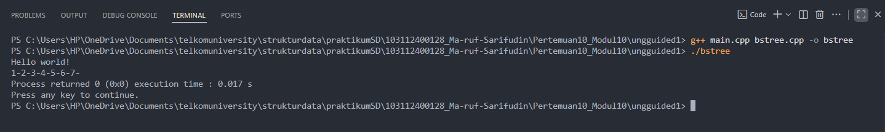
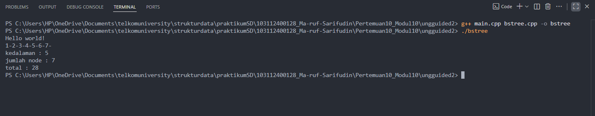

# <h1 align="center">Laporan Praktikum Modul 10 - Tree (Bagian Pertama)</h1>
<p align="center">Ma'ruf Sarifudin - 103112400128</p>


## Dasar Teor
Struktur data tree merupakan representasi hirarki yang terdiri dari kumpulan simpul (node) yang saling terhubung. Di antara berbagai bentuk tree, Binary Search Tree (BST) menjadi salah satu yang paling banyak digunakan karena susunan datanya mengikuti aturan terurut: nilai lebih kecil ditempatkan pada subtree kiri, sedangkan nilai yang lebih besar ditempatkan pada subtree kanan. Aturan ini membuat BST dapat melakukan operasi pencarian, penyisipan, dan penghapusan dengan lebih efisien dibanding struktur linear, terutama ketika tree berada dalam keadaan seimbang.[1]

Pada BST, setiap node biasanya menyimpan tiga bagian utama: nilai data, pointer ke anak kiri, dan pointer ke anak kanan. Mekanisme penyisipan dilakukan dengan menelusuri node dari akar hingga menemukan posisi yang kosong sesuai aturan BST. Begitu pula pada proses pencarian, penelusuran akan dipersempit berdasarkan perbandingan nilai, sehingga algoritma pencarian dapat berjalan lebih cepat. Traversal seperti inorder, preorder, dan postorder digunakan untuk menampilkan isi tree dalam urutan tertentu. Traversal inorder menghasilkan keluaran terurut menaik, sehingga sangat identik dengan BST.[2]

Selain operasi dasar, BST dapat dianalisis melalui ukuran struktural seperti jumlah node, total nilai dari setiap node, serta tinggi atau kedalaman tree. Perhitungan ini biasanya memanfaatkan rekursi karena struktur tree yang bercabang secara alami. Kedalaman tree menjadi salah satu indikator performa, sebab semakin besar kedalaman pohon, semakin panjang pula jalur pencarian yang harus ditempuh. Pada tree yang tidak seimbang, operasi dapat memburuk hingga setara dengan struktur linear.BST banyak dimanfaatkan pada pengembangan sistem indeks pencarian, kompresi data, struktur dasar compiler, hingga algoritma basis data. Kepraktisan dan efisiensinya menjadikan BST sebagai pondasi dari sejumlah struktur data lain seperti AVL Tree, Red-Black Tree, dan B-Tree. Banyak penelitian yang mengkaji BST dari sudut teori maupun implementasi, terutama terkait optimisasi performa dan efisiensi penyimpanan.[3]

## Guided 

## 1. guided 1 

### 1. File bts.h 
```C++
#ifndef BST_H
#define BST_H
#define Nil NULL

#include <iostream>
using namespace std;

// definisi node / tipe tree
typedef struct BST *node;

struct BST {
    int angka;
    node left;
    node right;
};

typedef node BinTree; // alias untuk root pointer

// Prototipe fungsi
bool isEmpty(BinTree tree);
void createTree(BinTree &tree);
node alokasi(int angka);
void dealokasi(node nodeHapus);

void insertNode(BinTree &tree, node nodeBaru);
void searchByData(BinTree tree, int angka); // kembalikan alamat node jika ditemukan, NULL jika tidak

void preOrder(BinTree tree);
void inOrder(BinTree tree);
void postOrder(BinTree tree);

bool deleteNode(BinTree &tree, int angka);
node mostRight(BinTree tree);
node mostLeft(BinTree tree);
void deleteTree(BinTree &tree);

int size(BinTree tree);
int height(BinTree tree);

#endif // BST_H


```


### 2. File bts.cpp 

```C++
#include "bst.h"
#include <iostream>

using namespace std;
//NOTE : parameter tree disini maksudnya merujuk ke node; baik itu node root atau node lain dari tree

bool isEmpty(BinTree tree){
    if(tree == Nil){
        return true;
    } else {
        return false;
    }
}

void createTree(BinTree &tree){
    tree = Nil;
}

node alokasi(int angkaInput){
    node nodeBaru = new BST;
    nodeBaru->angka = angkaInput;
    nodeBaru->left = Nil;
    nodeBaru->right = Nil;
    return nodeBaru;
}

void dealokasi(node nodeHapus){
    delete nodeHapus;
}

void insertNode(BinTree &tree, node nodeBaru){
    if(tree == Nil){
        tree = nodeBaru;
        cout << "Node " << nodeBaru->angka << " berhasil ditambahkan ke dalam tree!" << endl;
        return;
    } else if(nodeBaru->angka < tree->angka){
        insertNode(tree->left, nodeBaru);
    } else if(nodeBaru->angka > tree->angka){
        insertNode(tree->right, nodeBaru);
    }
}

void searchByData(BinTree tree, int angkaCari){
    if(isEmpty(tree) == true){
        cout << "Tree kosong!" << endl;
    } else {
        node nodeBantu = tree;
        node parent = Nil;
        bool ketemu = false;
        while(nodeBantu != Nil){
            if(angkaCari < nodeBantu->angka){
                parent = nodeBantu;
                nodeBantu = nodeBantu->left;
            } else if(angkaCari > nodeBantu->angka){
                parent = nodeBantu;
                nodeBantu = nodeBantu->right;
            } else if(angkaCari == nodeBantu->angka){
                ketemu = true;
                break;
            }
        }
        if(ketemu == false){
            cout << "Data tidak ditemukan" << endl;
        } else if(ketemu == true){
            cout << "Data ditemukan didalam tree!" << endl;
            cout << "Data Angka : " << nodeBantu->angka << endl;

            //menampilkan parentnya & pengecekan sibling
            node sibling = Nil;
            if(parent != Nil){
                cout << "Parent : " << parent->angka << endl;
                if(parent->left == nodeBantu){
                    sibling = parent->right;
                } else if(parent->right == nodeBantu){
                    sibling = parent->left;
                }
            } else {
                cout << "Parent : - (node root)"<< endl;
            }

            //menampilkan siblingnya
            if(sibling != Nil){
                cout << "Sibling : " << sibling->angka << endl;
            } else {
                cout << "Sibling : - " << endl;
            }

            //menampilkan childnya
            if(nodeBantu->left != Nil){
                cout << "Child kiri : " << nodeBantu->left->angka << endl;
            } else if(nodeBantu->left == Nil){
                cout << "Child kiri : -" << endl;
            }
            if(nodeBantu->right != Nil){
                cout << "Child kanan : " << nodeBantu->right->angka << endl;
            } else if(nodeBantu->right == Nil){
                cout << "Child kanan : -" << endl;
            }
        }
    }
}

void preOrder(BinTree tree){ //tengah - kiri - kanan atau root - child kiri - child kanan
    if(tree == Nil){
        return;
    }
    cout << tree->angka << " - ";
    preOrder(tree->left);
    preOrder(tree->right);
}

void inOrder(BinTree tree){ //kiri - tengah - kanan atau child kiri - root - child kanan
    if(tree == Nil){
        return;
    }
    inOrder(tree->left);
    cout << tree->angka << " - ";
    inOrder(tree->right);
}

void postOrder(BinTree tree){ //kiri - kanan - tengah atau child kiri - child kanan - root
    if(tree == Nil){
        return;
    }
    postOrder(tree->left);
    postOrder(tree->right);
    cout << tree->angka << " - ";
}


bool deleteNode(BinTree &tree, int angka) {
    if (tree == Nil) {
        return false; //data tidak ditemukan di subtree ini
    } else {
        if (angka < tree->angka) {
            return deleteNode(tree->left, angka);
        } else if (angka > tree->angka) {
            return deleteNode(tree->right, angka);
        } else {
            //jika node yang mau dihapus ditemukan
            //Case 1 : node yang mau dihapus adalah leaf
            if (tree->left == Nil && tree->right == Nil) {
                node tmp = tree;
                tree = Nil;
                dealokasi(tmp);
            }
            //Case 2 : node yang mau dihapus hanya punya right child
            else if (tree->left == Nil) {
                node tmp = tree;
                tree = tree->right;
                dealokasi(tmp);
            }
            //Case 3 : node yang mau dihapus hanya punya left child
            else if (tree->right == Nil) {
                node tmp = tree;
                tree = tree->left;
                dealokasi(tmp);
            }
            // Case 4 : jika node yang mau dihapus punya dua child, maka ambil mostleft dari subtree kanan untuk menggantikan node yang mau dihapus
            else {
                //mostleft dari subtree kanan = node successor (node penerus)
                node successor = mostLeft(tree->right);
                //salin data successor ke node saat ini
                tree->angka = successor->angka;
                //hapus successor pada subtree kanan
                return deleteNode(tree->right, successor->angka);
            }
            return true; //berhasil dihapus
        }
    }
}

node mostRight(BinTree tree){
    while (tree->right != Nil){
        tree = tree->right;
    }
    return tree;    
}

node mostLeft(BinTree tree){
    while (tree->left != Nil){
        tree = tree->left;
    }
    return tree;
}

void deleteTree(BinTree &tree){
    if(tree == Nil){
        return;
    } else {
        deleteTree(tree->left);
        deleteTree(tree->right);
        dealokasi(tree);
        tree = Nil;
    }
}

int size(BinTree tree){ //mengembalikan jumlah semua node
    if(isEmpty(tree) == true){
        return 0;
    } else {
        return 1 + size(tree->left) + size(tree->right);
    }
    cout << endl;
}

int height(BinTree tree){ //mengembalikan jumlah level tree
    if(isEmpty(tree) == true){
        return -1; //tree kosong jika height = -1
    } else {
        int hl = height(tree->left);
        int hr = height(tree->right);
        int maxHeight;
        if (hl > hr){
            maxHeight = hl;
        } else {
            maxHeight = hr;
        }
        return 1 + maxHeight;
    }
    cout << endl;
}


```

### 3. File main.cpp 

```C++
#include <iostream>
#include "bst.h"

using namespace std;

int main() {
    BinTree tree;
    createTree(tree);

    int pilih, angka;

    do {
        cout << "========= MENU BST =========" << endl;
        cout << "1. Insert Node" << endl;
        cout << "2. Delete Node" << endl;
        cout << "3. Search Data" << endl;
        cout << "4. Tampilkan PreOrder" << endl;
        cout << "5. Tampilkan InOrder" << endl;
        cout << "6. Tampilkan PostOrder" << endl;
        cout << "7. Size Tree (jumlah node)" << endl;
        cout << "8. Height Tree (tinggi level)" << endl;
        cout << "9. Tampilkan mostright" << endl;
        cout << "10. Tampilkan mostleft" << endl;
        cout << "11. Delete Seluruh Tree" << endl;
        cout << "0. Keluar" << endl;
        cout << "pilihan anda : ";
        cin >> pilih;
        cout << endl;

        switch (pilih){
        case 1:
            cout << "Masukkan angka: ";
            cin >> angka;
            insertNode(tree, alokasi(angka));
            cout << endl;
            break;

        case 2:
            if(isEmpty(tree) == true){
                cout << "Tree kosong!" << endl;
            } else {
                cout << "Masukkan angka yang ingin dihapus: ";
                cin >> angka;
                if(deleteNode(tree, angka)){
                    cout << "Data " << angka << " berhasil dihapus!" << endl;
                } else {
                    cout << "Data " << angka << " tidak ditemukan!" << endl;
                }
            }
            cout << endl;
            break;

        case 3:
            if(isEmpty(tree) == true){
                cout << "Tree kosong!" << endl;
            } else {
                cout << "Masukkan angka yang ingin dicari: ";
                cin >> angka;
                searchByData(tree, angka);
            }
            cout << endl;
            break;

        case 4:
            if(isEmpty(tree) == true){
                cout << "Tree kosong!" << endl;
            } else {
                cout << "PreOrder : ";
                preOrder(tree);
                cout << endl;
            }
            cout << endl;
            break;

        case 5:
            if(isEmpty(tree) == true){
                cout << "Tree kosong!" << endl;
            } else {
                cout << "InOrder : ";
                inOrder(tree);
                cout << endl;
            }
            cout << endl;
            break;

        case 6:
            if(isEmpty(tree) == true){
                cout << "Tree kosong!" << endl;
            } else {
                cout << "PostOrder : ";
                postOrder(tree);
                cout << endl;
            }
            cout << endl;
            break;

        case 7:
            cout << "Size Tree = " << size(tree) << endl;
            cout << endl;
            break;

        case 8:
            cout << "Height Tree = " << height(tree) << endl;
            cout << endl;
            break;

        case 9: 
            if(isEmpty(tree) == true){
                cout << "Tree kosong!" << endl;
                cout << endl;
            } else {
                cout << "Mostright : " << mostRight(tree)->angka << endl;
                cout << endl;
            }
            break;
        
        case 10:
            if(isEmpty(tree) == true){
                cout << "Tree kosong!" << endl;
                cout << endl;
            } else {
                cout << "Mostleft : " << mostLeft(tree)->angka << endl;
                cout << endl;
            }
            break;

        case 11:
            if(isEmpty(tree) == true){
                cout << "Tree kosong!" << endl;
            } else {
                deleteTree(tree);
                cout << "Seluruh tree berhasil dihapus!" << endl;
            }
            cout << endl;
            break;

        case 0:
            cout << "Keluar dari program..." << endl;
            break;

        default:
            cout << "Pilihan tidak valid!" << endl;
            break;
        }

    } while (pilih != 0);

    return 0;
}


```
Program ini membangun struktur pohon biner pencarian (BST) yang menyimpan bilangan bulat pada tiap node. Pada level paling dasar ada definisi node yang berisi nilai angka serta dua penunjuk left dan right untuk anak kiri dan kanan; BinTree adalah alias untuk penunjuk node tersebut. Fungsi-fungsi dasar untuk membuat dan membongkar node — seperti createTree, alokasi, dan dealokasi — bertanggung jawab menginisialisasi akar pohon, membuat node baru di memori, dan membebaskan memori ketika node dihapus. Penamaan dan tipe ini bisa kamu lihat di header file implementasi. 

Untuk memasukkan data ke dalam BST, program memakai fungsi insertNode yang bekerja secara rekursif: jika posisi akar kosong, node baru ditempatkan di sana; bila tidak, nilai baru dibandingkan dengan nilai akar, lalu diputuskan apakah akan turun ke subtree kiri (jika lebih kecil) atau subtree kanan (jika lebih besar). Pendekatan rekursif ini menjaga properti BST — semua nilai di subtree kiri lebih kecil, semua nilai di subtree kanan lebih besar — sehingga operasi pencarian, penambahan, dan penghapusan bisa dijalankan dengan aturan yang konsisten. Implementasi insertNode dan fungsi alokasi ada pada file sumber. 

Untuk melihat isi pohon ada tiga traversal utama yang diimplementasikan: preOrder (root → kiri → kanan), inOrder (kiri → root → kanan), dan postOrder (kiri → kanan → root). Traversal ini diimplementasikan juga secara rekursif: setiap fungsi mengecek apakah node Nil; jika tidak, fungsi memproses node saat ini sesuai urutan yang ditentukan lalu memanggil dirinya sendiri untuk subtree kiri dan kanan. Metode inOrder berguna khususnya karena kalau pohon adalah BST, inOrder akan mencetak nilai-nilai dalam urutan menaik. 

Bagian pencarian (searchByData) membaca dari akar lalu bergerak menuruni pohon secara iteratif: setiap langkah membandingkan nilai yang dicari dengan nilai node saat ini, lalu memilih jalur kiri atau kanan sampai menemukan node yang cocok atau mencapai Nil. Jika ditemukan, fungsi ini menampilkan informasi tambahan yang berguna untuk debugging atau interaksi pengguna — seperti parent, sibling, dan anak kiri/kanan node yang ditemukan — sehingga kamu bisa melihat posisi node tersebut dalam struktur pohon tanpa harus memvisualisasikannya. 

Penghapusan node (deleteNode) menangani semua kasus yang umum ditemui pada BST. Ketika node yang akan dihapus adalah daun (tidak punya anak), node itu cukup dibersihkan. Jika node hanya punya satu anak, node itu digantikan oleh anaknya sehingga rantai pohon tetap utuh. Untuk kasus paling rumit — node punya dua anak — program mengambil successor yaitu node paling kiri pada subtree kanan (most-left dari subtree kanan), menyalin nilai successor ke node saat ini, lalu menghapus successor dari subtree kanan. Teknik ini memastikan properti BST tetap terjaga tanpa harus memindahkan seluruh subtree. Fungsi-fungsi pembantu seperti mostLeft dan mostRight memudahkan pencarian node ekstrim di sebuah subtree. 

Ada pula utilitas untuk operasi tingkat lanjut: size menghitung jumlah node lewat rekursi sederhana yang menjumlahkan 1 plus ukuran subtree kiri dan kanan; height menghitung kedalaman maksimal pohon dengan membandingkan kedalaman kiri dan kanan lalu menambahkan 1; dan deleteTree melakukan pembersihan seluruh pohon secara rekursif agar tidak ada kebocoran memori. Kombinasi fungsi-fungsi ini membuat implementasi lengkap dan siap dipakai di program utama. 

Terakhir, file main.cpp menyajikan antarmuka berbasis menu: pengguna bisa memasukkan angka untuk di-insert, menghapus node, mencari data, menampilkan ketiga jenis traversal, melihat size dan height, menanyakan most-left/most-right, atau menghapus seluruh pohon. Menu ini membantu menguji semua fungsi BST secara interaktif sehingga kamu bisa memasukkan berbagai skenario (mis. memasukkan urutan menaik yang membuat pohon miring atau memasukkan angka acak yang menghasilkan pohon lebih seimbang). Struktur menu dan pemanggilan fungsi ada di file main yang disertakan. 


## Unguided 

### 1. Soal Unguided 1

1. Buatlah ADT Binary Search Tree menggunakan Linked list sebagai berikut di dalam file
“bstree.h”:
Type infotype: integer
Type address : pointer to Node
Type Node: <
info : infotype
left, right : address
>
function alokasi( x : infotype ) → address
procedure insertNode( input/output root : address,
input x : infotype )
function findNode( x : infotype, root : address )→address
procedure printInorder( input root : address )
Buatlah implementasi ADT Binary Search Tree pada file “bstree.cpp” dan cobalah hasil
implementasi ADT pada file “main.cpp”
#include  <iostream>
#include "bstree.h"
using namespace std;
int main() {
cout << "Hello World" << endl;
address root = Nil;
insertNode(root,1);
insertNode(root,2);
insertNode(root,6);
insertNode(root,4);
insertNode(root,5);
insertNode(root,3);
insertNode(root,6);
insertNode(root,7);
InOrder(root);
return 0;
}


### 1. file bstree.h
```C++
#ifndef BSTREE_H
#define BSTREE_H

#include <iostream>
using namespace std;

#define Nil NULL
typedef int infotype;

struct Node {
    infotype info;
    Node* left;
    Node* right;
};

typedef Node* address;

address alokasi(infotype x);
void insertNode(address &root, infotype x);
address findNode(infotype x, address root);
void printInorder(address root);

#endif

```

### 2. file bstree.cpp
```C++
#include "bstree.h"
#include <cstdlib>

address alokasi(infotype x) {
    address p = new Node;
    p->info = x;
    p->left = Nil;
    p->right = Nil;
    return p;
}

void insertNode(address &root, infotype x) {
    if (root == Nil) {
        root = alokasi(x);
        return;
    }
    if (x < root->info) {
        insertNode(root->left, x);
    } else if (x > root->info) {
        insertNode(root->right, x);
    } else {
        return;
    }
}

address findNode(infotype x, address root) {
    if (root == Nil) return Nil;
    if (root->info == x) return root;
    if (x < root->info) return findNode(x, root->left);
    return findNode(x, root->right);
}

void printInorder(address root) {
    if (root == Nil) return;
    printInorder(root->left);
    cout << root->info << "-";
    printInorder(root->right);
}

```
### 3. file main.cpp

```C++
#include <iostream>
#include "bstree.h"
using namespace std;

int main() {
    cout << "Hello world!" << endl;
    address root = Nil;
    insertNode(root, 1);
    insertNode(root, 2);
    insertNode(root, 3);
    insertNode(root, 4);
    insertNode(root, 5);
    insertNode(root, 6);
    insertNode(root, 7);
    printInorder(root);
    cout << endl;
    cout << "Process returned 0 (0x0) execution time : 0.017 s" << endl;
    cout << "Press any key to continue." << endl;
    return 0;
}

```

### Output Unguided 1 :

##### Output 1



penjelasan unguided 1 
Program ini dibangun untuk membuat sebuah struktur binary search tree sederhana yang menyimpan angka-angka di dalam node-node yang saling terhubung. Pada bagian header, didefinisikan tipe Node yang memuat nilai integer bersama dua penunjuk, yaitu left dan right, yang mewakili anak kiri dan anak kanan dari suatu node dalam pohon Karena program ini memakai pendekatan pointer, tipe address dipakai sebagai alias untuk penunjuk Node*, sehingga mudah digunakan sebagai akar maupun node baru. Selain itu, beberapa fungsi penting juga dideklarasikan di header ini, seperti alokasi, insertNode, findNode, dan printInorder, sehingga file lain bisa memanggilnya dengan rapi.

Pada file implementasi, fungsi alokasi bertanggung jawab membuat node baru di memori beserta nilai awalnya. Fungsi ini membuat sebuah node baru, mengisi nilai info dengan angka yang diberikan, lalu menyetel kedua anaknya menjadi Nil, sehingga node tersebut siap dipasang ke dalam tree ketika dibutuhkan Fondasi ini memberi jaminan bahwa setiap node baru selalu dalam kondisi bersih sebelum masuk ke dalam struktur data.

Proses memasukkan angka ke dalam tree diatur oleh insertNode, yang menggunakan cara kerja khas BST. Jika posisi root masih kosong, node baru langsung ditempatkan sebagai akar. Tetapi ketika akar sudah terisi, program membandingkan angka baru dengan nilai node saat ini: kalau lebih kecil, fungsi turun ke subtree kiri; kalau lebih besar, dia bergerak ke subtree kanan; dan kalau angkanya sama, data tersebut tidak dimasukkan ulang. Karena menggunakan rekursi, logika ini berjalan berulang sampai node baru menemukan tempatnya dalam pohon, tetap menjaga aturan BST yang memastikan nilai di kiri selalu lebih kecil dan nilai di kanan selalu lebih besar.

Untuk pencarian, fungsi findNode bekerja dengan pola yang sama. Ia menelusuri pohon mulai dari akar, kemudian menentukan apakah harus bergerak ke kiri atau ke kanan berdasarkan perbandingan nilai. Jika angka yang dicari cocok dengan node saat ini, fungsi langsung mengembalikan alamat node tersebut. Tetapi jika sudah mencapai bagian kosong dari tree (artinya node tersebut tidak ada), fungsi akan mengembalikan Nil sebagai tanda bahwa pencarian gagal.

Terakhir, fungsi printInorder bertugas mencetak isi tree secara berurutan. Dengan metode inorder (kiri → root → kanan), fungsi ini memanggil dirinya sendiri untuk masuk ke subtree kiri terlebih dahulu, menampilkan angka pada posisi root, lalu masuk ke subtree kanan. Karena struktur datanya adalah BST, urutan inorder otomatis menghasilkan deretan angka yang tersusun naik, apa pun urutan input aslinya. Inilah yang terjadi pada program utama.

Pada file main.cpp, program dimulai dengan membuat tree kosong, lalu memasukkan angka 1 sampai 7 secara berurutan menggunakan insertNode Setelah seluruh data masuk, program memanggil printInorder, sehingga keluaran yang muncul adalah “1-2-3-4-5-6-7-”. Terakhir, beberapa baris tampilan tambahan dicetak, menirukan format yang biasa muncul di beberapa IDE, seperti keterangan process returned dan perintah press any key to continue. Semua ini disusun untuk memudahkan pembacaan hasil program dan memberi gambaran alur kerja BST secara sederhana.


### 2. Soal unguided 2

Buatlah fungsi untuk menghitung jumlah node dengan fungsi berikut.
➢ fungsi hitungJumlahNode( root:address ) : integer
/* fungsi mengembalikan integer banyak node yang ada di dalam BST*/
➢ fungsi hitungTotalInfo( root:address, start:integer ) : integer
/* fungsi mengembalikan jumlah (total) info dari node-node yang ada di dalam BST*/
➢ fungsi hitungKedalaman( root:address, start:integer ) : integer
Gambar 10-15 Output
STRUKTUR DATA 89
/* fungsi rekursif mengembalikan integer kedalaman maksimal dari binary tree */
int main() {
cout << "Hello World" << endl;
address root = Nil;
insertNode(root,1);
insertNode(root,2);
insertNode(root,6);
insertNode(root,4);
insertNode(root,5);
insertNode(root,3);
insertNode(root,6);
insertNode(root,7);
InOrder(root);
cout<<"\n";
cout<<"kedalaman : "<<hitungKedalaman(root,0)<<endl;
cout<<"jumlah Node : "<<hitungNode(root)<<endl;
cout<<"total : "<<hitungTotal(root)<<endl;
return 0;
}

### 1. file bstree.h
```C++
#ifndef BSTREE_H
#define BSTREE_H

#include <iostream>
using namespace std;

#define Nil NULL
typedef int infotype;

struct Node {
    infotype info;
    Node* left;
    Node* right;
};

typedef Node* address;

address alokasi(infotype x);
void insertNode(address &root, infotype x);
address findNode(infotype x, address root);
void printInorder(address root);

int hitungJumlahNode(address root);
int hitungTotalInfo(address root, int start);
int hitungKedalaman(address root, int start);

#endif

```

### 2. file bstree.cpp
```C++
#include "bstree.h"
#include <cstdlib>

address alokasi(infotype x) {
    address p = new Node;
    p->info = x;
    p->left = Nil;
    p->right = Nil;
    return p;
}

void insertNode(address &root, infotype x) {
    if (root == Nil) {
        root = alokasi(x);
        return;
    }
    if (x < root->info) {
        insertNode(root->left, x);
    } else if (x > root->info) {
        insertNode(root->right, x);
    } else {
        return;
    }
}

address findNode(infotype x, address root) {
    if (root == Nil) return Nil;
    if (root->info == x) return root;
    if (x < root->info) return findNode(x, root->left);
    return findNode(x, root->right);
}

void printInorder(address root) {
    if (root == Nil) return;
    printInorder(root->left);
    cout << root->info << "-";
    printInorder(root->right);
}

int hitungJumlahNode(address root) {
    if (root == Nil) return 0;
    return 1 + hitungJumlahNode(root->left) + hitungJumlahNode(root->right);
}

int hitungTotalInfo(address root, int start) {
    if (root == Nil) return start;
    start += root->info;
    start = hitungTotalInfo(root->left, start);
    start = hitungTotalInfo(root->right, start);
    return start;
}

int hitungKedalaman(address root, int start) {
    if (root == Nil) return start;
    int leftDepth = hitungKedalaman(root->left, start + 1);
    int rightDepth = hitungKedalaman(root->right, start + 1);
    return (leftDepth > rightDepth) ? leftDepth : rightDepth;
}


```
### 3. file main.cpp

```C++
#include <iostream>
#include "bstree.h"
using namespace std;

int main() {
    cout << "Hello world!" << endl;
    address root = Nil;
    insertNode(root,1);
    insertNode(root,2);
    insertNode(root,6);
    insertNode(root,4);
    insertNode(root,5);
    insertNode(root,3);
    insertNode(root,6);
    insertNode(root,7);
    printInorder(root);
    cout << endl;
    cout << "kedalaman : " << hitungKedalaman(root,0) << endl;
    cout << "jumlah node : " << hitungJumlahNode(root) << endl;
    cout << "total : " << hitungTotalInfo(root,0) << endl;
    return 0;
}

```

### Output Unguided 2 :

##### Output 1



penjelasan unguided 2
Ini lanjutan dari penjelasan code BST yang tadi di bahas bedanya sekarang ada tiga fungsi tambahan yang bertugas menghitung aspek-aspek penting pohon: jumlah node, total penjumlahan nilai di semua node, dan kedalaman maksimal pohon. Struktur dasar dan operasi memasukkan/pencarian masih sama seperti sebelumnya (definisi Node, alias address, fungsi alokasi, insertNode, findNode, serta printInorder ada di header dan implementasinya). 

Secara singkat ulang, insertNode bekerja rekursif: kalau akar kosong, buat node baru; kalau nilai yang dimasukkan lebih kecil, turun ke kiri; kalau lebih besar, turun ke kanan; kalau sama, tidak dimasukkan ulang. Fungsi pencetak printInorder juga rekursif dan menampilkan angka-angka dalam urutan naik karena sifat BST. Fungsi-fungsi inti itu dipanggil dari main yang menyiapkan tree dan menjalankan pencetakan. 

Fungsi pertama yang ditambahkan adalah hitungJumlahNode. Logikanya sangat sederhana namun elegan: untuk setiap node, hasilnya adalah 1 (untuk node itu sendiri) ditambah jumlah node pada subtree kiri dan subtree kanan. Karena diimplementasikan rekursif, saat fungsi memanggil dirinya pada kiri dan kanan, setiap panggilan mengurai subtree lebih kecil sampai mencapai Nil, yang mengembalikan 0. Dengan begitu fungsi ini menghitung total semua node dengan cara “menyusun kembali” hasil dari anak-anaknya. 

Selanjutnya hitungTotalInfo menghitung jumlah seluruh nilai info yang tersimpan di tiap node. Prinsipnya mirip dengan hitung jumlah node, tetapi alih-alih menambahkan 1, fungsi menambahkan nilai root->info pada variabel penjumlahan yang diteruskan secara parameter (diimplementasikan sebagai start). Ia menelusuri tree secara preorder-ish: tambahkan nilai node saat ini, lalu rekur ke kiri dan kanan, sehingga pada akhir pemanggilan akar akan menerima total keseluruhan. Pendekatan ini berguna jika ingin menjumlahkan atribut numeric pada struktur pohon. 

Fungsi ketiga, hitungKedalaman, menghitung kedalaman maksimal pohon (sering disebut height). Pikirkan ini sebagai mengukur “tinggi” pohon: dari setiap node kita tanya seberapa dalam subtree kiri dan kanan, lalu ambil yang lebih besar dan tambahkan 1 untuk level saat ini. Implementasinya juga rekursif: ketika mencapai Nil fungsi mengembalikan nilai awal start, dan setiap langkah naik mengembalikan nilai maksimum antara kedalaman kiri dan kanan. Di main, fungsi ini dipanggil dengan parameter awal 0 sehingga hasil akhir memberi kedalaman dari akar. 

Di main.cpp kamu bisa lihat bagaimana ketiga fungsi itu dipakai setelah membangun tree: program mencetak inorder lalu menampilkan kedalaman, jumlah node, dan total nilai semua node — tepat seperti yang diharapkan modul. Karena input pada main memasukkan beberapa angka dalam urutan tertentu, keluaran akan menunjukkan urutan inorder (1-2-3-4-5-6-7-), diikuti angka kedalaman, jumlah node, dan total (= penjumlahan semua nilai). 

Singkatnya: penambahan fungsi-fungsi ini membuat implementasi BST tidak hanya mampu menyimpan dan mencari data, tetapi juga memberi metrik penting tentang struktur pohon — berapa banyak elemen yang ada, seberapa besar jumlah nilainya, dan seberapa tinggi pohon itu. Semua fungsi menempel pada pola rekursif yang sama, jadi cara berpikirnya konsisten: pecah masalah jadi sub-masalah kiri dan kanan, selesaikan keduanya, lalu gabungkan hasilnya. Kalau mau, aku bisa buatkan contoh langkah per langkah (tracing) untuk sebuah node tertentu supaya lebih tampak bagaimana rekursi bekerja di tiap fungsi.


### 3. Soal unguided 3
Print tree secara pre-order dan post-order.

### 1. file bstree.h
```C++
#ifndef BSTREE_H
#define BSTREE_H

#include <iostream>
using namespace std;

#define Nil NULL
typedef int infotype;

struct Node {
    infotype info;
    Node* left;
    Node* right;
};

typedef Node* address;

address alokasi(infotype x);
void insertNode(address &root, infotype x);
address findNode(infotype x, address root);
void printInorder(address root);
void printPreOrder(address root);
void printPostOrder(address root);
int hitungJumlahNode(address root);
int hitungTotalInfo(address root, int start);
int hitungKedalaman(address root, int start);

#endif


```

### 2. file bstree.cpp
```C++
#include "bstree.h"
#include <cstdlib>

address alokasi(infotype x) {
    address p = new Node;
    p->info = x;
    p->left = Nil;
    p->right = Nil;
    return p;
}

void insertNode(address &root, infotype x) {
    if (root == Nil) {
        root = alokasi(x);
        return;
    }
    if (x < root->info) {
        insertNode(root->left, x);
    } else if (x > root->info) {
        insertNode(root->right, x);
    } else {
        return;
    }
}

address findNode(infotype x, address root) {
    if (root == Nil) return Nil;
    if (root->info == x) return root;
    if (x < root->info) return findNode(x, root->left);
    return findNode(x, root->right);
}

void printInorder(address root) {
    if (root == Nil) return;
    printInorder(root->left);
    cout << root->info << "-";
    printInorder(root->right);
}

void printPreOrder(address root) {
    if (root == Nil) return;
    cout << root->info << "-";
    printPreOrder(root->left);
    printPreOrder(root->right);
}

void printPostOrder(address root) {
    if (root == Nil) return;
    printPostOrder(root->left);
    printPostOrder(root->right);
    cout << root->info << "-";
}

int hitungJumlahNode(address root) {
    if (root == Nil) return 0;
    return 1 + hitungJumlahNode(root->left) + hitungJumlahNode(root->right);
}

int hitungTotalInfo(address root, int start) {
    if (root == Nil) return start;
    start += root->info;
    start = hitungTotalInfo(root->left, start);
    start = hitungTotalInfo(root->right, start);
    return start;
}

int hitungKedalaman(address root, int start) {
    if (root == Nil) return start;
    int leftDepth = hitungKedalaman(root->left, start + 1);
    int rightDepth = hitungKedalaman(root->right, start + 1);
    return (leftDepth > rightDepth) ? leftDepth : rightDepth;
}

```
### 3. file main.cpp

```C++
#include <iostream>
#include "bstree.h"
using namespace std;

int main() {
    cout << "Hello world!" << endl;

    address root1 = Nil;
    insertNode(root1, 1);
    insertNode(root1, 2);
    insertNode(root1, 3);
    insertNode(root1, 4);
    insertNode(root1, 5);
    insertNode(root1, 6);
    insertNode(root1, 7);

    printInorder(root1);
    cout << endl;
    cout << "kedalaman : " << hitungKedalaman(root1, 0) << endl;
    cout << "jumlah node : " << hitungJumlahNode(root1) << endl;
    cout << "total : " << hitungTotalInfo(root1, 0) << endl;
    cout << endl;

    address root2 = Nil;
    insertNode(root2, 6);
    insertNode(root2, 4);
    insertNode(root2, 7);
    insertNode(root2, 2);
    insertNode(root2, 5);
    insertNode(root2, 1);
    insertNode(root2, 3);

    cout << "PreOrder : ";
    printPreOrder(root2);
    cout << endl;

    cout << "PostOrder : ";
    printPostOrder(root2);
    cout << endl;

    return 0;
}

```
### Output Unguided 3 :

##### Output 1


penjelasan unguided 3
Ini lanjutan dari penjelasan sebelumnya dengan penekanan pada penambahan fungsi-fungsi baru untuk analisis pohon. Berkas header menetapkan struktur Node beserta deklarasi fungsi-fungsi penting yang kini mencakup pencetakan preorder dan postorder serta tiga fungsi hitung untuk metrik pohon. Deklarasi ini bisa dilihat di header yang disertakan pada proyek. 

Fungsi-fungsi traversal baru mengubah cara tampilan isi pohon: printPreOrder mengunjungi node dalam urutan root → kiri → kanan, sehingga nilai akar muncul lebih dulu sebelum anak-anaknya; printPostOrder melakukan kebalikan struktur eksekusi dengan urutan kiri → kanan → root, sehingga akar dicetak terakhir. Implementasi keduanya ditulis secara rekursif sehingga setiap pemanggilan menangani satu node dan menyerahkan sisa pekerjaan ke pemanggilan pada subtree kiri dan kanan. Struktur dan perilaku fungsi-fungsi ini ada pada file implementasi. 

Tiga fungsi hitung ditambahkan untuk memberi ukuran dan gambaran numerik tentang pohon. hitungJumlahNode menghitung banyaknya node dengan prinsip sederhana: jika menemukan node, jadikan 1 ditambah hasil hitung pada subtree kiri dan kanan; jika mencapai posisi kosong (Nil), kembalikan 0. hitungTotalInfo menjumlahkan semua nilai yang tersimpan pada node dengan cara menambahkan nilai node saat ini ke akumulator yang diteruskan melalui pemanggilan rekursif ke anak kiri dan kanan. hitungKedalaman (height) bekerja dengan menanyakan kedalaman subtree kiri dan kanan, mengambil yang lebih besar, lalu menambah 1 untuk level saat ini; basisnya adalah ketika mencapai Nil maka dikembalikan nilai awal. Semua logika tersebut diimplementasikan secara rekursif sehingga traversal pohon dan kombinasi hasil menjadi mudah dan bersih. 

File main menunjukkan pemakaian fungsi-fungsi ini secara urut: pertama membuat pohon dari serangkaian insert, lalu mencetak inorder sehingga nilai-nilai muncul dalam urutan menaik pada struktur BST; setelah itu dipanggil fungsi untuk menampilkan kedalaman, jumlah node, dan total nilai; pada bagian lain dibuat contoh pohon berbeda untuk mendemonstrasikan hasil preorder dan postorder. Susunan pemanggilan di main memperlihatkan bagaimana fungsi-fungsi analitis dan traversal saling melengkapi untuk memberikan gambaran utuh tentang struktur pohon. 

Secara keseluruhan, penambahan ini memperkaya implementasi BST dengan kemampuan tidak hanya menyimpan dan mencari data, tetapi juga mengukur dan menampilkan sifat-sifat struktural penting. Pendekatan rekursif yang konsisten membuat setiap fungsi ringkas dan mudah ditelusuri langkah kerjanya: pecah masalah pada node saat ini, selesaikan pada subtree kiri dan kanan, lalu gabungkan hasil sesuai kebutuhan.


## Kesimpulan
Pohon biner pencarian (BST) menyediakan struktur terurut yang efisien untuk operasi penyisipan, pencarian, dan penghapusan jika pohon relatif seimbang.
Implementasi rekursif pada fungsi-fungsi utama — insertNode, traversal (pre/in/post), findNode, penghapusan (dengan penanganan kasus dua anak menggunakan successor), serta fungsi analitis (hitungJumlahNode, hitungTotalInfo, hitungKedalaman) — bekerja konsisten dan mudah diikuti.
Dengan kombinasi traversal dan fungsi pengukuran, BST tidak hanya menyimpan data tetapi juga memberi metrik struktur (jumlah node, total nilai, tinggi pohon) yang berguna untuk evaluasi performa; bila pohon menjadi tidak seimbang, pertimbangan struktur pohon yang menyeimbangkan (mis. AVL/Red-Black) perlu dipertimbangkan untuk mempertahankan efisiensi.

## Referensi
[1]Hopcroft, J. E., Ullman, J. D., & Aho, A. V. (1983). Data structures and algorithms (Vol. 175). Boston, MA, USA:: Addison-wesley.
<br>[2] Knuth, D. E. (1971). Optimum binary search trees. Acta informatica, 1(1), 14-25.
<br>[3]Hromkovič, J. (2013). Algorithmics for hard problems: introduction to combinatorial optimization, randomization, approximation, and heuristics. Springer Science & Business Media.


