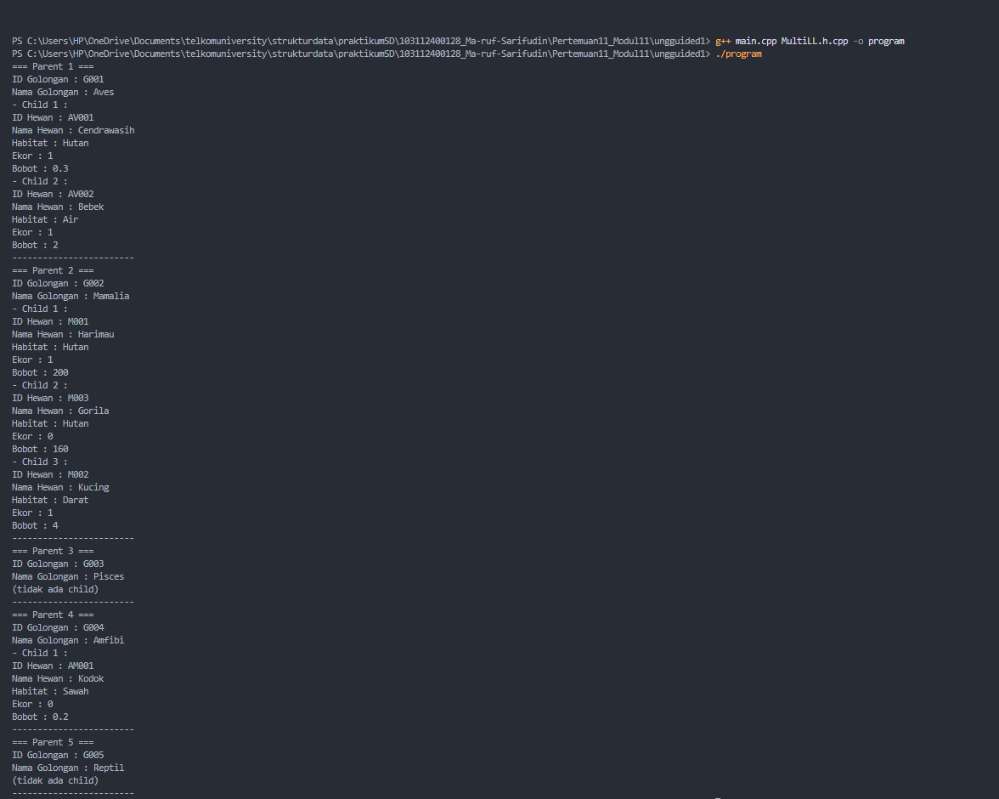
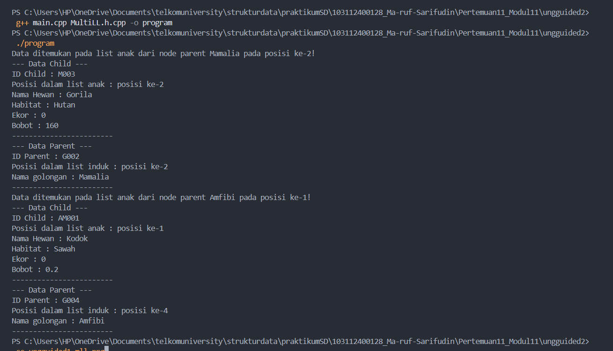
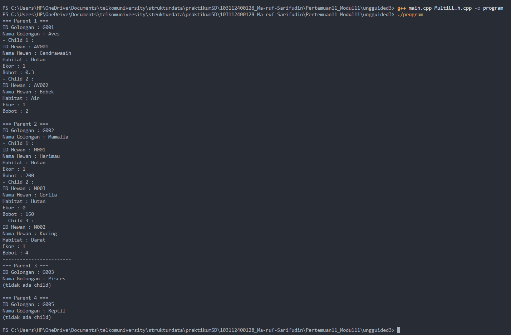

# <h1 align="center">Laporan Praktikum Modul 13 - MULTI LINKED LIST</h1>
<p align="center">Ma'ruf Sarifudin - 103112400128</p>


## Dasar Teori Multi Linked List
Struktur data multi linked list merupakan pengembangan dari konsep linked list biasa, di mana sebuah node tidak hanya menyimpan data dan penunjuk ke node berikutnya, tetapi juga memiliki sebuah linked list lain yang menjadi turunannya. Dasarnya mengacu pada karakteristik linked list yang bersifat dinamis dan fleksibel dalam pengelolaan memori, karena setiap elemen disimpan dalam bentuk node terpisah dan saling terhubung melalui pointer. Konsep ini dijelaskan pada materi struktur data yang menegaskan bahwa linked list memudahkan operasi penambahan dan penghapusan elemen tanpa perlu melakukan pemindahan data secara keseluruhan seperti pada array, sehingga sangat efisien untuk data yang berubah-ubah ukurannya.[1]

Pada struktur multi linked list, setiap node induk memiliki list anak yang merepresentasikan hubungan one-to-many. Model ini banyak dipakai ketika data bersifat hierarkis, misalnya kategori yang memiliki beberapa item, atau golongan hewan yang memiliki daftar hewan tertentu. Penjelasan tentang nested atau hierarchical linked list disebutkan sebagai bentuk list bertingkat yang memungkinkan penyimpanan data secara berlapis menggunakan pointer yang saling terhubung. Dengan cara ini, data dapat ditelusuri per parent terlebih dahulu, kemudian per child pada parent tersebut, tanpa kehilangan keterhubungan antara dua level data.[2]

Selain itu, struktur multi linked list juga menjadi solusi logis dalam representasi struktur hirarki sederhana tanpa harus membangun algoritma tree yang kompleks. Pada penerapannya, penghapusan satu induk otomatis menghilangkan seluruh anak yang berada di bawahnya karena semua node berada pada memori terpisah, sehingga relasi antar node dapat dikendalikan secara langsung melalui pointer. Hal ini sejalan dengan prinsip pemodelan one-to-many dalam data terstruktur yang disajikan melalui bentuk linked list berlapis. Dengan demikian, multi linked list tidak hanya memudahkan penyimpanan dan traversal data bersarang, tetapi juga sangat fleksibel untuk berbagai operasi seperti insert, delete, search, dan update pada dua level data secara terpisah maupun bersamaan.[3]

## Guided 

## 1. guided 1 

### 1. File mll.h 
```C++
#ifndef MLL_H
#define MLL_H

#include <iostream>
#include <string>

using namespace std;

struct DataMakanan {
    string idMakanan;
    string namaMakanan;
    float harga;
};

struct KategoriMakanan {
    string idKategori;
    string namaKategori;
};

typedef struct nodeParent *NodeParent;
typedef struct nodeChild *NodeChild;

struct nodeChild {
    DataMakanan isidata;
    NodeChild next;
    NodeChild prev;
};

struct listAnak {
    NodeChild first;
    NodeChild last;
};

struct nodeParent {
    KategoriMakanan isidata;
    NodeParent next;
    NodeParent prev;
    listAnak L_Anak;
};

struct listInduk {
    NodeParent first;
    NodeParent last;
};

//isEmpty & create list
bool isEmptyInduk(listInduk LInduk);
bool isEmptyAnak(listAnak LAnak);
void createListInduk(listInduk &LInduk);
void createListAnak(listAnak &LAnak);

//alokasi & dealokasi
NodeParent alokasiNodeParent(string idKategori, string namaKategori);
NodeChild alokasiNodeChild(string idMakanan, string namaMakanan, float harga);
void dealokasiNodeChild(NodeChild &nodeAnak);
void dealokasiNodeParent(NodeParent &nodeInduk);

//operasi pada parent
void insertFirstParent(listInduk &LInduk, NodeParent nodeBaruParent);
void insertLastParent(listInduk &LInduk, NodeParent nodeBaruParent);
void insertAfterParent(listInduk &LInduk, NodeParent nodeBaruParent, NodeParent nodePrevParent);
void deleteFirstParent(listInduk &LInduk);
void deleteLastParent(listInduk &LInduk);
void deleteAfterParent(listInduk &LInduk, NodeParent nodePrev);
void findParentByID(listInduk &LInduk, string IDCari);
void updateDataParentByID(listInduk &LInduk, string IDCari, string newNamaKategori);

//operasi pada child
void insertFirstChild(listAnak &LAnak, NodeChild nodeBaruChild);
void insertLastChild(listAnak &LAnak, NodeChild nodeBaruChild);
void insertAfterChild(listAnak &LAnak, NodeChild nodeBaruChild, NodeChild nodePrevChild);
void deleteFirstChild(listAnak &LAnak);
void deleteLastChild(listAnak &LAnak);
void deleteAfterChild(listAnak &LAnak, NodeChild nodePrev);
void findChildByID(listInduk &LInduk, string IDCari);
void updateDataChildByID(listInduk &LInduk, string IDCari, string newNamaMakanan, float newHarga);

//operasi print
void printStrukturMLL(listInduk &LInduk);
void printListInduk(listInduk &LInduk);
void printListAnak(listInduk &LInduk, NodeParent nodeInduk);

//operasi hapus list
void hapusListInduk(listInduk &LInduk);
void hapusListAnak(listAnak &LAnak);

#endif

```


### 2. File mll.cpp 

```C++
#include "mll.h"
#include <iostream>
#include <string>

using namespace std;

//isEmpty & create list
bool isEmptyInduk(listInduk LInduk){
    if(LInduk.first == NULL){
        return true;
    } else {
        return false;
    }
}

bool isEmptyAnak(listAnak LAnak){
    if(LAnak.first == NULL){
        return true;
    } else {
        return false;
    }
}

void createListInduk(listInduk &LInduk) {
    LInduk.first = LInduk.last = NULL;
}

void createListAnak(listAnak &LAnak) {
    LAnak.first = LAnak.last = NULL;
}

//alokasi & dealokasi
NodeParent alokasiNodeParent(string idKategori, string namaKategori) {
    NodeParent nodeBaruParent = new nodeParent;
    nodeBaruParent->isidata.idKategori = idKategori;
    nodeBaruParent->isidata.namaKategori = namaKategori;
    nodeBaruParent->next = NULL;
    nodeBaruParent->prev = NULL;
    createListAnak(nodeBaruParent->L_Anak);
    return nodeBaruParent;
}

NodeChild alokasiNodeChild(string idMakanan, string namaMakanan, float harga) {
    NodeChild nodeBaruChild = new nodeChild;
    nodeBaruChild->isidata.idMakanan = idMakanan;
    nodeBaruChild->isidata.namaMakanan = namaMakanan;
    nodeBaruChild->isidata.harga = harga;
    nodeBaruChild->next = NULL;
    nodeBaruChild->prev = NULL;
    return nodeBaruChild;
}

void dealokasiNodeChild(NodeChild &nodeAnak) {
    if(nodeAnak != NULL) {
        nodeAnak->next = nodeAnak->prev = NULL;
        delete nodeAnak;
        nodeAnak = NULL;
    }
}

void dealokasiNodeParent(NodeParent &nodeInduk) {
    if(nodeInduk != NULL) {
        nodeInduk->next = nodeInduk->prev = NULL;
        delete nodeInduk;
        nodeInduk = NULL;
    }
}

//operasi pada parent
void insertFirstParent(listInduk &LInduk, NodeParent nodeBaruParent) {
    if(isEmptyInduk(LInduk) == true) {
        LInduk.first = LInduk.last = nodeBaruParent;
    } else {
        nodeBaruParent->next = LInduk.first;
        LInduk.first->prev = nodeBaruParent;
        LInduk.first = nodeBaruParent;
    }
    cout << "Node parent "<< nodeBaruParent->isidata.namaKategori << " berhasil ditambahkan kedalam urutan pertama di list Induk!" << endl;
}

void insertLastParent(listInduk &LInduk, NodeParent nodeBaruParent) {
    if(isEmptyInduk(LInduk) == true) {
        LInduk.first = LInduk.last = nodeBaruParent;
    } else {
        nodeBaruParent->prev = LInduk.last;
        LInduk.last->next = nodeBaruParent;
        LInduk.last = nodeBaruParent;
    }
    cout << "Node parent "<< nodeBaruParent->isidata.namaKategori << " berhasil ditambahkan kedalam urutan terakhir di list Induk!" << endl;
}

void insertAfterParent(listInduk &LInduk, NodeParent nodeBaruParent, NodeParent nodePrevParent) {
    if(nodePrevParent == NULL) {
        cout << "Node Prev Parent tidak valid!" << endl;
    } else {
        if(nodePrevParent == LInduk.last){
            insertLastParent(LInduk, nodeBaruParent);
            return;
        } else {
            nodeBaruParent->next = nodePrevParent->next;
            nodeBaruParent->prev = nodePrevParent;
            (nodePrevParent->next)->prev = nodeBaruParent;
            nodePrevParent->next = nodeBaruParent;
            cout << "Node parent "<< nodeBaruParent->isidata.namaKategori << " berhasil ditambahkan kedalam list induk setelah node parent "<< nodePrevParent->isidata.namaKategori << endl;
        }
    }
}

void deleteFirstParent(listInduk &LInduk){
    if(isEmptyInduk(LInduk) == true){
        cout << "List Induk kosong!" << endl;
    } else {
        NodeParent nodeHapus = LInduk.first;
        if (LInduk.first == LInduk.last) { // KASUS KHUSUS 1 ELEMEN
            LInduk.first = NULL;
            LInduk.last = NULL;
        } else {
            LInduk.first = LInduk.first->next;
            LInduk.first->prev = NULL;
            nodeHapus->next = NULL;
        }
        if(nodeHapus->L_Anak.first != NULL){
            hapusListAnak(nodeHapus->L_Anak);
        }
        dealokasiNodeParent(nodeHapus);
        cout << "Node pertama list induk berhasil dihapus beserta anak-anaknya!" << endl;
    }
}

void deleteLastParent(listInduk &LInduk){
    if(isEmptyInduk(LInduk) == true){
        cout << "List Induk kosong!" << endl;
    } else {
        NodeParent nodeHapus = LInduk.last;
        if (LInduk.first == LInduk.last) {
            LInduk.first = NULL;
            LInduk.last = NULL;
        } else {
            LInduk.last = LInduk.last->prev;
            nodeHapus->prev = NULL;
            LInduk.last->next = NULL;
        }
        if(nodeHapus->L_Anak.first != NULL){
            hapusListAnak(nodeHapus->L_Anak);
        }
        dealokasiNodeParent(nodeHapus);
        cout << "Node terakhir list induk berhasil dihapus beserta anak-anaknya!" << endl;
    }
}

void deleteAfterParent(listInduk &LInduk, NodeParent nodePrev){
    if(isEmptyInduk(LInduk) == true){
        cout << "List induk kosong!" << endl;
    } else {
        if(nodePrev != NULL && nodePrev->next != NULL){
            NodeParent nodeHapus = nodePrev->next;
            nodePrev->next = nodeHapus->next;
            if (nodeHapus->next != NULL){
                (nodeHapus->next)->prev = nodePrev;
            } else {
                LInduk.last = nodePrev;
            }
            nodeHapus->next = NULL;
            if(nodeHapus->L_Anak.first != NULL){
                hapusListAnak(nodeHapus->L_Anak);
            }
            dealokasiNodeParent(nodeHapus);
            cout << "Node parent setelah node " << nodePrev->isidata.namaKategori << " berhasil dihapus beserta anak-anaknya!" << endl;
        } else {
            cout << "Node prev tidak valid!" << endl;
        }
    }
}

void findParentByID(listInduk &LInduk, string IDCari){
    if(isEmptyInduk(LInduk) == true){
        cout << "List induk kosong!" << endl;
    } else {
        NodeParent nodeBantu = LInduk.first;
        int index = 1;
        int ketemu = false;
        while(nodeBantu != NULL){
            if(nodeBantu->isidata.idKategori == IDCari){
                cout << "Data ID parent ditemukan pada list induk posisi ke-" << index << "!" << endl;
                cout << "ID : " << nodeBantu->isidata.idKategori << endl;
                cout << "Posisi dalam list induk : posisi ke-" << index << endl;
                cout << "Nama Kategori : " << nodeBantu->isidata.namaKategori << endl;
                ketemu = true;
                break;
            } else {
                nodeBantu = nodeBantu->next;
                index++;
            }
        }
        if(!ketemu){
            cout << "Data ID parent tidak ditemukan didalam list induk!" << endl;
        }
    }
}

void updateDataParentByID(listInduk &LInduk, string IDCari, string newNamaKategori) {
    if (isEmptyInduk(LInduk) == true) {
        cout << "List Induk kosong!" << endl;
    } else {
        NodeParent nodeBantu = LInduk.first;
        bool ketemu = false;
        while (nodeBantu != NULL) {
            if (nodeBantu->isidata.idKategori == IDCari) {
                // Proses Update
                nodeBantu->isidata.namaKategori = newNamaKategori;
                cout << "Update Parent Berhasil!" << endl;
                cout << "Node parent dengan ID " << IDCari << " berhasil diupdate menjadi : " << endl;
                cout << "Nama Kategori baru  : " << newNamaKategori << endl;
                ketemu = true;
                break; 
            } else {
                nodeBantu = nodeBantu->next;
            }
        }
        if (!ketemu) {
            cout << "Parent dengan ID " << IDCari << " tidak ditemukan" << endl;
        }
    }
}

//operasi pada child
void insertFirstChild(listAnak &LAnak, NodeChild nodeBaruChild) {
    if(isEmptyAnak(LAnak)) {
        LAnak.first = LAnak.last = nodeBaruChild;
    } else {
        nodeBaruChild->next = LAnak.first;
        LAnak.first->prev = nodeBaruChild;
        LAnak.first = nodeBaruChild;
    }
    cout << "Node child "<< nodeBaruChild->isidata.namaMakanan << " berhasil ditambahkan kedalam urutan pertama di list Anak!" << endl;
}

void insertLastChild(listAnak &LAnak, NodeChild nodeBaruChild) {
    if(isEmptyAnak(LAnak)) {
        LAnak.first = LAnak.last = nodeBaruChild;
    } else {
        nodeBaruChild->prev = LAnak.last;
        LAnak.last->next = nodeBaruChild;
        LAnak.last = nodeBaruChild;
    }
    cout << "Node child "<< nodeBaruChild->isidata.namaMakanan << " berhasil ditambahkan kedalam urutan terakhir di list Anak!" << endl;
}

void insertAfterChild(listAnak &LAnak, NodeChild nodeBaruChild, NodeChild nodePrevChild) {
    if(nodePrevChild == NULL) {
        cout << "Node Prev Parent tidak valid!" << endl;
    } else {
        if(nodePrevChild == LAnak.last){
            insertLastChild(LAnak, nodeBaruChild);
            return;
        } else {
            nodeBaruChild->next = nodePrevChild->next;
            nodeBaruChild->prev = nodePrevChild;
            (nodePrevChild->next)->prev = nodeBaruChild;
            nodePrevChild->next = nodeBaruChild;
            cout << "Node child "<< nodeBaruChild->isidata.namaMakanan << " berhasil ditambahkan kedalam list anak setelah node child "<< nodePrevChild->isidata.namaMakanan << endl;
        }
    }
}

void deleteFirstChild(listAnak &LAnak){
    if(isEmptyAnak(LAnak) == true){
        cout << "List anak kosong!" << endl;
    } else {
        NodeChild nodeHapus = LAnak.first;
        if (LAnak.first == LAnak.last) { // KASUS KHUSUS 1 ELEMEN
            LAnak.first = NULL;
            LAnak.last = NULL;
        } else {
            LAnak.first = LAnak.first->next;
            LAnak.first->prev = NULL;
            nodeHapus->next = NULL;
        }
        dealokasiNodeChild(nodeHapus);
        cout << "Node pertama list anak berhasil dihapus!" << endl;
    }
}

void deleteLastChild(listAnak &LAnak){
    if(isEmptyAnak(LAnak) == true){
        cout << "List anak kosong!" << endl;
    } else {
        NodeChild nodeHapus = LAnak.last;
        if (LAnak.first == LAnak.last) {
            LAnak.first = NULL;
            LAnak.last = NULL;
        } else {
            LAnak.last = LAnak.last->prev;
            nodeHapus->prev = NULL;
            LAnak.last->next = NULL;
        }
        dealokasiNodeChild(nodeHapus);
        cout << "Node terakhir list anak berhasil dihapus!" << endl;
    }
}

void deleteAfterChild(listAnak &LAnak, NodeChild nodePrev){
    if(isEmptyAnak(LAnak) == true){
        cout << "List induk kosong!" << endl;
    } else {
        if(nodePrev != NULL && nodePrev->next != NULL){
            NodeChild nodeHapus = nodePrev->next;
            nodePrev->next = nodeHapus->next;
            if (nodeHapus->next != NULL){
                (nodeHapus->next)->prev = nodePrev;
            } else {
                LAnak.last = nodePrev;
            }
            nodeHapus->next = NULL;
            dealokasiNodeChild(nodeHapus);
            cout << "Node child setelah node " << nodePrev->isidata.namaMakanan << " berhasil dihapus!" << endl;
        } else {
            cout << "Node prev tidak valid!" << endl;
        }
    }
}

void findChildByID(listInduk &LInduk, string IDCari){
    if(isEmptyInduk(LInduk) == true){
        cout << "List induk kosong!" << endl;
    } else {
        NodeParent nodeBantuParent = LInduk.first;
        int indexParent = 1;
        int ketemu = false;
        while(nodeBantuParent != NULL){
            NodeChild nodeBantuChild = nodeBantuParent->L_Anak.first;
            int indexChild = 1;
            while(nodeBantuChild != NULL){
                if(nodeBantuChild->isidata.idMakanan == IDCari) {
                    cout << "Data ID child ditemukan pada list anak dari node parent " << nodeBantuParent->isidata.namaKategori << " pada posisi ke-" << indexChild << "!" << endl;
                    cout << "--- Data Child ---" << endl;
                    cout << "ID Child : " << nodeBantuChild->isidata.idMakanan << endl;
                    cout << "Posisi dalam list anak : posisi ke-" << indexChild << endl;
                    cout << "Nama Makanan : " << nodeBantuChild->isidata.namaMakanan << endl;
                    cout << "Harga : " << nodeBantuChild->isidata.harga << endl;
                    cout << "---------------------------" << endl;
                    cout << "--- Data Parent ---" << endl;
                    cout << "ID Parent : " << nodeBantuParent->isidata.idKategori << endl;
                    cout << "Posisi dalam list induk : posisi ke-" << indexParent << endl;
                    cout << "Nama kategori : " << nodeBantuParent->isidata.namaKategori << endl;
                    ketemu = true;
                    break;
                } else {
                    nodeBantuChild = nodeBantuChild->next;
                    indexChild++;
                }
            }
            if(ketemu){
                break;
            } else {
                nodeBantuParent = nodeBantuParent->next;
                indexParent++;
            }
        }
        if(!ketemu){
            cout << "Data ID child tidak ditemukan didalam list anak!" << endl;
        }
    }
}

void updateDataChildByID(listInduk &LInduk, string IDCari, string newNamaMakanan, float newHarga) {
    if (isEmptyInduk(LInduk) == true) {
        cout << "List Induk kosong!" << endl;
    } else {
        NodeParent nodeBantuParent = LInduk.first;
        bool ketemu = false;
        // Loop Parent (karena child ada di dalam parent)
        while (nodeBantuParent != NULL) {
            NodeChild nodeBantuChild = nodeBantuParent->L_Anak.first;
            // Loop Child
            while (nodeBantuChild != NULL) {
                if (nodeBantuChild->isidata.idMakanan == IDCari) {
                    // Proses Update
                    nodeBantuChild->isidata.namaMakanan = newNamaMakanan;
                    nodeBantuChild->isidata.harga = newHarga;
                    cout << "Update Child Berhasil!" << endl;
                    cout << "Lokasi : Ada di dalam Parent " << nodeBantuParent->isidata.namaKategori << endl;
                    cout << "Node child dengan ID " << IDCari << " berhasil diupdate menjadi : " << endl;
                    cout << "Nama Makanan Baru  : " << newNamaMakanan << endl;
                    cout << "Harga Baru : " << newHarga << endl;
                    ketemu = true;
                    break; // Break loop child
                } else {
                    nodeBantuChild = nodeBantuChild->next;
                }
            }
            if (ketemu){
                break; // Break loop parent jika sudah ketemu di dalam
            } else {
                nodeBantuParent = nodeBantuParent->next;
            }
        }
        if (!ketemu) {
            cout << "Child dengan ID " << IDCari << " tidak ditemukan di parent manapun." << endl;
        }
    }
}

//operasi print
void printStrukturMLL(listInduk &LInduk) {
    if(isEmptyInduk(LInduk)) {
        cout << "List induk kosong!" << endl;
    } else {
        NodeParent nodeBantuParent = LInduk.first;
        int indexParent = 1;
        while(nodeBantuParent != NULL) {
            cout << "=== Parent " << indexParent << " ===" << endl;
            cout << "ID Kategori : " << nodeBantuParent->isidata.idKategori << endl;
            cout << "Nama Kategori : " << nodeBantuParent->isidata.namaKategori << endl;

            //print list anak dari node parentnya
            NodeChild nodeBantuChild = nodeBantuParent->L_Anak.first;
            if(nodeBantuChild == NULL) {
                cout << "  (tidak ada child)" << endl;
            } else {
                int indexChild = 1;
                while(nodeBantuChild != NULL) {
                    cout << "  - Child " << indexChild << " :" << endl;
                    cout << "      ID Makanan : " << nodeBantuChild->isidata.idMakanan << endl;
                    cout << "      Nama Makanan : " << nodeBantuChild->isidata.namaMakanan << endl;
                    cout << "      Harga : " << nodeBantuChild->isidata.harga << endl;
                    nodeBantuChild = nodeBantuChild->next;
                    indexChild++;
                }
            }
            cout << "---------------------------" << endl;
            nodeBantuParent = nodeBantuParent->next;
            indexParent++;
        }
    }
}

void printListInduk(listInduk &LInduk) {
    if(isEmptyInduk(LInduk)) {
        cout << "List induk Kosong!" << endl;
    } else {
        NodeParent nodeBantuParent = LInduk.first;
        int index = 1;
        while(nodeBantuParent != NULL) {
            cout << "=== Parent " << index << " ===" << endl;
            cout << "ID Kategori : " << nodeBantuParent->isidata.idKategori << endl;
            cout << "Nama Kategori : " << nodeBantuParent->isidata.namaKategori << endl;
            cout << "---------------------------" << endl;
            nodeBantuParent = nodeBantuParent->next;
            index++;
        }
    }
}

void printListAnak(listInduk &LInduk, NodeParent nodeInduk) {
    if(isEmptyInduk(LInduk) == true || nodeInduk == NULL){
        cout << "List induk kosong atau node induk tidak valid!" << endl;
    } else {
        NodeChild nodeBantuChild = nodeInduk->L_Anak.first;
        if(nodeBantuChild == NULL) {
            cout << "node parent " << nodeInduk->isidata.namaKategori << " tidak memiliki list anak!" << endl;
        } else {
            cout << "=== List Anak Node Parent " << nodeInduk->isidata.namaKategori << " ===" << endl;
            int index = 1;
            while(nodeBantuChild != NULL) {
                cout << "Child " << index << " :" << endl;
                cout << "ID Makanan : " << nodeBantuChild->isidata.idMakanan << endl;
                cout << "Nama Makanan : " << nodeBantuChild->isidata.namaMakanan << endl;
                cout << "Harga : " << nodeBantuChild->isidata.harga << endl;
                cout << "---------------------------" << endl;
                nodeBantuChild = nodeBantuChild->next;
                index++;
            }
        }
    }
}

//operasi hapus list
void hapusListInduk(listInduk &LInduk) {
    NodeParent nodeBantu = LInduk.first;
    while(nodeBantu != NULL) {
        NodeParent nodeHapus = nodeBantu;
        nodeBantu = nodeBantu->next;
        //panggil prosedur hapusListAnak() untuk menghapus child-child nya
        hapusListAnak(nodeHapus->L_Anak);
        dealokasiNodeParent(nodeHapus);
    }
    LInduk.first = LInduk.last = NULL;
}

void hapusListAnak(listAnak &LAnak) {
    NodeChild nodeBantu = LAnak.first;
    while(nodeBantu != NULL) {
        NodeChild nodeHapus = nodeBantu;
        nodeBantu = nodeBantu->next;
        dealokasiNodeChild(nodeHapus);
    }
    LAnak.first = LAnak.last = NULL;
}


```

### 3. File main.cpp 

```C++
#include "mll.h"
#include <iostream>

using namespace std;

int main() {
    // 1. Inisialisasi List
    listInduk L;
    createListInduk(L);
    cout << "=== MENU RESTORAN DIBUAT ===" << endl << endl;

    // 2. Membuat Data Parent (Kategori Makanan)
    // Kita simpan pointer-nya agar mudah memasukkan anak nanti
    NodeParent Kat1 = alokasiNodeParent("K01", "Makanan Berat");
    insertFirstParent(L, Kat1);

    NodeParent Kat2 = alokasiNodeParent("K02", "Minuman");
    insertAfterParent(L, Kat2, Kat1);

    NodeParent Kat3 = alokasiNodeParent("K03", "Dessert");
    insertLastParent(L, Kat3);
    
    cout << endl;

    // 3. Memasukkan Data Child (Menu Makanan) ke Kategori Tertentu
    
    // --> Isi Kategori Makanan Berat (K01)
    NodeChild Mkn1 = alokasiNodeChild("M01", "Nasi Goreng Spesial", 25000);
    insertFirstChild(Kat1->L_Anak, Mkn1);

    NodeChild Mkn2 = alokasiNodeChild("M02", "Ayam Bakar Madu", 30000);
    insertLastChild(Kat1->L_Anak, Mkn2);

    // --> Isi Kategori Minuman (K02)
    NodeChild Min1 = alokasiNodeChild("D01", "Es Teh Manis", 5000);
    insertLastChild(Kat2->L_Anak, Min1);
    
    NodeChild Min2 = alokasiNodeChild("D02", "Jus Alpukat", 15000);
    insertFirstChild(Kat2->L_Anak, Min2);

    // --> Isi Kategori Dessert (K03)
    NodeChild Des1 = alokasiNodeChild("S01", "Puding Coklat", 10000);
    insertLastChild(Kat3->L_Anak, Des1);
    cout << endl;

    cout << "=== TAMPILAN AWAL MENU ===" << endl;
    printStrukturMLL(L);
    cout << endl;

    // 4. Test Pencarian (Find)
    cout << "=== TEST PENCARIAN ===" << endl;
    findParentByID(L, "K02"); // Cari Kategori Minuman
    cout << "---------------------------" << endl;
    findChildByID(L, "M01");  // Cari Nasi Goreng
    cout << "---------------------------" << endl;
    findChildByID(L, "X99");  // Cari data ngawur (harus not found)
    cout << "---------------------------" << endl;
    cout << endl;

    // 5. Test Update Data
    cout << "=== TEST UPDATE ===" << endl;
    // Update Nama Kategori (Parent)
    // Mengubah "Dessert" menjadi "Makanan Penutup"
    updateDataParentByID(L, "K03", "Makanan Penutup");
    cout << "---------------------------" << endl;
    
    // Update Data Makanan (Child)
    // Mengubah "Nasi Goreng Spesial" jadi "Nasgor Gila", harga naik jadi 28000
    updateDataChildByID(L, "M01", "Nasgor Gila", 28000);
    cout << "---------------------------" << endl;
    
    cout << "\n=== SETELAH UPDATE ===" << endl;
    // Kita cek apakah data berubah
    printListInduk(L); // Cek nama kategori saja
    cout << endl;
    printListAnak(L, Kat1); // Cek list anak di kategori 1
    cout << endl;

    // 6. Test Penghapusan (Delete)
    cout << "=== TEST DELETE ===" << endl;
    
    // Hapus Child: Hapus Jus Alpukat (D02) dari Minuman
    cout << "> Menghapus Child D02..." << endl;
    deleteFirstChild(Kat2->L_Anak); 
    
    // Hapus Parent: Hapus Kategori Dessert/Makanan Penutup (K03)
    // DeleteLastParent akan menghapus elemen terakhir (K03)
    cout << "> Menghapus Parent Terakhir (K03)..." << endl;
    deleteLastParent(L); 

    cout << "\n=== TAMPILAN AKHIR MENU ===" << endl;
    printStrukturMLL(L);

    return 0;
}


```
Program ini mengelola data menu restoran menggunakan multi linked list, yaitu list induk berisi kategori makanan dan setiap kategori memiliki list anak berisi menu-menunya.

Pada mll.h didefinisikan tipe data parent (KategoriMakanan) yang menyimpan ID dan nama kategori, serta tipe child (DataMakanan) yang menyimpan ID menu, nama menu, dan harga. Parent dan child sama-sama disimpan dalam bentuk node yang saling terhubung kiri-kanan (double linked list), sedangkan tiap parent juga punya pointer ke list anak. 

Di mll.cpp, fungsi-fungsi dasar dibentuk: membuat list, mengalokasikan node baru, memasukkan node di awal/akhir/di antara node lain, menghapus node, dan mencari data berdasarkan ID. Saat parent dihapus, seluruh child miliknya ikut terhapus agar tidak ada data menggantung. Ada juga fungsi untuk menampilkan isi struktur dalam format yang rapi—parent dicetak berurutan beserta daftar menu di bawahnya. 

main.cpp menunjukkan cara penggunaan seluruh operasi tersebut. Program membuat tiga kategori: Makanan Berat, Minuman, dan Dessert. Lalu dimasukkan beberapa menu ke dalam masing-masing kategori. Setelah itu program menampilkan struktur lengkapnya, melakukan pencarian kategori dan menu, mengubah nama kategori dan harga menu tertentu, kemudian menampilkan data yang sudah diperbarui. Terakhir program mencoba menghapus menu pertama pada sebuah kategori dan menghapus kategori terakhir, lalu mencetak ulang hasilnya. Dengan alur tersebut terlihat bahwa multi linked list bekerja layaknya sistem menu restoran yang bisa menambah, mencari, mengubah, menghapus, dan menampilkan data secara fleksibel.


## Unguided 

### 1. Soal Unguided 1
Buatlah ADT Multi Linked List seperti di file MultiLL.h:
Struct golonganHewan berisi idGolongan dan namaGolongan.
Struct dataHewan berisi idHewan, namaHewan, habitat, ekor (boolean), dan bobot.
Definisi nodeChild, listChild, nodeParent, listParent (parent menyimpan golonganHewan dan punya satu listChild).
Deklarasi semua fungsi/prosedur:
isEmptyParent, isEmptyChild
createListParent, createListChild
allocNodeParent, allocNodeChild
deallocNodeParent, deallocNodeChild
insertFirstParent, insertLastParent, deleteFirstParent, deleteAfterParent
insertFirstChild, insertLastChild, deleteFirstChild, deleteAfterChild
printMLLStructure, deleteListChild.
Lalu diminta mengimplementasikan ADT tersebut di MultiLL.cpp.
Setelah itu, di main.cpp:
Buat list parent.
Insert parent G001–G005 dengan nama golongan:
G001: Aves
G002: Mamalia
G003: Pisces
G004: Amfibi
G005: Reptil
Tambah child sesuai data:
G001 → AV001, AV002
G002 → M001, M003, M002
G004 → AM001
Sehingga bentuk Multi Linked List sama seperti gambar soal (rantai parent G001–G005 dengan child di G001, G002, G004).
Terakhir, panggil printMLLStructure() dan screenshot output sebagai jawaban soal 1.


### 1. file MultiLL.h
```C++
#ifndef MULTILL_H
#define MULTILL_H

#include <iostream>
#include <string>
using namespace std;

struct golonganHewan {
    string idGolongan;
    string namaGolongan;
};

struct dataHewan {
    string idHewan;
    string namaHewan;
    string habitat;
    bool ekor;
    float bobot;
};

struct nodeParent;
struct nodeChild;

typedef nodeParent *NodeParent;
typedef nodeChild *NodeChild;

struct nodeChild {
    dataHewan isidata;
    NodeChild next;
    NodeChild prev;
};

struct listChild {
    NodeChild first;
    NodeChild last;
};

struct nodeParent {
    golonganHewan isidata;
    NodeParent next;
    NodeParent prev;
    listChild L_Child;
};

struct listParent {
    NodeParent first;
    NodeParent last;
};

bool isEmptyParent(listParent LParent);
bool isEmptyChild(listChild LChild);

void createListParent(listParent &LParent);
void createListChild(listChild &LChild);

NodeParent allocNodeParent(string idGol, string namaGol);
NodeChild allocNodeChild(string idHwn, string namaHwn, string habitat, bool tail, float weight);

void deallocNodeParent(NodeParent &NParent);
void deallocNodeChild(NodeChild &NChild);

void insertFirstParent(listParent &LParent, NodeParent newNParent);
void insertLastParent(listParent &LParent, NodeParent newNParent);
void deleteFirstParent(listParent &LParent);
void deleteAfterParent(listParent &LParent, NodeParent NPrev);

void insertFirstChild(listChild &LChild, NodeChild newNChild);
void insertLastChild(listChild &LChild, NodeChild newNChild);
void deleteFirstChild(listChild &LChild);
void deleteAfterChild(listChild &LChild, NodeChild NPrev);

void deleteListChild(listChild &LChild);
void printMLLStructure(listParent LParent);

#endif


```

### 2. file MultiLL.cpp
```C++
#include "MultiLL.h"

bool isEmptyParent(listParent LParent) {
    return LParent.first == NULL;
}

bool isEmptyChild(listChild LChild) {
    return LChild.first == NULL;
}

void createListParent(listParent &LParent) {
    LParent.first = NULL;
    LParent.last = NULL;
}

void createListChild(listChild &LChild) {
    LChild.first = NULL;
    LChild.last = NULL;
}

NodeParent allocNodeParent(string idGol, string namaGol) {
    NodeParent P = new nodeParent;
    P->isidata.idGolongan = idGol;
    P->isidata.namaGolongan = namaGol;
    P->next = NULL;
    P->prev = NULL;
    createListChild(P->L_Child);
    return P;
}

NodeChild allocNodeChild(string idHwn, string namaHwn, string habitat, bool tail, float weight) {
    NodeChild C = new nodeChild;
    C->isidata.idHewan = idHwn;
    C->isidata.namaHewan = namaHwn;
    C->isidata.habitat = habitat;
    C->isidata.ekor = tail;
    C->isidata.bobot = weight;
    C->next = NULL;
    C->prev = NULL;
    return C;
}

void deallocNodeParent(NodeParent &NParent) {
    delete NParent;
    NParent = NULL;
}

void deallocNodeChild(NodeChild &NChild) {
    delete NChild;
    NChild = NULL;
}

void insertFirstParent(listParent &LParent, NodeParent newNParent) {
    if (isEmptyParent(LParent)) {
        LParent.first = newNParent;
        LParent.last = newNParent;
    } else {
        newNParent->next = LParent.first;
        LParent.first->prev = newNParent;
        LParent.first = newNParent;
    }
}

void insertLastParent(listParent &LParent, NodeParent newNParent) {
    if (isEmptyParent(LParent)) {
        LParent.first = newNParent;
        LParent.last = newNParent;
    } else {
        newNParent->prev = LParent.last;
        LParent.last->next = newNParent;
        LParent.last = newNParent;
    }
}

void deleteFirstParent(listParent &LParent) {
    if (!isEmptyParent(LParent)) {
        NodeParent P = LParent.first;
        if (P->next == NULL) {
            deleteListChild(P->L_Child);
            LParent.first = NULL;
            LParent.last = NULL;
            deallocNodeParent(P);
        } else {
            LParent.first = P->next;
            LParent.first->prev = NULL;
            deleteListChild(P->L_Child);
            P->next = NULL;
            deallocNodeParent(P);
        }
    }
}

void deleteAfterParent(listParent &LParent, NodeParent NPrev) {
    if (NPrev != NULL && NPrev->next != NULL) {
        NodeParent P = NPrev->next;
        if (P == LParent.last) {
            NPrev->next = NULL;
            LParent.last = NPrev;
            deleteListChild(P->L_Child);
            P->prev = NULL;
            deallocNodeParent(P);
        } else {
            NPrev->next = P->next;
            P->next->prev = NPrev;
            deleteListChild(P->L_Child);
            P->next = NULL;
            P->prev = NULL;
            deallocNodeParent(P);
        }
    }
}

void insertFirstChild(listChild &LChild, NodeChild newNChild) {
    if (isEmptyChild(LChild)) {
        LChild.first = newNChild;
        LChild.last = newNChild;
    } else {
        newNChild->next = LChild.first;
        LChild.first->prev = newNChild;
        LChild.first = newNChild;
    }
}

void insertLastChild(listChild &LChild, NodeChild newNChild) {
    if (isEmptyChild(LChild)) {
        LChild.first = newNChild;
        LChild.last = newNChild;
    } else {
        newNChild->prev = LChild.last;
        LChild.last->next = newNChild;
        LChild.last = newNChild;
    }
}

void deleteFirstChild(listChild &LChild) {
    if (!isEmptyChild(LChild)) {
        NodeChild C = LChild.first;
        if (C->next == NULL) {
            LChild.first = NULL;
            LChild.last = NULL;
            deallocNodeChild(C);
        } else {
            LChild.first = C->next;
            LChild.first->prev = NULL;
            C->next = NULL;
            deallocNodeChild(C);
        }
    }
}

void deleteAfterChild(listChild &LChild, NodeChild NPrev) {
    if (NPrev != NULL && NPrev->next != NULL) {
        NodeChild C = NPrev->next;
        if (C == LChild.last) {
            NPrev->next = NULL;
            LChild.last = NPrev;
            C->prev = NULL;
            deallocNodeChild(C);
        } else {
            NPrev->next = C->next;
            C->next->prev = NPrev;
            C->next = NULL;
            C->prev = NULL;
            deallocNodeChild(C);
        }
    }
}

void deleteListChild(listChild &LChild) {
    while (!isEmptyChild(LChild)) {
        deleteFirstChild(LChild);
    }
}

void printMLLStructure(listParent LParent) {
    if (isEmptyParent(LParent)) {
        cout << "List parent kosong" << endl;
        return;
    }
    NodeParent P = LParent.first;
    int idxParent = 1;
    while (P != NULL) {
        cout << "=== Parent " << idxParent << " ===" << endl;
        cout << "ID Golongan : " << P->isidata.idGolongan << endl;
        cout << "Nama Golongan : " << P->isidata.namaGolongan << endl;
        NodeChild C = P->L_Child.first;
        if (C == NULL) {
            cout << "(tidak ada child)" << endl;
        } else {
            int idxChild = 1;
            while (C != NULL) {
                cout << "- Child " << idxChild << " :" << endl;
                cout << "ID Hewan : " << C->isidata.idHewan << endl;
                cout << "Nama Hewan : " << C->isidata.namaHewan << endl;
                cout << "Habitat : " << C->isidata.habitat << endl;
                cout << "Ekor : " << (C->isidata.ekor ? 1 : 0) << endl;
                cout << "Bobot : " << C->isidata.bobot << endl;
                C = C->next;
                idxChild++;
            }
        }
        cout << "------------------------" << endl;
        P = P->next;
        idxParent++;
    }
}


```
### 3. file main.cpp

```C++
#include <iostream>
#include "MultiLL.h"
using namespace std;

int main() {
    listParent LParent;
    createListParent(LParent);

    NodeParent G1 = allocNodeParent("G001", "Aves");
    NodeParent G2 = allocNodeParent("G002", "Mamalia");
    NodeParent G3 = allocNodeParent("G003", "Pisces");
    NodeParent G4 = allocNodeParent("G004", "Amfibi");
    NodeParent G5 = allocNodeParent("G005", "Reptil");

    insertLastParent(LParent, G1);
    insertLastParent(LParent, G2);
    insertLastParent(LParent, G3);
    insertLastParent(LParent, G4);
    insertLastParent(LParent, G5);

    NodeChild C_AV001 = allocNodeChild("AV001", "Cendrawasih", "Hutan", true, 0.3f);
    NodeChild C_AV002 = allocNodeChild("AV002", "Bebek", "Air", true, 2.0f);
    insertLastChild(G1->L_Child, C_AV001);
    insertLastChild(G1->L_Child, C_AV002);

    NodeChild C_M001 = allocNodeChild("M001", "Harimau", "Hutan", true, 200.0f);
    NodeChild C_M003 = allocNodeChild("M003", "Gorila", "Hutan", false, 160.0f);
    NodeChild C_M002 = allocNodeChild("M002", "Kucing", "Darat", true, 4.0f);
    insertLastChild(G2->L_Child, C_M001);
    insertLastChild(G2->L_Child, C_M003);
    insertLastChild(G2->L_Child, C_M002);

    NodeChild C_AM001 = allocNodeChild("AM001", "Kodok", "Sawah", false, 0.2f);
    insertLastChild(G4->L_Child, C_AM001);

    printMLLStructure(LParent);

    return 0;
}


```

### Output Unguided 1 :

##### Output 1



penjelasan unguided 1 
Program ini dibangun struktur multi linked list untuk menyimpan data golongan hewan dan daftar hewan di tiap golongan. Di bagian header MultiLL.h terlihat dulu tipe-tipe datanya. golonganHewan menyimpan idGolongan dan namaGolongan, misalnya “G001 – Aves” atau “G002 – Mamalia”. Lalu dataHewan menyimpan detail hewan: idHewan, namaHewan, habitat, status ekor (true kalau berekor, false kalau tidak), dan bobot dalam kilogram. Kedua data ini kemudian dibungkus dalam node: nodeParent untuk golongan dan nodeChild untuk hewan. Parent punya pointer next dan prev (double linked list antar golongan) serta satu listChild yang isinya pointer first dan last ke deretan nodeChild. Child juga double linked list lewat next dan prev. Di luar itu ada listParent yang menyimpan first dan last dari seluruh parent. Header ini juga mendeklarasikan fungsi-fungsi seperti createListParent, allocNodeParent, insertLastParent, insertLastChild, deleteListChild, dan printMLLStructure.

Isi dari fungsi-fungsinya ada di MultiLL.h.cpp. Fungsi createListParent dan createListChild hanya mengosongkan list dengan mengisi first dan last menjadi NULL. allocNodeParent membuat nodeParent baru di heap: mengisi ID dan nama golongan, mengosongkan pointer next/prev, lalu memanggil createListChild untuk menyiapkan list anak kosong di dalam parent tersebut. allocNodeChild melakukan hal yang sama untuk nodeChild: mengisi semua field hewan lalu menyetel next dan prev ke NULL. Ada juga isEmptyParent dan isEmptyChild yang mengecek apakah list sedang kosong, serta deallocNodeParent dan deallocNodeChild yang menghapus node dan menyetel pointer-nya jadi NULL.

Untuk mengatur susunan data, fungsi insertFirstParent dan insertLastParent menambahkan parent baru di awal atau di akhir list induk. Jika list masih kosong, parent baru otomatis menjadi first dan last. Kalau tidak kosong, fungsi mengatur ulang pointer next dan prev sehingga rantai double linked list tetap nyambung. Operasi delete di parent ditangani oleh deleteFirstParent dan deleteAfterParent; sebelum menghapus node parent, fungsi ini memanggil deleteListChild supaya semua anak di bawah parent tersebut ikut dibersihkan, baru kemudian node parent-nya sendiri dihapus. Bagian anak punya pola yang mirip: insertFirstChild dan insertLastChild menghubungkan nodeChild baru ke awal/akhir list anak, sedangkan deleteFirstChild dan deleteAfterChild melepas child dari rantai lalu memanggil deallocNodeChild. Fungsi deleteListChild tinggal memanggil deleteFirstChild berulang-ulang sampai list anak kosong. Terakhir, printMLLStructure menelusuri semua parent; untuk tiap parent, fungsi ini mencetak ID dan nama golongan, lalu menelusuri list anaknya dan mencetak semua hewan (ID, nama, habitat, ekor, bobot). Kalau suatu parent tidak punya anak, muncul teks “(tidak ada child)”.

File main.cpp menunjukkan cara memakai semua fungsi tadi untuk membangun data seperti di soal. Pertama dibuat sebuah listParent LParent lalu diinisialisasi dengan createListParent. Setelah itu dibuat lima parent: G001 “Aves”, G002 “Mamalia”, G003 “Pisces”, G004 “Amfibi”, dan G005 “Reptil” menggunakan allocNodeParent. Kelima node ini dimasukkan berurutan ke list induk dengan insertLastParent, sehingga terbentuk rantai parent dari G001 sampai G005.

Langkah berikutnya adalah mengisi list anak untuk beberapa golongan. Untuk G001 dibuat dua child: AV001 “Cendrawasih” (habitat Hutan, berekor, bobot 0,3) dan AV002 “Bebek” (habitat Air, berekor, bobot 2). Keduanya dialokasikan memakai allocNodeChild lalu dimasukkan ke G1->L_Child dengan insertLastChild. Golongan G002 diisi tiga hewan: M001 “Harimau” (Hutan, berekor, 200), M003 “Gorila” (Hutan, tidak berekor, 160), dan M002 “Kucing” (Darat, berekor, 4). Semua juga dimasukkan ke list anak milik G002 secara berurutan. Terakhir, G004 mempunyai satu child AM001 “Kodok” (Sawah, tidak berekor, 0,2) yang dimasukkan ke G4->L_Child. Golongan G003 dan G005 dibiarkan tanpa child untuk menggambarkan kasus parent yang belum punya data hewan.

Di akhir fungsi main, program memanggil printMLLStructure(LParent). Dari sini akan muncul tampilan berurutan: “Parent 1” sampai “Parent 5”, masing-masing berisi id dan nama golongan. Di bawah G001 tercetak dua child (AV001 dan AV002), di bawah G002 tercetak tiga child (M001, M003, M002), di bawah G004 tercetak satu child (AM001), sedangkan G003 dan G005 menampilkan tulisan “(tidak ada child)”. Pola keluaran ini persis menggambarkan diagram multi linked list pada soal: list induk yang berisi golongan hewan, dan dari beberapa node parent turun rantai list anak berisi hewan-hewan di golongan tersebut.

### 2. Soal unguided 2

Tambahkan prosedur searchHewanByEkor(input/output LParent : listParent, input tail : Boolean) yang digunakan untuk melakukan operasi SEARCHING hewan-hewan yang memiliki EKOR FALSE (pencarian dilakukan dengan menelusuri list child yang ada pada masing-masing node parent). Kemudian panggil prosedur tersebut pada main.cpp.

### 1. file MultiLL.h
```C++
#ifndef MULTILL_H
#define MULTILL_H

#include <iostream>
#include <string>
using namespace std;

struct golonganHewan {
    string idGolongan;
    string namaGolongan;
};

struct dataHewan {
    string idHewan;
    string namaHewan;
    string habitat;
    bool ekor;
    float bobot;
};

struct nodeParent;
struct nodeChild;

typedef nodeParent *NodeParent;
typedef nodeChild *NodeChild;

struct nodeChild {
    dataHewan isidata;
    NodeChild next;
    NodeChild prev;
};

struct listChild {
    NodeChild first;
    NodeChild last;
};

struct nodeParent {
    golonganHewan isidata;
    NodeParent next;
    NodeParent prev;
    listChild L_Child;
};

struct listParent {
    NodeParent first;
    NodeParent last;
};

bool isEmptyParent(listParent LParent);
bool isEmptyChild(listChild LChild);

void createListParent(listParent &LParent);
void createListChild(listChild &LChild);

NodeParent allocNodeParent(string idGol, string namaGol);
NodeChild allocNodeChild(string idHwn, string namaHwn, string habitat, bool tail, float weight);

void deallocNodeParent(NodeParent &NParent);
void deallocNodeChild(NodeChild &NChild);

void insertFirstParent(listParent &LParent, NodeParent newNParent);
void insertLastParent(listParent &LParent, NodeParent newNParent);
void deleteFirstParent(listParent &LParent);
void deleteAfterParent(listParent &LParent, NodeParent NPrev);

void insertFirstChild(listChild &LChild, NodeChild newNChild);
void insertLastChild(listChild &LChild, NodeChild newNChild);
void deleteFirstChild(listChild &LChild);
void deleteAfterChild(listChild &LChild, NodeChild NPrev);

void deleteListChild(listChild &LChild);
void printMLLStructure(listParent LParent);

void searchHewanByEkor(listParent &LParent, bool tail);

#endif


```

### 2. file MultiLL.cpp
```C++
#include "MultiLL.h"

bool isEmptyParent(listParent LParent) {
    return LParent.first == NULL;
}

bool isEmptyChild(listChild LChild) {
    return LChild.first == NULL;
}

void createListParent(listParent &LParent) {
    LParent.first = NULL;
    LParent.last = NULL;
}

void createListChild(listChild &LChild) {
    LChild.first = NULL;
    LChild.last = NULL;
}

NodeParent allocNodeParent(string idGol, string namaGol) {
    NodeParent P = new nodeParent;
    P->isidata.idGolongan = idGol;
    P->isidata.namaGolongan = namaGol;
    P->next = NULL;
    P->prev = NULL;
    createListChild(P->L_Child);
    return P;
}

NodeChild allocNodeChild(string idHwn, string namaHwn, string habitat, bool tail, float weight) {
    NodeChild C = new nodeChild;
    C->isidata.idHewan = idHwn;
    C->isidata.namaHewan = namaHwn;
    C->isidata.habitat = habitat;
    C->isidata.ekor = tail;
    C->isidata.bobot = weight;
    C->next = NULL;
    C->prev = NULL;
    return C;
}

void deallocNodeParent(NodeParent &NParent) {
    delete NParent;
    NParent = NULL;
}

void deallocNodeChild(NodeChild &NChild) {
    delete NChild;
    NChild = NULL;
}

void insertFirstParent(listParent &LParent, NodeParent newNParent) {
    if (isEmptyParent(LParent)) {
        LParent.first = newNParent;
        LParent.last = newNParent;
    } else {
        newNParent->next = LParent.first;
        LParent.first->prev = newNParent;
        LParent.first = newNParent;
    }
}

void insertLastParent(listParent &LParent, NodeParent newNParent) {
    if (isEmptyParent(LParent)) {
        LParent.first = newNParent;
        LParent.last = newNParent;
    } else {
        newNParent->prev = LParent.last;
        LParent.last->next = newNParent;
        LParent.last = newNParent;
    }
}

void deleteFirstParent(listParent &LParent) {
    if (!isEmptyParent(LParent)) {
        NodeParent P = LParent.first;
        if (P->next == NULL) {
            deleteListChild(P->L_Child);
            LParent.first = NULL;
            LParent.last = NULL;
            deallocNodeParent(P);
        } else {
            LParent.first = P->next;
            LParent.first->prev = NULL;
            deleteListChild(P->L_Child);
            P->next = NULL;
            deallocNodeParent(P);
        }
    }
}

void deleteAfterParent(listParent &LParent, NodeParent NPrev) {
    if (NPrev != NULL && NPrev->next != NULL) {
        NodeParent P = NPrev->next;
        if (P == LParent.last) {
            NPrev->next = NULL;
            LParent.last = NPrev;
            deleteListChild(P->L_Child);
            P->prev = NULL;
            deallocNodeParent(P);
        } else {
            NPrev->next = P->next;
            P->next->prev = NPrev;
            deleteListChild(P->L_Child);
            P->next = NULL;
            P->prev = NULL;
            deallocNodeParent(P);
        }
    }
}

void insertFirstChild(listChild &LChild, NodeChild newNChild) {
    if (isEmptyChild(LChild)) {
        LChild.first = newNChild;
        LChild.last = newNChild;
    } else {
        newNChild->next = LChild.first;
        LChild.first->prev = newNChild;
        LChild.first = newNChild;
    }
}

void insertLastChild(listChild &LChild, NodeChild newNChild) {
    if (isEmptyChild(LChild)) {
        LChild.first = newNChild;
        LChild.last = newNChild;
    } else {
        newNChild->prev = LChild.last;
        LChild.last->next = newNChild;
        LChild.last = newNChild;
    }
}

void deleteFirstChild(listChild &LChild) {
    if (!isEmptyChild(LChild)) {
        NodeChild C = LChild.first;
        if (C->next == NULL) {
            LChild.first = NULL;
            LChild.last = NULL;
            deallocNodeChild(C);
        } else {
            LChild.first = C->next;
            LChild.first->prev = NULL;
            C->next = NULL;
            deallocNodeChild(C);
        }
    }
}

void deleteAfterChild(listChild &LChild, NodeChild NPrev) {
    if (NPrev != NULL && NPrev->next != NULL) {
        NodeChild C = NPrev->next;
        if (C == LChild.last) {
            NPrev->next = NULL;
            LChild.last = NPrev;
            C->prev = NULL;
            deallocNodeChild(C);
        } else {
            NPrev->next = C->next;
            C->next->prev = NPrev;
            C->next = NULL;
            C->prev = NULL;
            deallocNodeChild(C);
        }
    }
}

void deleteListChild(listChild &LChild) {
    while (!isEmptyChild(LChild)) {
        deleteFirstChild(LChild);
    }
}

void printMLLStructure(listParent LParent) {
    if (isEmptyParent(LParent)) {
        cout << "List parent kosong" << endl;
        return;
    }
    NodeParent P = LParent.first;
    int idxParent = 1;
    while (P != NULL) {
        cout << "=== Parent " << idxParent << " ===" << endl;
        cout << "ID Golongan : " << P->isidata.idGolongan << endl;
        cout << "Nama Golongan : " << P->isidata.namaGolongan << endl;
        NodeChild C = P->L_Child.first;
        if (C == NULL) {
            cout << "(tidak ada child)" << endl;
        } else {
            int idxChild = 1;
            while (C != NULL) {
                cout << "- Child " << idxChild << " :" << endl;
                cout << "ID Hewan : " << C->isidata.idHewan << endl;
                cout << "Nama Hewan : " << C->isidata.namaHewan << endl;
                cout << "Habitat : " << C->isidata.habitat << endl;
                cout << "Ekor : " << (C->isidata.ekor ? 1 : 0) << endl;
                cout << "Bobot : " << C->isidata.bobot << endl;
                C = C->next;
                idxChild++;
            }
        }
        cout << "------------------------" << endl;
        P = P->next;
        idxParent++;
    }
}

void searchHewanByEkor(listParent &LParent, bool tail) {
    if (isEmptyParent(LParent)) {
        cout << "List parent kosong" << endl;
        return;
    }
    NodeParent P = LParent.first;
    int posParent = 1;
    while (P != NULL) {
        NodeChild C = P->L_Child.first;
        int posChild = 1;
        while (C != NULL) {
            if (C->isidata.ekor == tail) {
                cout << "Data ditemukan pada list anak dari node parent " << P->isidata.namaGolongan << " pada posisi ke-" << posChild << "!" << endl;
                cout << "--- Data Child ---" << endl;
                cout << "ID Child : " << C->isidata.idHewan << endl;
                cout << "Posisi dalam list anak : posisi ke-" << posChild << endl;
                cout << "Nama Hewan : " << C->isidata.namaHewan << endl;
                cout << "Habitat : " << C->isidata.habitat << endl;
                cout << "Ekor : " << (C->isidata.ekor ? 1 : 0) << endl;
                cout << "Bobot : " << C->isidata.bobot << endl;
                cout << "------------------------" << endl;
                cout << "--- Data Parent ---" << endl;
                cout << "ID Parent : " << P->isidata.idGolongan << endl;
                cout << "Posisi dalam list induk : posisi ke-" << posParent << endl;
                cout << "Nama golongan : " << P->isidata.namaGolongan << endl;
                cout << "------------------------" << endl;
            }
            C = C->next;
            posChild++;
        }
        P = P->next;
        posParent++;
    }
}


```
### 3. file main.cpp

```C++
#include <iostream>
#include "MultiLL.h"
using namespace std;

int main() {
    listParent LParent;
    createListParent(LParent);

    NodeParent G1 = allocNodeParent("G001", "Aves");
    NodeParent G2 = allocNodeParent("G002", "Mamalia");
    NodeParent G3 = allocNodeParent("G003", "Pisces");
    NodeParent G4 = allocNodeParent("G004", "Amfibi");
    NodeParent G5 = allocNodeParent("G005", "Reptil");

    insertLastParent(LParent, G1);
    insertLastParent(LParent, G2);
    insertLastParent(LParent, G3);
    insertLastParent(LParent, G4);
    insertLastParent(LParent, G5);

    NodeChild C_AV001 = allocNodeChild("AV001", "Cendrawasih", "Hutan", true, 0.3f);
    NodeChild C_AV002 = allocNodeChild("AV002", "Bebek", "Air", true, 2.0f);
    insertLastChild(G1->L_Child, C_AV001);
    insertLastChild(G1->L_Child, C_AV002);

    NodeChild C_M001 = allocNodeChild("M001", "Harimau", "Hutan", true, 200.0f);
    NodeChild C_M003 = allocNodeChild("M003", "Gorila", "Hutan", false, 160.0f);
    NodeChild C_M002 = allocNodeChild("M002", "Kucing", "Darat", true, 4.0f);
    insertLastChild(G2->L_Child, C_M001);
    insertLastChild(G2->L_Child, C_M003);
    insertLastChild(G2->L_Child, C_M002);

    NodeChild C_AM001 = allocNodeChild("AM001", "Kodok", "Sawah", false, 0.2f);
    insertLastChild(G4->L_Child, C_AM001);

    searchHewanByEkor(LParent, false);

    return 0;
}


```

### Output Unguided 2 :

##### Output 1



penjelasan unguided 2
Ini lanjutan dari penjelasan code multi linked list yang tadi dibahas, bedanya sekarang ada satu fungsi tambahan yang khusus dipakai untuk mencari hewan berdasarkan kondisi ekor, lalu dipanggil di main sebagai operasi searching. Struktur dasarnya masih sama: ada list parent yang menyimpan golongan hewan seperti Aves, Mamalia, Pisces, Amfibi, dan Reptil, masing-masing parent punya list anak berisi data hewan lengkap dengan id, nama, habitat, status ekor, dan bobot. Semua tipe data dan deklarasi fungsi itu tetap didefinisikan di MultiLL.h seperti sebelumnya, jadi bagian ini tidak berubah dari soal nomor satu. 

Tambahan utama ada di fungsi searchHewanByEkor di file MultiLL.h.cpp. Fungsi ini menerima parameter list parent dan sebuah nilai boolean tail yang menunjukkan kriteria ekor yang ingin dicari, misalnya false untuk hewan yang tidak berekor. Pertama-tama fungsi mengecek apakah list parent kosong; kalau kosong langsung mencetak pesan dan selesai. Kalau tidak, fungsi mulai menelusuri setiap parent dari LParent.first sambil menyimpan posisi parent dalam variabel posParent. Untuk setiap parent, fungsi kemudian masuk ke list anak milik parent tersebut, memulai dari P->L_Child.first, dan menghitung posisi anak dengan posChild. Di dalam loop anak ini, setiap node dicek: jika C->isidata.ekor sama dengan nilai tail yang diminta, maka data hewan tersebut dianggap cocok dan langsung dicetak. Output yang ditampilkan cukup lengkap: ada blok “Data Child” yang berisi ID hewan, posisi dalam list anak, nama, habitat, nilai ekor (ditulis 0 atau 1), dan bobot; lalu diikuti blok “Data Parent” yang menampilkan ID golongan, posisi parent di list induk, dan nama golongan. Setelah itu pencarian tidak berhenti, tetapi lanjut menelusuri seluruh parent dan child lain, sehingga semua hewan yang memenuhi syarat ekor akan ikut tercetak. 

Di main.cpp, pola pembentukan datanya masih sama seperti soal pertama: dibuat listParent LParent, lalu diinisialisasi dengan createListParent. Setelah itu lima golongan hewan dialokasikan dengan allocNodeParent untuk Aves, Mamalia, Pisces, Amfibi, dan Reptil, lalu disambungkan ke dalam list menggunakan insertLastParent sehingga tersusun berurutan dari G001 sampai G005. Setelah parent siap, barulah masing-masing list anak diisi: golongan Aves mendapat dua hewan (Cendrawasih dan Bebek), golongan Mamalia tiga hewan (Harimau, Gorila, Kucing), dan golongan Amfibi satu hewan (Kodok). Semua hewan dialokasikan dengan allocNodeChild dan dimasukkan ke list anak parent yang sesuai memakai insertLastChild, sehingga struktur multi linked list-nya persis seperti gambar di soal. 

Perbedaannya dengan kode sebelumnya hanya di bagian akhir main, sekarang tidak lagi memanggil printMLLStructure, tetapi langsung memanggil searchHewanByEkor(LParent, false). Pemanggilan ini berarti program diminta mencari dan menampilkan semua hewan yang nilai ekor-nya false (atau 0). Dengan data yang sudah dimasukkan, fungsi tersebut akan menemukan misalnya Gorila di golongan Mamalia dan Kodok di golongan Amfibi, lalu mencetak keduanya lengkap dengan informasi di level child dan parent, termasuk posisi mereka di masing-masing list. Jadi, kalau kode pertama cuma membangun dan menampilkan struktur multi linked list, kode lanjutan ini menambahkan kemampuan untuk melakukan pencarian spesifik berdasarkan atribut tertentu (dalam hal ini, ekor) dan menampilkan hasilnya dengan format yang lebih informatif.

### 3. Soal unguided 3
Lakukan operasi DELETE dengan menghapus node G004 yang ada pada list parent (list child dari node tersebut juga terhapus), kemudian lakukan lagi operasi PRINT dengan memanggil prosedur printMLLStructure(). Sehingga bentuk dari multi linked listnya berubah menjadi seperi ini :

### 1. file MultiLL.h
```C++
#ifndef MULTILL_H
#define MULTILL_H

#include <iostream>
#include <string>
using namespace std;

struct golonganHewan {
    string idGolongan;
    string namaGolongan;
};

struct dataHewan {
    string idHewan;
    string namaHewan;
    string habitat;
    bool ekor;
    float bobot;
};

struct nodeParent;
struct nodeChild;

typedef nodeParent *NodeParent;
typedef nodeChild *NodeChild;

struct nodeChild {
    dataHewan isidata;
    NodeChild next;
    NodeChild prev;
};

struct listChild {
    NodeChild first;
    NodeChild last;
};

struct nodeParent {
    golonganHewan isidata;
    NodeParent next;
    NodeParent prev;
    listChild L_Child;
};

struct listParent {
    NodeParent first;
    NodeParent last;
};

bool isEmptyParent(listParent LParent);
bool isEmptyChild(listChild LChild);

void createListParent(listParent &LParent);
void createListChild(listChild &LChild);

NodeParent allocNodeParent(string idGol, string namaGol);
NodeChild allocNodeChild(string idHwn, string namaHwn, string habitat, bool tail, float weight);

void deallocNodeParent(NodeParent &NParent);
void deallocNodeChild(NodeChild &NChild);

void insertFirstParent(listParent &LParent, NodeParent newNParent);
void insertLastParent(listParent &LParent, NodeParent newNParent);
void deleteFirstParent(listParent &LParent);
void deleteAfterParent(listParent &LParent, NodeParent NPrev);

void insertFirstChild(listChild &LChild, NodeChild newNChild);
void insertLastChild(listChild &LChild, NodeChild newNChild);
void deleteFirstChild(listChild &LChild);
void deleteAfterChild(listChild &LChild, NodeChild NPrev);

void deleteListChild(listChild &LChild);
void printMLLStructure(listParent LParent);

void searchHewanByEkor(listParent &LParent, bool tail);

#endif

```

### 2. file MultiLL.cpp
```C++
#include "MultiLL.h"

bool isEmptyParent(listParent LParent) {
    return LParent.first == NULL;
}

bool isEmptyChild(listChild LChild) {
    return LChild.first == NULL;
}

void createListParent(listParent &LParent) {
    LParent.first = NULL;
    LParent.last = NULL;
}

void createListChild(listChild &LChild) {
    LChild.first = NULL;
    LChild.last = NULL;
}

NodeParent allocNodeParent(string idGol, string namaGol) {
    NodeParent P = new nodeParent;
    P->isidata.idGolongan = idGol;
    P->isidata.namaGolongan = namaGol;
    P->next = NULL;
    P->prev = NULL;
    createListChild(P->L_Child);
    return P;
}

NodeChild allocNodeChild(string idHwn, string namaHwn, string habitat, bool tail, float weight) {
    NodeChild C = new nodeChild;
    C->isidata.idHewan = idHwn;
    C->isidata.namaHewan = namaHwn;
    C->isidata.habitat = habitat;
    C->isidata.ekor = tail;
    C->isidata.bobot = weight;
    C->next = NULL;
    C->prev = NULL;
    return C;
}

void deallocNodeParent(NodeParent &NParent) {
    delete NParent;
    NParent = NULL;
}

void deallocNodeChild(NodeChild &NChild) {
    delete NChild;
    NChild = NULL;
}

void insertFirstParent(listParent &LParent, NodeParent newNParent) {
    if (isEmptyParent(LParent)) {
        LParent.first = newNParent;
        LParent.last = newNParent;
    } else {
        newNParent->next = LParent.first;
        LParent.first->prev = newNParent;
        LParent.first = newNParent;
    }
}

void insertLastParent(listParent &LParent, NodeParent newNParent) {
    if (isEmptyParent(LParent)) {
        LParent.first = newNParent;
        LParent.last = newNParent;
    } else {
        newNParent->prev = LParent.last;
        LParent.last->next = newNParent;
        LParent.last = newNParent;
    }
}

void deleteFirstParent(listParent &LParent) {
    if (!isEmptyParent(LParent)) {
        NodeParent P = LParent.first;
        if (P->next == NULL) {
            deleteListChild(P->L_Child);
            LParent.first = NULL;
            LParent.last = NULL;
            deallocNodeParent(P);
        } else {
            LParent.first = P->next;
            LParent.first->prev = NULL;
            deleteListChild(P->L_Child);
            P->next = NULL;
            deallocNodeParent(P);
        }
    }
}

void deleteAfterParent(listParent &LParent, NodeParent NPrev) {
    if (NPrev != NULL && NPrev->next != NULL) {
        NodeParent P = NPrev->next;
        if (P == LParent.last) {
            NPrev->next = NULL;
            LParent.last = NPrev;
            deleteListChild(P->L_Child);
            P->prev = NULL;
            deallocNodeParent(P);
        } else {
            NPrev->next = P->next;
            P->next->prev = NPrev;
            deleteListChild(P->L_Child);
            P->next = NULL;
            P->prev = NULL;
            deallocNodeParent(P);
        }
    }
}

void insertFirstChild(listChild &LChild, NodeChild newNChild) {
    if (isEmptyChild(LChild)) {
        LChild.first = newNChild;
        LChild.last = newNChild;
    } else {
        newNChild->next = LChild.first;
        LChild.first->prev = newNChild;
        LChild.first = newNChild;
    }
}

void insertLastChild(listChild &LChild, NodeChild newNChild) {
    if (isEmptyChild(LChild)) {
        LChild.first = newNChild;
        LChild.last = newNChild;
    } else {
        newNChild->prev = LChild.last;
        LChild.last->next = newNChild;
        LChild.last = newNChild;
    }
}

void deleteFirstChild(listChild &LChild) {
    if (!isEmptyChild(LChild)) {
        NodeChild C = LChild.first;
        if (C->next == NULL) {
            LChild.first = NULL;
            LChild.last = NULL;
            deallocNodeChild(C);
        } else {
            LChild.first = C->next;
            LChild.first->prev = NULL;
            C->next = NULL;
            deallocNodeChild(C);
        }
    }
}

void deleteAfterChild(listChild &LChild, NodeChild NPrev) {
    if (NPrev != NULL && NPrev->next != NULL) {
        NodeChild C = NPrev->next;
        if (C == LChild.last) {
            NPrev->next = NULL;
            LChild.last = NPrev;
            C->prev = NULL;
            deallocNodeChild(C);
        } else {
            NPrev->next = C->next;
            C->next->prev = NPrev;
            C->next = NULL;
            C->prev = NULL;
            deallocNodeChild(C);
        }
    }
}

void deleteListChild(listChild &LChild) {
    while (!isEmptyChild(LChild)) {
        deleteFirstChild(LChild);
    }
}

void printMLLStructure(listParent LParent) {
    if (isEmptyParent(LParent)) {
        cout << "List parent kosong" << endl;
        return;
    }
    NodeParent P = LParent.first;
    int idxParent = 1;
    while (P != NULL) {
        cout << "=== Parent " << idxParent << " ===" << endl;
        cout << "ID Golongan : " << P->isidata.idGolongan << endl;
        cout << "Nama Golongan : " << P->isidata.namaGolongan << endl;
        NodeChild C = P->L_Child.first;
        if (C == NULL) {
            cout << "(tidak ada child)" << endl;
        } else {
            int idxChild = 1;
            while (C != NULL) {
                cout << "- Child " << idxChild << " :" << endl;
                cout << "ID Hewan : " << C->isidata.idHewan << endl;
                cout << "Nama Hewan : " << C->isidata.namaHewan << endl;
                cout << "Habitat : " << C->isidata.habitat << endl;
                cout << "Ekor : " << (C->isidata.ekor ? 1 : 0) << endl;
                cout << "Bobot : " << C->isidata.bobot << endl;
                C = C->next;
                idxChild++;
            }
        }
        cout << "------------------------" << endl;
        P = P->next;
        idxParent++;
    }
}

void searchHewanByEkor(listParent &LParent, bool tail) {
    if (isEmptyParent(LParent)) {
        cout << "List parent kosong" << endl;
        return;
    }
    NodeParent P = LParent.first;
    int posParent = 1;
    while (P != NULL) {
        NodeChild C = P->L_Child.first;
        int posChild = 1;
        while (C != NULL) {
            if (C->isidata.ekor == tail) {
                cout << "Data ditemukan pada list anak dari node parent " << P->isidata.namaGolongan << " pada posisi ke-" << posChild << "!" << endl;
                cout << "--- Data Child ---" << endl;
                cout << "ID Child : " << C->isidata.idHewan << endl;
                cout << "Posisi dalam list anak : posisi ke-" << posChild << endl;
                cout << "Nama Hewan : " << C->isidata.namaHewan << endl;
                cout << "Habitat : " << C->isidata.habitat << endl;
                cout << "Ekor : " << (C->isidata.ekor ? 1 : 0) << endl;
                cout << "Bobot : " << C->isidata.bobot << endl;
                cout << "------------------------" << endl;
                cout << "--- Data Parent ---" << endl;
                cout << "ID Parent : " << P->isidata.idGolongan << endl;
                cout << "Posisi dalam list induk : posisi ke-" << posParent << endl;
                cout << "Nama golongan : " << P->isidata.namaGolongan << endl;
                cout << "------------------------" << endl;
            }
            C = C->next;
            posChild++;
        }
        P = P->next;
        posParent++;
    }
}

```
### 3. file main.cpp

```C++
#include <iostream>
#include "MultiLL.h"
using namespace std;

int main() {
    listParent LParent;
    createListParent(LParent);

    NodeParent G1 = allocNodeParent("G001", "Aves");
    NodeParent G2 = allocNodeParent("G002", "Mamalia");
    NodeParent G3 = allocNodeParent("G003", "Pisces");
    NodeParent G4 = allocNodeParent("G004", "Amfibi");
    NodeParent G5 = allocNodeParent("G005", "Reptil");

    insertLastParent(LParent, G1);
    insertLastParent(LParent, G2);
    insertLastParent(LParent, G3);
    insertLastParent(LParent, G4);
    insertLastParent(LParent, G5);

    NodeChild C_AV001 = allocNodeChild("AV001", "Cendrawasih", "Hutan", true, 0.3f);
    NodeChild C_AV002 = allocNodeChild("AV002", "Bebek", "Air", true, 2.0f);
    insertLastChild(G1->L_Child, C_AV001);
    insertLastChild(G1->L_Child, C_AV002);

    NodeChild C_M001 = allocNodeChild("M001", "Harimau", "Hutan", true, 200.0f);
    NodeChild C_M003 = allocNodeChild("M003", "Gorila", "Hutan", false, 160.0f);
    NodeChild C_M002 = allocNodeChild("M002", "Kucing", "Darat", true, 4.0f);
    insertLastChild(G2->L_Child, C_M001);
    insertLastChild(G2->L_Child, C_M003);
    insertLastChild(G2->L_Child, C_M002);

    NodeChild C_AM001 = allocNodeChild("AM001", "Kodok", "Sawah", false, 0.2f);
    insertLastChild(G4->L_Child, C_AM001);

    NodeParent P = LParent.first;
    NodeParent prev = NULL;
    while (P != NULL && P->isidata.idGolongan != "G004") {
        prev = P;
        P = P->next;
    }

    if (P != NULL) {
        if (P == LParent.first) {
            deleteFirstParent(LParent);
        } else {
            deleteAfterParent(LParent, prev);
        }
    }

    printMLLStructure(LParent);

    return 0;
}

```
### Output Unguided 3 :

##### Output 1



penjelasan unguided 3
Ini lanjutan dari penjelasan code multi linked list yang tadi dibahas, bedanya sekarang ada tambahan logika di bagian utama program untuk melakukan operasi DELETE pada salah satu parent, yaitu golongan G004 (Amfibi), beserta seluruh anaknya, lalu menampilkan kembali struktur yang sudah berubah. Bagian definisi struktur dan fungsi-fungsi dasar di MultiLL.h dan MultiLL.h.cpp sebenarnya masih sama seperti sebelumnya: ada struct golonganHewan dan dataHewan, node parent dan child yang terhubung double linked list, serta fungsi-fungsi seperti allocNodeParent, allocNodeChild, insertLastParent, insertLastChild, deleteFirstParent, deleteAfterParent, deleteListChild, dan printMLLStructure.

Di main.cpp, bagian awal program tetap membangun struktur multi linked list yang sama dengan soal pertama dan kedua. Dibuat sebuah listParent LParent, lalu diinisialisasi dengan createListParent. Setelah itu lima parent dialokasikan: G001 (Aves), G002 (Mamalia), G003 (Pisces), G004 (Amfibi), dan G005 (Reptil). Semuanya disambungkan ke list induk menggunakan insertLastParent, sehingga urutan parent di list adalah G001 → G002 → G003 → G004 → G005. Lalu setiap golongan tertentu diberi anak: Aves mendapat dua hewan (Cendrawasih dan Bebek), Mamalia mendapat tiga hewan (Harimau, Gorila, Kucing), dan Amfibi mendapat satu hewan (Kodok). Semua anak ini dibuat dengan allocNodeChild dan dimasukkan ke list anak parent masing-masing memakai insertLastChild, sehingga struktur awalnya sama persis seperti gambar: beberapa parent punya rantai child, beberapa parent masih kosong.

Perbedaan utama soal nomor tiga ada di blok kode setelah pengisian data. Di sini program melakukan pencarian node parent dengan idGolongan "G004" untuk dihapus. Variabel P diisi dengan LParent.first dan prev diisi NULL, lalu ada loop while (P != NULL && P->isidata.idGolongan != "G004") yang berjalan dari awal list sambil menggeser prev ke node saat ini dan P ke P->next. Ketika loop berhenti, ada dua kemungkinan: P sudah menunjuk ke node G004, atau P menjadi NULL kalau G004 tidak ditemukan. Kalau P tidak NULL, berarti golongan Amfibi berhasil ditemukan. Lalu ada pengecekan lagi: kalau posisi G004 kebetulan di awal list (P == LParent.first), penghapusan dilakukan dengan deleteFirstParent(LParent); kalau tidak, berarti G004 ada di tengah atau di belakang, sehingga dipanggil deleteAfterParent(LParent, prev) yang menghapus node setelah prev. Kedua prosedur delete ini bukan hanya memutus node parent dari rantai list, tetapi juga memanggil deleteListChild terlebih dahulu untuk menghapus semua child milik parent tersebut, sehingga hewan Kodok (AM001) ikut hilang bersama parent Amfibi.

Setelah proses delete selesai, program memanggil printMLLStructure(LParent) untuk menampilkan kondisi multi linked list yang baru. Hasilnya, golongan G004 – Amfibi sudah tidak muncul lagi di daftar parent, dan anaknya (Kodok) juga sudah lenyap karena list anak parent itu sudah dikosongkan sebelum parent-nya di-dealokasi. Urutan parent sekarang menjadi G001 (Aves), G002 (Mamalia), G003 (Pisces), dan G005 (Reptil), dengan susunan child yang masih sama untuk Aves dan Mamalia. Dari sini terlihat jelas bahwa versi kode pada soal ketiga ini menambahkan satu langkah penting: bukan hanya bisa membangun dan mencari di dalam multi linked list, tetapi juga bisa menghapus satu parent tertentu beserta seluruh cabang anak di bawahnya, lalu menampilkan kembali struktur yang sudah diperbarui.


## Kesimpulan
Kesimpulan dari modul Multi Linked List ini adalah bahwa struktur data multi linked list sangat cocok untuk merepresentasikan data yang bersifat hirarkis dengan relasi one-to-many, seperti golongan hewan–daftar hewan ataupun kategori makanan–daftar menu. Setiap node parent menyimpan satu list anak, sehingga data bisa diorganisasi per kelompok tanpa kehilangan keterhubungan antar level. Dibandingkan array biasa, pendekatan ini jauh lebih fleksibel karena menggunakan pointer dan alokasi dinamis, sehingga operasi penambahan, penghapusan, maupun pemindahan data bisa dilakukan tanpa perlu menggeser seluruh elemen.

## Referensi
[1]Enea, C., Saveluc, V., & Sighireanu, M. (2013, March). Compositional invariant checking for overlaid and nested linked lists. In European Symposium on Programming (pp. 129-148). Berlin, Heidelberg: Springer Berlin Heidelberg.
<br>[2] Montin, M., Ledein, A., & Dubois, C. (2022). Libndt: Towards a formal library on spreadable properties over linked nested datatypes. arXiv preprint arXiv:2207.03994.
<br>[3]R20CSE2101 – Data Structures. (n.d.). Data Structures course material (Unit I). (Original work on stacks, queues, linked lists, operations, algorithms, and implementations).https://sriindu.ac.in/wp-content/uploads/2023/02/R20CSE2101-Data-Structures.pdf?utm_source=chatgpt.com


