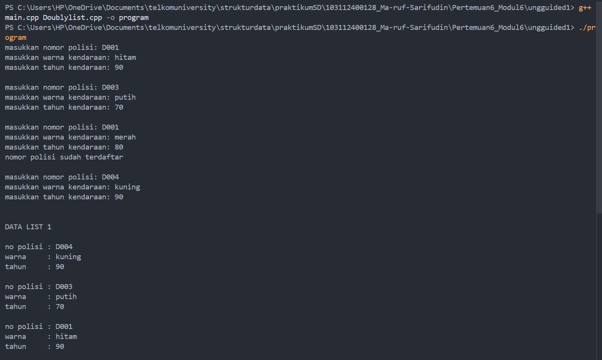
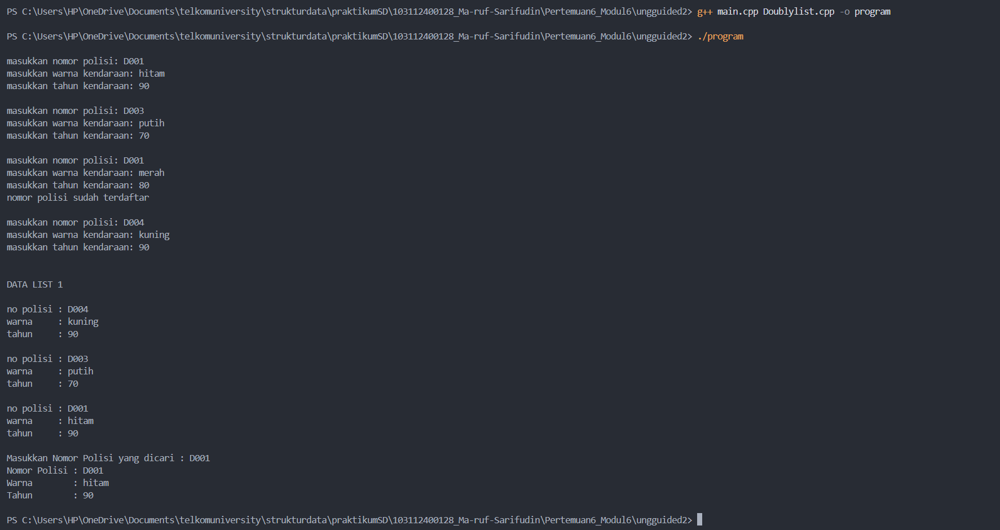
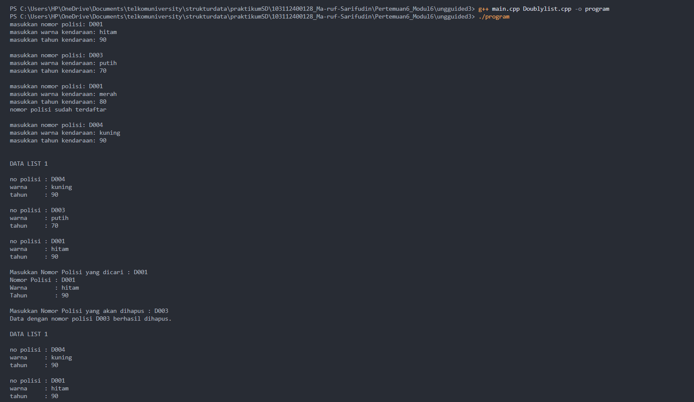

# <h1 align="center">Laporan Praktikum Modul 6 - DOUBLY LINKED LIST (BAGIAN PERTAMA)</h1>
<p align="center">Ma'ruf Sarifudin - 103112400128</p>


## Dasar Teori

### A.Struktur Data Doubly Linked List
Doubly Linked List (DLL) merupakan salah satu bentuk struktur data berantai (linked list) yang memiliki dua arah keterhubungan antar elemen (node). Setiap node pada struktur ini terdiri atas tiga komponen utama, yaitu data yang menyimpan informasi, pointer prev yang menunjuk ke node sebelumnya, dan pointer next yang menunjuk ke node berikutnya. Dengan adanya dua pointer ini, pergerakan atau penelusuran data dapat dilakukan dari depan ke belakang (forward traversal) maupun dari belakang ke depan (backward traversal), sehingga lebih fleksibel dibandingkan struktur singly linked list yang hanya dapat diakses dari satu arah.  konsep DLL memberikan efisiensi lebih tinggi dalam operasi manipulasi data seperti penyisipan dan penghapusan karena tidak memerlukan pergeseran elemen secara keseluruhan sebagaimana pada array.

Doubly Linked List juga banyak digunakan untuk kasus yang membutuhkan efisiensi pada penghapusan atau penambahan data di posisi tengah list, sebab pointer prev memungkinkan akses langsung ke elemen sebelumnya tanpa harus melakukan traversal dari node pertama. Dalam konteks akademik dan praktis, DLL dinilai sebagai pengembangan dari SLL yang mampu meningkatkan performa dalam pengelolaan data dinamis, terutama pada sistem yang memerlukan perubahan data secara terus-menerus, seperti daftar antrian, sistem transaksi, atau penyimpanan akun pengguna. Dengan kemampuan tersebut, Doubly Linked List sangat relevan diterapkan dalam pengelolaan data berbasis dinamis di mana efisiensi dan fleksibilitas menjadi prioritas utama.[1]


### B.Operasi Dasar pada Doubly Linked List
Dalam implementasi Doubly Linked List, terdapat beberapa operasi dasar yang menjadi pondasi dari seluruh aktivitas manipulasi data di dalamnya. Operasi tersebut mencakup insertFirst, insertLast, insertAfter, dan insertBefore yang berfungsi untuk menambahkan node baru pada posisi tertentu; serta deleteFirst, deleteLast, deleteAfter, dan deleteBefore yang digunakan untuk menghapus node dari list. Selain itu, terdapat pula operasi search atau find, yang digunakan untuk mencari node berdasarkan nilai data tertentu, dan traversal yang digunakan untuk menelusuri seluruh isi list secara berurutan. Menurut jurnal penelitian yang diterbitkan oleh UNIKOM Repository (2023), keberadaan dua pointer (prev dan next) pada setiap node memungkinkan proses penambahan maupun penghapusan data di tengah list dilakukan dengan kompleksitas waktu yang lebih rendah dibandingkan dengan singly linked list, karena node sebelumnya dapat diakses langsung tanpa perlu penelusuran dari awal.

Lebih lanjut, studi oleh Mbejo et al. (2025) dalam Jurnal Sains Informatika Terapan (JSIT) menunjukkan bahwa penerapan struktur data linked list, termasuk Doubly Linked List, secara signifikan meningkatkan fleksibilitas sistem yang memerlukan manipulasi data dinamis seperti penambahan dan penghapusan yang sering terjadi. Struktur ini juga memungkinkan efisiensi dalam penggunaan memori karena node dialokasikan secara dinamis menggunakan mekanisme manajemen memori heap. Penggunaan DLL dalam sistem data yang sering berubah memberikan keuntungan berupa efisiensi waktu dan kemudahan perawatan kode karena perubahan struktur list tidak bergantung pada ukuran atau lokasi elemen lainnya. Hal ini menjadikan Doubly Linked List sebagai salah satu struktur data paling penting dalam pemrograman modern, khususnya dalam aplikasi yang berorientasi pada manajemen data kompleks 

### C.Penerapan pada Sistem Penyimpanan Data Akun
Dalam konteks tugas praktikum ini, struktur Doubly Linked List digunakan untuk mengelola data akun pengguna yang terdiri dari username dan password dengan syarat username bersifat unik. Implementasi DLL pada sistem ini sangat sesuai karena data akun dapat dimanipulasi secara fleksibel — baik untuk proses registrasi, pencarian akun, maupun penghapusan akun. Operasi insertLast digunakan untuk menambahkan akun baru di bagian akhir list, sementara deleteFirst, deleteLast, dan deleteAfter digunakan untuk menghapus akun pada posisi tertentu tanpa perlu menggeser elemen-elemen lain sebagaimana pada array. Proses pencarian akun (findAkun) dilakukan melalui traversal dari node pertama hingga terakhir, memastikan setiap username unik dapat diverifikasi sebelum ditambahkan ke dalam list.

Penggunaan Doubly Linked List dalam sistem penyimpanan data memungkinkan perubahan data secara dinamis tanpa membebani sistem dengan alokasi memori statis. Selain itu,  juga mengemukakan bahwa algoritma Doubly Linked List sangat efektif untuk operasi penyisipan (insertion) dan penghapusan (deletion) data dalam aplikasi berbasis manajemen akun atau data dinamis. Penerapan konsep tersebut dalam program praktikum ini menunjukkan bahwa DLL tidak hanya efisien secara teori, tetapi juga relevan secara praktis dalam membangun aplikasi berbasis data yang memerlukan fleksibilitas tinggi, seperti sistem login, database pengguna, atau aplikasi keuangan sederhana.


## Guided 

##### 1. guided 1 

### 1. File ListMakanan.h 
```C++
#ifndef LISTMAKANAN_H
#define LISTMAKANAN_H
#define Nil NULL

#include<iostream>
using namespace std;

struct makanan{
    string nama;
    string jenis; 
    float harga;
    float rating; 
};

typedef makanan dataMakanan;

typedef struct node *address;

struct node{
    dataMakanan isidata;
    address next;
    address prev;
};

struct linkedlist{
    address first;
    address last;
};

bool isEmpty(linkedlist List);
void createList(linkedlist &List);
address alokasi(string nama, string jenis, float harga, float rating);
void dealokasi(address &node);

void insertFirst(linkedlist &List, address nodeBaru);
void insertLast(linkedlist &List, address nodeBaru);
void insertAfter(linkedlist &List, address nodeBaru, address Prev);
void insertBefore(linkedlist &List, address nodeBaru, address nodeNext);

void printList(linkedlist List);

void updateFirst(linkedlist List);
void updateLast(linkedlist List);
void updateAfter(linkedlist List, address prev);
void updateBefore(linkedlist List, address nodeNext);

#endif

```


### 2. File ListMakanan.cpp 

```C++

#include "ListMakanan.h"
#include <iostream>
using namespace std;

bool isEmpty(linkedlist List) {
    if(List.first == Nil){
        return true; 
    } else {
        return false;
    }
}

void createList(linkedlist &List) {
    List.first = Nil;
    List.last = Nil;
}

//pembuatan node baru dengan menerapkan manajemen memori
address alokasi(string nama, string jenis, float harga, float rating) { 
    address nodeBaru = new node;
    nodeBaru->isidata.nama = nama;
    nodeBaru->isidata.jenis = jenis; 
    nodeBaru->isidata.harga = harga;
    nodeBaru->isidata.rating =  rating;
    nodeBaru->next = Nil;
    nodeBaru->prev = Nil;
    return nodeBaru;
}

void dealokasi(address &node) {
    node->next = Nil;
    node->prev = Nil;
    delete node;
}

void insertFirst(linkedlist &List, address nodeBaru){
    if (isEmpty(List)) {
        List.first = List.last = nodeBaru;
    } else {
        nodeBaru->next = List.first;
        List.first->prev = nodeBaru;
        List.first = nodeBaru;
    }
    cout << "Node " << nodeBaru->isidata.nama << " berhasil ditambahkan sebagai node pertama list" << endl;
}

void insertLast(linkedlist &List, address nodeBaru){
    if(isEmpty(List) == true){
        List.first = List.last = nodeBaru;
    } else {
        nodeBaru->prev = List.last;
        List.last->next = nodeBaru;
        List.last = nodeBaru;
    }
    cout << "Node " << nodeBaru->isidata.nama << " berhasil ditambahkan sebagai node terakhir list" << endl;
}

void insertAfter(linkedlist &List, address nodeBaru, address nodePrev){
    if(isEmpty(List) == true){
        List.first = List.last = nodeBaru;
    } else {
        if (nodePrev != Nil){
            if(nodePrev == List.last){
                insertLast(List, nodeBaru);
            } else {
                nodeBaru->next = nodePrev->next;
                nodeBaru->prev = nodePrev;
                (nodePrev->next)->prev = nodeBaru;
                nodePrev->next = nodeBaru;
                cout << "Node " << nodeBaru->isidata.nama << " berhasil ditambahkan setelah node " << nodePrev->isidata.nama << endl;
            }
        } else {
            cout << "node sebelumnya (nodePrev) tidak valid!" << endl;
        }
    }
}

void insertBefore(linkedlist &List, address nodeBaru, address nodeNext){
    if(isEmpty(List) == true){
        List.first = List.last = nodeBaru;
    } else {
        if (nodeNext != Nil){
            if(nodeNext == List.first){
                insertFirst(List, nodeBaru);
            } else {
                nodeBaru->next = nodeNext;
                nodeBaru->prev = nodeNext->prev;
                (nodeNext->prev)->next = nodeBaru;
                nodeNext->prev = nodeBaru;
                cout << "Node " << nodeBaru->isidata.nama << " berhasil ditambahkan sebelum node " << nodeNext->isidata.nama << endl;
            }
        } else {
            cout << "node setelahnya (nodeNext) tidak valid!" << endl;
        }
    }
}

void printList(linkedlist List) {
    if (isEmpty(List) == true) {
        cout << "List kosong!" << endl;
    } else {
        address nodeBantu = List.first;
        while (nodeBantu != Nil) { 
            cout << "Nama makanan : " << nodeBantu->isidata.nama << endl;
            cout << "Jenis        : " << nodeBantu->isidata.jenis << endl;
            cout << "Harga        : " << nodeBantu->isidata.harga << endl; 
            cout << "Rating       : " << nodeBantu->isidata.rating << endl;
            cout << "-------------------------------" << endl;
            nodeBantu = nodeBantu->next;
        }
    }
}

void updateFirst(linkedlist List){
    if(isEmpty(List) == true){
        cout << "List kosong!" << endl;
    } else {
        cout << "Masukkan update data node pertama : " << endl;
        cout << "Nama makanan : ";
        getline(cin, List.first->isidata.nama);
        cout << "Jenis makanan : ";
        getline(cin, List.first->isidata.jenis);
        cout << "Harga : ";
        cin >> List.first->isidata.harga;
        cout << "Rating : ";
        cin >> List.first->isidata.rating;
        cin.ignore(); //menghapus karakter newline (/n) dari input buffer
        cout << "Data Berhasil Diupdate!" << endl;
        cout << endl; 
    }
}

void updateLast(linkedlist List){
    if(isEmpty(List) == true){
        cout << "List kosong!" << endl;
    } else {
        cout << "Masukkan update data node terakhir : " << endl;
        cout << "Nama makanan : ";
        getline(cin, List.last->isidata.nama);
        cout << "Jenis makanan : ";
        getline(cin, List.last->isidata.jenis);
        cout << "Harga : ";
        cin >> List.last->isidata.harga;
        cout << "Rating : ";
        cin >> List.last->isidata.rating;
        cin.ignore(); //menghapus karakter newline (/n) dari input buffer
        cout << "Data Berhasil Diupdate!" << endl;
        cout << endl; 
    }
}

void updateAfter(linkedlist List, address nodePrev){
    if(isEmpty(List) == true){
        cout << "List kosong!" << endl;
    } else {
        if(nodePrev != Nil && nodePrev->next != Nil){
            address nodeBantu = nodePrev->next;
            cout << "masukkan update data node setelah node " << nodePrev->isidata.nama << " : " << endl;
            cout << "Nama makanan : ";
            getline(cin, nodeBantu->isidata.nama);
            cout << "Jenis makanan : ";
            getline(cin, nodeBantu->isidata.jenis);
            cout << "Harga : ";
            cin >> nodeBantu->isidata.harga;
            cout << "Rating : ";
            cin >> nodeBantu->isidata.rating;
            cin.ignore(); //menghapus karakter newline (/n) dari input buffer
            cout << "Data Berhasil Diupdate!" << endl;
            cout << endl;
        } else {
            cout << "Node sebelumnya (nodePrev) tidak valid!" << endl;
        }
    }
}

void updateBefore(linkedlist List, address nodeNext){
    if(isEmpty(List) == true){
        cout << "List kosong!" << endl;
    } else {
        if (nodeNext != Nil && nodeNext->prev != Nil){
            address nodeBantu = nodeNext->prev;
            cout << "masukkan update data node sebelum node " << nodeNext->isidata.nama << " : " << endl;
            cout << "Nama makanan : ";
            getline(cin, nodeBantu->isidata.nama);
            cout << "Jenis makanan : ";
            getline(cin, nodeBantu->isidata.jenis);
            cout << "Harga : ";
            cin >> nodeBantu->isidata.harga;
            cout << "Rating : ";
            cin >> nodeBantu->isidata.rating;
            cin.ignore(); //menghapus karakter newline (/n) dari input buffer
            cout << "Data Berhasil Diupdate!" << endl;
            cout << endl;
        } else {
            cout << "Node sebelumnya (prev) tidak valid!" << endl;
        }
    }
}


```

### 3. File main.cpp 

```C++

#include "ListMakanan.h"
#include <iostream>

using namespace std;

int main(){
    linkedlist List;
    address nodeA, nodeB, nodeC, nodeD, nodeE = Nil;
    createList(List);

    dataMakanan dtMakanan;

    nodeA = alokasi("Nasi Rames", "Makanan Berat", 10000, 8.5);
    nodeB = alokasi("Ayam Geprek", "Makanan Berat", 13000, 9.0);
    nodeC = alokasi("Risol Mayo", "Makanan Ringan", 3500, 8.8);
    nodeD = alokasi("Mie Ayam", "Makanan Berat", 15000, 9.9);
    nodeE = alokasi("Donat", "Makanan Ringan", 2000, 7.7);

    insertFirst(List, nodeD);
    insertLast(List, nodeE);
    insertAfter(List, nodeA, nodeD);
    insertBefore(List, nodeC, nodeE);
    insertLast(List, nodeB);
    cout << endl;

    //D - A - C - E - B
    cout << "--- Isi List Setelah Insert ---" << endl;
    printList(List);
    cout << endl;

    updateFirst(List);
    updateLast(List);
    updateBefore(List, nodeC);
    updateAfter(List, nodeC);

    cout << "--- Isi List Setelah Update ---" << endl;
    printList(List);

    return 0;
}

```
Program ini adalah implementasi dari Doubly Linked List (DLL) yang dirancang khusus untuk mengelola data makanan, di mana setiap makanan memiliki nama, jenis, harga, dan rating. Pendekatan yang digunakan adalah modular, memisahkan kode menjadi tiga file utama. File listMakanan.h bertindak sebagai header yang mendefinisikan struktur data, yaitu struct makanan untuk datanya, struct node yang kini memiliki dua pointer (next dan prev ), dan struct linkedlist yang menyimpan pointer first dan last . File ini juga mendaftarkan semua prototipe fungsi, termasuk fungsi baru seperti insertBefore dan updateBefore yang dimungkinkan oleh adanya pointer prev. File listMakanan.cpp berisi implementasi detail dari semua fungsi tersebut, menunjukkan bagaimana operasi seperti insertFirst, insertLast, dan insertAfter kini memanipulasi pointer prev selain next untuk menjaga koneksi dua arah , serta fungsi update yang memungkinkan perubahan data. Terakhir, file main.cpp bertindak sebagai program utama yang menjalankan logika: ia membuat lima node makanan, menyisipkannya ke dalam list menggunakan berbagai fungsi (seperti insertFirst, insertLast, insertAfter, dan insertBefore) untuk membentuk list D -> A -> C -> E -> B, lalu menampilkan list tersebut. Setelah itu, program memanggil serangkaian fungsi update (seperti updateFirst, updateLast, updateBefore, dan updateAfter) untuk mengubah data makanan di dalam list, dan akhirnya menampilkan isi list yang sudah diperbarui.

##### 2. guided 2 

### 1. File ListMakanan.h 
```C++
#ifndef LISTMAKANAN_H
#define LISTMAKANAN_H
#define Nil NULL

#include<iostream>
using namespace std;

struct makanan{
    string nama;
    string jenis; 
    float harga;
    float rating; 
};

typedef makanan dataMakanan;

typedef struct node *address;

struct node{
    dataMakanan isidata;
    address next;
    address prev;
};

struct linkedlist{
    address first;
    address last;
};

bool isEmpty(linkedlist List);
void createList(linkedlist &List);
address alokasi(string nama, string jenis, float harga, float rating);
void dealokasi(address &node);

void insertFirst(linkedlist &List, address nodeBaru);
void insertLast(linkedlist &List, address nodeBaru);
void insertAfter(linkedlist &List, address nodeBaru, address Prev);
void insertBefore(linkedlist &List, address nodeBaru, address nodeNext);

void printList(linkedlist List);

void updateFirst(linkedlist List);
void updateLast(linkedlist List);
void updateAfter(linkedlist List, address prev);
void updateBefore(linkedlist List, address nodeNext);

// Searching
void findByName(linkedlist List, string nama);
void findByJenis(linkedlist List, string jenis);
void findByMinRating(linkedlist List, float minRating);

// Delete
void deleteFirst(linkedlist &List);
void deleteLast(linkedlist &List);
void deleteAfter(linkedlist &List, address Prev);
void deleteBefore(linkedlist &List, address nodeNext);

void deleteNode(linkedlist &List, address target);
void deleteByName(linkedlist &List, string nama);

#endif

```


### 2. File ListMakanan.cpp 

```C++

#include "listMakanan.h"
#include <iostream>
#include <string>
using namespace std;

bool isEmpty(linkedlist List) {
    if(List.first == Nil){
        return true; 
    } else {
        return false;
    }
}

void createList(linkedlist &List) {
    List.first = Nil;
    List.last = Nil;
}

//pembuatan node baru dengan menerapkan manajemen memori
address alokasi(string nama, string jenis, float harga, float rating) { 
    address nodeBaru = new node;
    nodeBaru->isidata.nama = nama;
    nodeBaru->isidata.jenis = jenis; 
    nodeBaru->isidata.harga = harga;
    nodeBaru->isidata.rating =  rating;
    nodeBaru->next = Nil;
    nodeBaru->prev = Nil;
    return nodeBaru;
}

void dealokasi(address &node) {
    node->next = Nil;
    node->prev = Nil;
    delete node;
}

void insertFirst(linkedlist &List, address nodeBaru){
    if (isEmpty(List)) {
        List.first = List.last = nodeBaru;
    } else {
        nodeBaru->next = List.first;
        List.first->prev = nodeBaru;
        List.first = nodeBaru;
    }
    cout << "Node " << nodeBaru->isidata.nama << " berhasil ditambahkan sebagai node pertama list" << endl;
}

void insertLast(linkedlist &List, address nodeBaru){
    if(isEmpty(List) == true){
        List.first = List.last = nodeBaru;
    } else {
        nodeBaru->prev = List.last;
        List.last->next = nodeBaru;
        List.last = nodeBaru;
    }
    cout << "Node " << nodeBaru->isidata.nama << " berhasil ditambahkan sebagai node terakhir list" << endl;
}

void insertAfter(linkedlist &List, address nodeBaru, address nodePrev){
    if(isEmpty(List) == true){
        List.first = List.last = nodeBaru;
    } else {
        if (nodePrev != Nil){
            if(nodePrev == List.last){
                insertLast(List, nodeBaru);
            } else {
                nodeBaru->next = nodePrev->next;
                nodeBaru->prev = nodePrev;
                (nodePrev->next)->prev = nodeBaru;
                nodePrev->next = nodeBaru;
                cout << "Node " << nodeBaru->isidata.nama << " berhasil ditambahkan setelah node " << nodePrev->isidata.nama << endl;
            }
        } else {
            cout << "node sebelumnya (nodePrev) tidak valid!" << endl;
        }
    }
}

void insertBefore(linkedlist &List, address nodeBaru, address nodeNext){
    if(isEmpty(List) == true){
        List.first = List.last = nodeBaru;
    } else {
        if (nodeNext != Nil){
            if(nodeNext == List.first){
                insertFirst(List, nodeBaru);
            } else {
                nodeBaru->next = nodeNext;
                nodeBaru->prev = nodeNext->prev;
                (nodeNext->prev)->next = nodeBaru;
                nodeNext->prev = nodeBaru;
                cout << "Node " << nodeBaru->isidata.nama << " berhasil ditambahkan sebelum node " << nodeNext->isidata.nama << endl;
            }
        } else {
            cout << "node setelahnya (nodeNext) tidak valid!" << endl;
        }
    }
}

void printList(linkedlist List) {
    if (isEmpty(List) == true) {
        cout << "List kosong!" << endl;
    } else {
        address nodeBantu = List.first;
        while (nodeBantu != Nil) { 
            cout << "Nama makanan : " << nodeBantu->isidata.nama << endl;
            cout << "Jenis        : " << nodeBantu->isidata.jenis << endl;
            cout << "Harga        : " << nodeBantu->isidata.harga << endl; 
            cout << "Rating       : " << nodeBantu->isidata.rating << endl;
            cout << "-------------------------------" << endl;
            nodeBantu = nodeBantu->next;
        }
    }
}

void updateFirst(linkedlist List){
    if(isEmpty(List) == true){
        cout << "List kosong!" << endl;
    } else {
        cout << "Masukkan update data node pertama : " << endl;
        cout << "Nama makanan : ";
        getline(cin, List.first->isidata.nama);
        cout << "Jenis makanan : ";
        getline(cin, List.first->isidata.jenis);
        cout << "Harga : ";
        cin >> List.first->isidata.harga;
        cout << "Rating : ";
        cin >> List.first->isidata.rating;
        cin.ignore(); //menghapus karakter newline (/n) dari input buffer
        cout << "Data Berhasil Diupdate!" << endl;
        cout << endl; 
    }
}

void updateLast(linkedlist List){
    if(isEmpty(List) == true){
        cout << "List kosong!" << endl;
    } else {
        cout << "Masukkan update data node terakhir : " << endl;
        cout << "Nama makanan : ";
        getline(cin, List.last->isidata.nama);
        cout << "Jenis makanan : ";
        getline(cin, List.last->isidata.jenis);
        cout << "Harga : ";
        cin >> List.last->isidata.harga;
        cout << "Rating : ";
        cin >> List.last->isidata.rating;
        cin.ignore(); //menghapus karakter newline (/n) dari input buffer
        cout << "Data Berhasil Diupdate!" << endl;
        cout << endl; 
    }
}

void updateAfter(linkedlist List, address nodePrev){
    if(isEmpty(List) == true){
        cout << "List kosong!" << endl;
    } else {
        if(nodePrev != Nil && nodePrev->next != Nil){
            address nodeBantu = nodePrev->next;
            cout << "masukkan update data node setelah node " << nodePrev->isidata.nama << " : " << endl;
            cout << "Nama makanan : ";
            getline(cin, nodeBantu->isidata.nama);
            cout << "Jenis makanan : ";
            getline(cin, nodeBantu->isidata.jenis);
            cout << "Harga : ";
            cin >> nodeBantu->isidata.harga;
            cout << "Rating : ";
            cin >> nodeBantu->isidata.rating;
            cin.ignore(); //menghapus karakter newline (/n) dari input buffer
            cout << "Data Berhasil Diupdate!" << endl;
            cout << endl;
        } else {
            cout << "Node sebelumnya (nodePrev) tidak valid!" << endl;
        }
    }
}

void updateBefore(linkedlist List, address nodeNext){
    if(isEmpty(List) == true){
        cout << "List kosong!" << endl;
    } else {
        if (nodeNext != Nil && nodeNext->prev != Nil){
            address nodeBantu = nodeNext->prev;
            cout << "masukkan update data node sebelum node " << nodeNext->isidata.nama << " : " << endl;
            cout << "Nama makanan : ";
            getline(cin, nodeBantu->isidata.nama);
            cout << "Jenis makanan : ";
            getline(cin, nodeBantu->isidata.jenis);
            cout << "Harga : ";
            cin >> nodeBantu->isidata.harga;
            cout << "Rating : ";
            cin >> nodeBantu->isidata.rating;
            cin.ignore(); //menghapus karakter newline (/n) dari input buffer
            cout << "Data Berhasil Diupdate!" << endl;
            cout << endl;
        } else {
            cout << "Node sebelumnya (prev) tidak valid!" << endl;
        }
    }
}

// SEARCHING
void findByName(linkedlist List, string nama){
    if(isEmpty(List)){
        cout << "List kosong!" << endl;
        return;
    }
    address p = List.first;
    while(p != Nil){
        if(p->isidata.nama == nama){
            cout << "Ditemukan (berdasarkan nama):" << endl;
            cout << "Nama makanan : " << p->isidata.nama << endl;
            cout << "Jenis        : " << p->isidata.jenis << endl;
            cout << "Harga        : " << p->isidata.harga << endl;
            cout << "Rating       : " << p->isidata.rating << endl;
            return;
        }
        p = p->next;
    }
    cout << "Data dengan nama \"" << nama << "\" tidak ditemukan." << endl;
}

void findByJenis(linkedlist List, string jenis){
    if(isEmpty(List)){
        cout << "List kosong!" << endl;
        return;
    }
    address p = List.first;
    while(p != Nil){
        if(p->isidata.jenis == jenis){
            cout << "Ditemukan (berdasarkan jenis):" << endl;
            cout << "Nama makanan : " << p->isidata.nama << endl;
            cout << "Jenis        : " << p->isidata.jenis << endl;
            cout << "Harga        : " << p->isidata.harga << endl;
            cout << "Rating       : " << p->isidata.rating << endl;
            return;
        }
        p = p->next;
    }
    cout << "Data dengan jenis \"" << jenis << "\" tidak ditemukan." << endl;
}

void findByMinRating(linkedlist List, float minRating){
    if(isEmpty(List)){
        cout << "List kosong!" << endl;
        return;
    }
    address p = List.first;
    while(p != Nil){
        if(p->isidata.rating >= minRating){
            cout << "Ditemukan (rating >= " << minRating << "):" << endl;
            cout << "Nama makanan : " << p->isidata.nama << endl;
            cout << "Jenis        : " << p->isidata.jenis << endl;
            cout << "Harga        : " << p->isidata.harga << endl;
            cout << "Rating       : " << p->isidata.rating << endl;
            return;
        }
        p = p->next;
    }
    cout << "Tidak ada data dengan rating >= " << minRating << "." << endl;
}

// DELETE
void deleteFirst(linkedlist &List){
    if(isEmpty(List) == true){
        cout << "List kosong! Tidak ada node yang dihapus." << endl;
        return;
    }
    address pDel = List.first;
    if(List.first == List.last){
        List.first = List.last = Nil;
    } else {
        List.first = pDel->next;
        List.first->prev = Nil;
        pDel->next = Nil;
    }
    pDel->prev = Nil;
    cout << "Node " << pDel->isidata.nama << " berhasil dihapus dari posisi pertama." << endl;
    dealokasi(pDel);
}

void deleteLast(linkedlist &List){
    if(isEmpty(List) == true){
        cout << "List kosong! Tidak ada node yang dihapus." << endl;
        return;
    }
    address pDel = List.last;
    if(List.first == List.last){
        List.first = List.last = Nil;
    } else {
        List.last = pDel->prev;
        List.last->next = Nil;
        pDel->prev = Nil;
    }
    pDel->next = Nil;
    cout << "Node " << pDel->isidata.nama << " berhasil dihapus dari posisi terakhir." << endl;
    dealokasi(pDel);
}

void deleteAfter(linkedlist &List, address Prev){
    if(isEmpty(List) == true){
        cout << "List kosong! Tidak ada node yang dihapus." << endl;
        return;
    }
    if(Prev == Nil || Prev->next == Nil){
        cout << "Node sebelumnya (Prev) tidak valid atau tidak ada node setelahnya!" << endl;
        return;
    }
    if(Prev->next == List.last){
        deleteLast(List);
        return;
    }
    address pDel = Prev->next;
    Prev->next = pDel->next;
    pDel->next->prev = Prev;
    pDel->next = Nil;
    pDel->prev = Nil;
    cout << "Node " << pDel->isidata.nama << " berhasil dihapus setelah node " << Prev->isidata.nama << "." << endl;
    dealokasi(pDel);
}

void deleteBefore(linkedlist &List, address nodeNext){
    if(isEmpty(List) == true){
        cout << "List kosong! Tidak ada node yang dihapus." << endl;
        return;
    }
    if(nodeNext == Nil || nodeNext->prev == Nil){
        cout << "Node setelahnya (nodeNext) tidak valid atau tidak ada node sebelumnya!" << endl;
        return;
    }
    if(nodeNext->prev == List.first){
        deleteFirst(List);
        return;
    }
    address pDel = nodeNext->prev;
    nodeNext->prev = pDel->prev;
    pDel->prev->next = nodeNext;
    pDel->next = Nil;
    pDel->prev = Nil;
    cout << "Node " << pDel->isidata.nama << " berhasil dihapus sebelum node " << nodeNext->isidata.nama << "." << endl;
    dealokasi(pDel);
}

void deleteNode(linkedlist &List, address target){
    if(isEmpty(List) == true || target == Nil){
        cout << "Target tidak valid atau list kosong!" << endl;
        return;
    }
    if(target == List.first){
        deleteFirst(List);
    } else if(target == List.last){
        deleteLast(List);
    } else {
        address L = target->prev;
        address R = target->next;
        L->next = R;
        R->prev = L;
        target->next = Nil;
        target->prev = Nil;
        cout << "Node " << target->isidata.nama << " berhasil dihapus dari tengah list." << endl;
        dealokasi(target);
    }
}

void deleteByName(linkedlist &List, string nama){
    if(isEmpty(List)){
        cout << "List kosong! Tidak ada node yang dihapus." << endl;
        return;
    }

    address target = List.first;
    while(target != Nil && target->isidata.nama != nama){
        target = target->next;
    }
    if(target == Nil){
        cout << "Node dengan nama \"" << nama << "\" tidak ditemukan." << endl;
        return;
    }

    deleteNode(List, target);
    cout << "Node dengan nama \"" << nama << "\" telah dihapus dan didealokasi." << endl;
}


```

### 3. File main.cpp 

```C++

	#include "listMakanan.h"
#include <iostream>

using namespace std;

int main(){
    linkedlist List;
    address nodeA, nodeB, nodeC, nodeD, nodeE = Nil;
    createList(List);

    dataMakanan dtMakanan;

    nodeA = alokasi("Nasi Rames", "Makanan Berat", 10000, 8.5);
    nodeB = alokasi("Ayam Geprek", "Makanan Berat", 13000, 9.0);
    nodeC = alokasi("Risol Mayo", "Makanan Ringan", 3500, 8.8);
    nodeD = alokasi("Mie Ayam", "Makanan Berat", 15000, 9.9);
    nodeE = alokasi("Donat", "Makanan Ringan", 2000, 7.7);

    insertFirst(List, nodeD);
    insertLast(List, nodeE);
    insertAfter(List, nodeA, nodeD);
    insertBefore(List, nodeC, nodeE);
    insertLast(List, nodeB);
    cout << endl;

    //D - A - C - E - B
    cout << "--- Isi List Setelah Insert ---" << endl;
    printList(List);
    cout << endl;

    updateFirst(List);
    updateLast(List);
    updateBefore(List, nodeC);
    updateAfter(List, nodeA);

    cout << "--- Isi List Setelah Update ---" << endl;
    printList(List);

    cout << endl;

    findByName(List, "Nasgor");

    deleteByName(List, "Nasgor");
    deleteFirst(List);
    deleteBefore(List, nodeE);

    cout << endl << "--- Isi List Setelah Delete ---" << endl;
    printList(List);

    return 0;
}

```
Program ini adalah lanjutan dari guided sebelumnya, di mana pada guided 1  telah belajar membuat dasar-dasar Doubly Linked List (menggunakan pointer prev dan last ) dan mengimplementasikan fungsi-fungsi penyisipan (insertFirst, insertLast, insertAfter, insertBefore) serta pembaruan (updateFirst, updateLast, updateAfter, updateBefore) data makanan. Pada guided 2 ini melengkapi ADT tersebut dengan menambahkan fungsionalitas pencarian (searching) dan penghapusan (delete). File listMakanan.h diperbarui dengan prototipe untuk fungsi-fungsi baru seperti findByName, findByJenis (untuk mencari data) serta deleteFirst, deleteLast, deleteAfter, deleteBefore, deleteNode, dan deleteByName (untuk menghapus data). Sesuai dengan itu, file listMakanan.cpp kini berisi implementasi lengkap untuk semua fungsi delete dan search tersebut, menjelaskan bagaimana cara menghapus node (seperti deleteFirst atau deleteNode ) dengan tetap menjaga sambungan pointer prev dan next dari node di sekitarnya agar list tidak terputus. File main.cpp kemudian mendemonstrasikan semua fitur ini: setelah membuat, mengisi, dan meng-update list (seperti di guided 1), program kini juga memanggil findByName untuk mencari data, lalu memanggil deleteByName, deleteFirst, dan deleteBefore untuk menghapus beberapa node, sebelum akhirnya mencetak isi list terakhir.

## Unguided 

### 1. Soal Unguided 1

Buatlah ADT Doubly Linked list sebagai berikut di dalam file “Doublylist.h”:
Type infotype : kendaraan <
nopol : string
warna : string
thnBuat : integer
>
Type address : pointer to ElmList
Type ElmList <
info : infotype
next :address
prev : address
>
Type List <
First : address
Last : address
>
procedure CreateList( input/output L : List )
function alokasi( x : infotype ) → address
procedure dealokasi(input/output P : address )
procedure printInfo( input L : List )
procedure insertLast(input/output L : List,
input P : address )
Buatlah implementasi ADT Doubly Linked list pada file “Doublylist.cpp” dan coba hasil
implementasi ADT pada file “main.cpp”.


## 1. file Duoblylist.h
```C++
#ifndef DOUBLYLIST_H
#define DOUBLYLIST_H
#define Nil nullptr

#include <iostream>
#include <string>
using namespace std;

struct kendaraan {
    string nopol;
    string warna;
    int thnBuat;
};

typedef kendaraan infotype;
typedef struct ElmList *address;

struct ElmList {
    infotype info;
    address next;
    address prev;
};

struct List {
    address First;
    address Last;
};

void CreateList(List &L);
address alokasi(infotype x);
void dealokasi(address &P);
void printInfo(List L);
void insertLast(List &L, address P);

bool isEmpty(List L);
void insertFirst(List &L, address P);
address findByNopol(List L, string nopol);

#endif

```

## 2. file Doublylist.cpp
```C++
#include "Doublylist.h"

void CreateList(List &L) {
    L.First = Nil;
    L.Last = Nil;
}

address alokasi(infotype x) {
    address P = new ElmList;
    P->info = x;
    P->next = Nil;
    P->prev = Nil;
    return P;
}

void dealokasi(address &P) {
    delete P;
    P = Nil;
}

bool isEmpty(List L) {
    return (L.First == Nil);
}

void insertFirst(List &L, address P) {
    if (isEmpty(L)) {
        L.First = P;
        L.Last = P;
    } else {
        P->next = L.First;
        L.First->prev = P;
        L.First = P;
    }
}

void insertLast(List &L, address P) {
    if (isEmpty(L)) {
        L.First = P;
        L.Last = P;
    } else {
        P->prev = L.Last;
        L.Last->next = P;
        L.Last = P;
    }
}

void printInfo(List L) {
    if (isEmpty(L)) {
        cout << "List kosong." << endl;
        return;
    }

    address P = L.First;
    cout << "DATA LIST 1" << endl;
    cout << endl;

    while (P != Nil) {
        cout << "no polisi : " << P->info.nopol << endl;
        cout << "warna     : " << P->info.warna << endl;
        cout << "tahun     : " << P->info.thnBuat << endl;
        cout << endl;
        P = P->next;
    }
}

address findByNopol(List L, string nopol) {
    address P = L.First;
    while (P != Nil) {
        if (P->info.nopol == nopol) {
            return P;
        }
        P = P->next;
    }
    return Nil;
}


```
## 3. file main.cpp

```C++
#include "Doublylist.h"
#include <iostream>
#include <string>

using namespace std;

int main() {
    List L;
    CreateList(L);
    address P;
    infotype data;
    string nopol;

    for (int i = 0; i < 4; i++) {
        cout << "masukkan nomor polisi: ";
        cin >> nopol;
        
        if (findByNopol(L, nopol) != Nil) {
            cout << "masukkan warna kendaraan: ";
            cin >> data.warna;
            cout << "masukkan tahun kendaraan: ";
            cin >> data.thnBuat;
            cout << "nomor polisi sudah terdaftar" << endl;
        } else {
            data.nopol = nopol;
            cout << "masukkan warna kendaraan: ";
            cin >> data.warna;
            cout << "masukkan tahun kendaraan: ";
            cin >> data.thnBuat;
            
            P = alokasi(data);
            insertFirst(L, P);
        }
        cout << endl;
    }
    
    cout << endl;
    printInfo(L);

    return 0;
}

```

### Output Unguided 1 :

##### Output 1



penjelasan unguided 1 

Program ini merupakan implementasi dari ADT Doubly Linked List (DLL) yang dirancang untuk mengelola data kendaraan, dengan setiap kendaraan memiliki nomor polisi, warna, dan tahun buat. Kode ini disusun secara modular menggunakan tiga file. File Doublylist.h berfungsi sebagai header yang mendefinisikan struktur kendaraan, ElmList (sebagai node yang memiliki pointer next dan prev ), dan List (yang memiliki pointer First dan Last ). Header ini juga mendaftarkan prototipe fungsi-fungsi dasar seperti CreateList, alokasi, dealokasi, printInfo, insertLast (sesuai permintaan soal ), serta fungsi tambahan insertFirst dan findByNopol yang diperlukan agar program bisa berjalan sesuai contoh output.

File Doublylist.cpp berisi implementasi dari semua fungsi tersebut. CreateList menginisialisasi First dan Last ke Nil. alokasi membuat node baru dengan pointer next dan prev diatur ke Nil. Fungsi insertFirst dan insertLast menangani penambahan node baru di kedua ujung list, dengan cermat memperbarui pointer prev dan next untuk menjaga sambungan dua arah, termasuk menangani kasus khusus saat list masih kosong. printInfo bertugas mencetak semua data kendaraan dari First ke Last, dan findByNopol digunakan untuk mencari node berdasarkan nomor polisi, mengembalikan alamat node jika ditemukan atau Nil jika tidak.

Terakhir, file main.cpp mensimulasikan proses input data. Program ini menggunakan loop for untuk meminta pengguna memasukkan data kendaraan sebanyak empat kali. Di dalam loop, program terlebih dahulu memeriksa apakah nomor polisi yang baru dimasukkan sudah ada di dalam list menggunakan findByNopol. Jika nomor polisi belum ada, data kendaraan baru akan dialokasi dan ditambahkan ke awal list menggunakan insertFirst. Jika nomor polisi sudah ada, program akan mencetak pesan "nomor polisi sudah terdaftar". Setelah loop selesai, printInfo(L) dipanggil untuk menampilkan seluruh isi list akhir. Karena program selalu menggunakan insertFirst, data yang terakhir kali berhasil dimasukkan (seperti "D004") akan muncul di urutan pertama, sesuai dengan contoh output yang diharapkan.

### 2. Soal unguided 2

Carilah elemen dengan nomor polisi D001 dengan membuat fungsi baru.
fungsi findElm( L : List, x : infotype ) : address


### 1. file Doublylist.h

```C++
#ifndef DOUBLYLIST_H
#define DOUBLYLIST_H
#define Nil nullptr

#include <iostream>
#include <string>
using namespace std;

struct kendaraan {
    string nopol;
    string warna;
    int thnBuat;
};

typedef kendaraan infotype;
typedef struct ElmList *address;

struct ElmList {
    infotype info;
    address next;
    address prev;
};

struct List {
    address First;
    address Last;
};

void CreateList(List &L);
address alokasi(infotype x);
void dealokasi(address &P);
void printInfo(List L);
void insertLast(List &L, address P);
bool isEmpty(List L);
void insertFirst(List &L, address P);

address findElm(List L, infotype x);

#endif


```

### 2. file Doublylist.cpp

```C++
#include "Doublylist.h"

void CreateList(List &L) {
    L.First = Nil;
    L.Last = Nil;
}

address alokasi(infotype x) {
    address P = new ElmList;
    P->info = x;
    P->next = Nil;
    P->prev = Nil;
    return P;
}

void dealokasi(address &P) {
    delete P;
    P = Nil;
}

bool isEmpty(List L) {
    return (L.First == Nil);
}

void insertFirst(List &L, address P) {
    if (isEmpty(L)) {
        L.First = P;
        L.Last = P;
    } else {
        P->next = L.First;
        L.First->prev = P;
        L.First = P;
    }
}

void insertLast(List &L, address P) {
    if (isEmpty(L)) {
        L.First = P;
        L.Last = P;
    } else {
        P->prev = L.Last;
        L.Last->next = P;
        L.Last = P;
    }
}

void printInfo(List L) {
    if (isEmpty(L)) {
        cout << "List kosong." << endl;
        return;
    }

    address P = L.First;
    cout << "DATA LIST 1" << endl;
    cout << endl;

    while (P != Nil) {
        cout << "no polisi : " << P->info.nopol << endl;
        cout << "warna     : " << P->info.warna << endl;
        cout << "tahun     : " << P->info.thnBuat << endl;
        cout << endl;
        P = P->next;
    }
}

address findElm(List L, infotype x) {
    address P = L.First;
    while (P != Nil) {
        if (P->info.nopol == x.nopol) {
            return P;
        }
        P = P->next;
    }
    return Nil;
}


```


### 3. file main.cpp

```C++
#include "Doublylist.h"
#include <iostream>
#include <string>

using namespace std;

int main() {
    List L;
    CreateList(L);
    address P;
    infotype data;
    
    for (int i = 0; i < 4; i++) {
        cout << "masukkan nomor polisi: ";
        cin >> data.nopol;
        
        if (findElm(L, data) != Nil) {
            cout << "masukkan warna kendaraan: ";
            cin >> data.warna;
            cout << "masukkan tahun kendaraan: ";
            cin >> data.thnBuat;
            cout << "nomor polisi sudah terdaftar" << endl;
        } else {
            cout << "masukkan warna kendaraan: ";
            cin >> data.warna;
            cout << "masukkan tahun kendaraan: ";
            cin >> data.thnBuat;
            
            P = alokasi(data);
            insertFirst(L, P);
        }
        cout << endl;
    }
    
    cout << endl;
    printInfo(L);

    cout << "Masukkan Nomor Polisi yang dicari : ";
    cin >> data.nopol;

    address foundNode = findElm(L, data);

    if (foundNode != Nil) {
        cout << "Nomor Polisi : " << foundNode->info.nopol << endl;
        cout << "Warna        : " << foundNode->info.warna << endl;
        cout << "Tahun        : " << foundNode->info.thnBuat << endl;
    } else {
        cout << "Data dengan nomor polisi " << data.nopol << " tidak ditemukan." << endl;
    }
    cout << endl;
    
    return 0;
}

```
### Output Unguided 2 :

##### Output 1



penjelasan unguided 2

Program ini adalah lanjutan dari Unguided 1, di mana pada program sebelumnya sudah berhasil membangun fondasi Doubly Linked List (DLL) untuk menyimpan data kendaraan. Di bagian pertama telah menyiapkan file Doublylist.h yang berisi rancangan atau "cetak biru" untuk struct kendaraan (nopol, warna, thnBuat), struct ElmList (sebagai node yang memiliki pointer next dan prev ), dan struct List (yang memiliki pointer First dan Last ). Sesuai dengan itu juga sudah membuat file Doublylist.cpp yang berisi implementasi atau cara kerja dari fungsi-fungsi inti, seperti CreateList untuk membuat list kosong , alokasi untuk membuat node baru , insertFirst untuk menambah data di awal list , insertLast , dan printInfo untuk mencetak isi list . Program main.cpp di Unguided 1 berfokus pada pengisian data, di mana meminta pengguna memasukkan 4 data kendaraan dan menggunakan insertFirst untuk menambahkannya, yang menghasilkan output data terbalik (data terakhir yang diinput muncul pertama). Pada bagian Unguided 2 ini diperintahkan untuk mendemonstrasikan fungsi findElm yang juga sudah kita buat, yang sesuai dengan permintaan soal fungsi findElm( L : List, x : infotype ) : address. Algoritma findElm di Doublylist.cpp  bekerja dengan cara menelusuri (traversing) list dari L.First; menggunakan pointer bantu (P) yang "berjalan" maju (P = P->next) di dalam loop while. Di setiap node  membandingkan P->info.nopol dengan nomor polisi (x.nopol) yang dicari. Jika cocok, fungsi ini akan langsung mengembalikan alamat (address) dari node yang ditemukan; jika tidak, ia terus berjalan sampai P menjadi Nil (akhir list) dan mengembalikan Nil. Bagian baru dari kode di main.cpp  adalah program meminta pengguna untuk "Masukkan Nomor Polisi yang dicari" setelah list awal tercetak. Setelah pengguna memasukkan nomor (contoh: "D001"), program memanggil foundNode = findElm(L, data). Sesuai dengan output yang diharapkan , jika foundNode tidak Nil (artinya data ditemukan), program akan mencetak detail lengkap dari kendaraan itu (Nomor Polisi, Warna, dan Tahun); jika foundNode adalah Nil, program akan mencetak pesan bahwa data tidak ditemukan.

### 3. Soal unguided 3

Hapus elemen dengan nomor polisi D003 dengan procedure delete.
- procedure deleteFirst( input/output L : List,
P : address )
- procedure deleteLast( input/output L : List,
P : address )
- procedure deleteAfter( input Prec : address,
input/output P : address )


### 1. file Doublylist.h

```C++
#ifndef DOUBLYLIST_H
#define DOUBLYLIST_H
#define Nil nullptr

#include <iostream>
#include <string>
using namespace std;

struct kendaraan {
    string nopol;
    string warna;
    int thnBuat;
};

typedef kendaraan infotype;
typedef struct ElmList *address;

struct ElmList {
    infotype info;
    address next;
    address prev;
};

struct List {
    address First;
    address Last;
};

void CreateList(List &L);
address alokasi(infotype x);
void dealokasi(address &P);
void printInfo(List L);
void insertLast(List &L, address P);
bool isEmpty(List L);
void insertFirst(List &L, address P);

address findElm(List L, infotype x);

void deleteFirst(List &L);
void deleteLast(List &L);
void deleteAfter(List &L, address Prev);
void deleteNode(List &L, address target);
void deleteByNopol(List &L, string nopol);

#endif

```

### 2. file Doublylist.cpp

```C++
#include "Doublylist.h"

void CreateList(List &L) {
    L.First = Nil;
    L.Last = Nil;
}

address alokasi(infotype x) {
    address P = new ElmList;
    P->info = x;
    P->next = Nil;
    P->prev = Nil;
    return P;
}

void dealokasi(address &P) {
    delete P;
    P = Nil;
}

bool isEmpty(List L) {
    return (L.First == Nil);
}

void insertFirst(List &L, address P) {
    if (isEmpty(L)) {
        L.First = P;
        L.Last = P;
    } else {
        P->next = L.First;
        L.First->prev = P;
        L.First = P;
    }
}

void insertLast(List &L, address P) {
    if (isEmpty(L)) {
        L.First = P;
        L.Last = P;
    } else {
        P->prev = L.Last;
        L.Last->next = P;
        L.Last = P;
    }
}

void printInfo(List L) {
    if (isEmpty(L)) {
        cout << "List kosong." << endl;
        return;
    }

    address P = L.First;
    cout << "DATA LIST 1" << endl;
    cout << endl;

    while (P != Nil) {
        cout << "no polisi : " << P->info.nopol << endl;
        cout << "warna     : " << P->info.warna << endl;
        cout << "tahun     : " << P->info.thnBuat << endl;
        cout << endl;
        P = P->next;
    }
}

address findElm(List L, infotype x) {
    address P = L.First;
    while (P != Nil) {
        if (P->info.nopol == x.nopol) {
            return P;
        }
        P = P->next;
    }
    return Nil;
}

void deleteFirst(List &L) {
    if (isEmpty(L)) {
        return;
    }
    address pDel = L.First;
    if (L.First == L.Last) {
        L.First = Nil;
        L.Last = Nil;
    } else {
        L.First = pDel->next;
        L.First->prev = Nil;
        pDel->next = Nil;
    }
    dealokasi(pDel);
}

void deleteLast(List &L) {
    if (isEmpty(L)) {
        return;
    }
    address pDel = L.Last;
    if (L.First == L.Last) {
        L.First = Nil;
        L.Last = Nil;
    } else {
        L.Last = pDel->prev;
        L.Last->next = Nil;
        pDel->prev = Nil;
    }
    dealokasi(pDel);
}

void deleteAfter(List &L, address Prev) {
    if (isEmpty(L)) {
        return;
    }
    if (Prev == Nil || Prev->next == Nil) {
        return;
    }
    if (Prev->next == L.Last) {
        deleteLast(L);
        return;
    }

    address pDel = Prev->next;
    Prev->next = pDel->next;
    pDel->next->prev = Prev;
    pDel->next = Nil;
    pDel->prev = Nil;
    dealokasi(pDel);
}

void deleteNode(List &L, address target) {
    if (isEmpty(L) || target == Nil) {
        return;
    }
    if (target == L.First) {
        deleteFirst(L);
    } else if (target == L.Last) {
        deleteLast(L);
    } else {
        target->prev->next = target->next;
        target->next->prev = target->prev;
        target->next = Nil;
        target->prev = Nil;
        dealokasi(target);
    }
}

void deleteByNopol(List &L, string nopol) {
    if (isEmpty(L)) {
        cout << "List kosong!" << endl;
        return;
    }
    
    infotype dummy;
    dummy.nopol = nopol;
    address target = findElm(L, dummy);

    if (target == Nil) {
        cout << "Data dengan nomor polisi " << nopol << " tidak ditemukan." << endl;
    } else {
        deleteNode(L, target);
        cout << "Data dengan nomor polisi " << nopol << " berhasil dihapus." << endl;
    }
}

```


### 3. file main.cpp

```C++
#include "Doublylist.h"
#include <iostream>
#include <string>

using namespace std;

int main() {
    List L;
    CreateList(L);
    address P;
    infotype data;
    string nopol;

    for (int i = 0; i < 4; i++) {
        cout << "masukkan nomor polisi: ";
        cin >> nopol;
        
        data.nopol = nopol;
        if (findElm(L, data) != Nil) {
            cout << "masukkan warna kendaraan: ";
            cin >> data.warna;
            cout << "masukkan tahun kendaraan: ";
            cin >> data.thnBuat;
            cout << "nomor polisi sudah terdaftar" << endl;
        } else {
            cout << "masukkan warna kendaraan: ";
            cin >> data.warna;
            cout << "masukkan tahun kendaraan: ";
            cin >> data.thnBuat;
            
            P = alokasi(data);
            insertFirst(L, P);
        }
        cout << endl;
    }
    
    cout << endl;
    printInfo(L);

    cout << "Masukkan Nomor Polisi yang dicari : ";
    cin >> data.nopol;

    address foundNode = findElm(L, data);

    if (foundNode != Nil) {
        cout << "Nomor Polisi : " << foundNode->info.nopol << endl;
        cout << "Warna        : " << foundNode->info.warna << endl;
        cout << "Tahun        : " << foundNode->info.thnBuat << endl;
    } else {
        cout << "Data dengan nomor polisi " << data.nopol << " tidak ditemukan." << endl;
    }
    cout << endl;

    string nopolHapus;
    cout << "Masukkan Nomor Polisi yang akan dihapus : ";
    cin >> nopolHapus;
    deleteByNopol(L, nopolHapus);
    cout << endl;
    
    printInfo(L);
    
    return 0;
}

```
### Output Unguided 3 :

##### Output 1



penjelasan unguided 3

Program ini adalah lanjutan dari Unguided 1 dan Unguided 2. Pada Unguided 1, fondasi ADT Doubly Linked List (DLL) untuk data kendaraan telah dibangun. Program tersebut mencakup definisi struct (ElmList dengan next dan prev , List dengan First dan Last ) di file Doublylist.h, serta implementasi CreateList , alokasi , insertFirst (diadaptasi dari modul ), insertLast , dan printInfo  di file Doublylist.cpp. Kemudian, pada Unguided 2, program dilengkapi dengan fungsi pencarian findElm , yang memungkinkan pencarian data berdasarkan nomor polisi.

Pada Unguided 3 ini, ADT tersebut disempurnakan dengan menambahkan fungsionalitas penghapusan (delete) yang komprehensif. File Doublylist.h diperbarui untuk mendaftarkan prototipe prosedur-prosedur baru: deleteFirst , deleteLast , deleteAfter , serta dua fungsi helper penting yang diadaptasi dari guided code yaitu deleteNode dan deleteByNopol.

File Doublylist.cpp kemudian mengimplementasikan algoritma untuk setiap prosedur delete tersebut. deleteFirst dan deleteLast menangani penghapusan di kedua ujung list, dengan logika khusus untuk menangani kasus jika list hanya memiliki satu elemen (First == Last). deleteAfter menangani penghapusan node setelah node Prev, dan juga secara cerdas memanggil deleteLast jika Prev->next kebetulan adalah Last. Inti dari proses penghapusan ada di deleteNode, yang berfungsi sebagai pengatur: ia akan memanggil deleteFirst atau deleteLast jika targetnya ada di ujung, atau jika target ada di tengah, ia akan menyambung ulang pointer prev->next dan next->prev untuk "melompati" node target sebelum mendealokasinya. Terakhir, deleteByNopol menggabungkan semua logika: ia menggunakan findElm (dari Unguided 2) untuk mencari alamat node berdasarkan nopol, dan jika ditemukan (target != Nil), ia memanggil deleteNode untuk mengeksekusinya.

File main.cpp mendemonstrasikan alur kerja lengkap dari ketiga soal. Bagian Unguided 1 dan Unguided 2 berjalan seperti sebelumnya, mengisi list dan melakukan pencarian. Setelah itu, program menjalankan bagian Soal 3: ia meminta pengguna "Masukkan Nomor Polisi yang akan dihapus" (misal "D003"). Fungsi deleteByNopol dipanggil, yang kemudian menemukan node "D003", memanggil deleteNode untuk menghapusnya, dan mencetak pesan konfirmasi "Data dengan nomor polisi D003 berhasil dihapus.". Sebagai output akhir, printInfo dipanggil sekali lagi, menampilkan isi list yang tersisa ("D004" dan "D001"), yang membuktikan bahwa proses penghapusan telah berhasil. 

## Kesimpulan
Kesimpulannya, melalui praktikum Doubly Linked List (DLL) ini dapat dipahami bahwa struktur data berantai dua arah ini memiliki keunggulan dalam mengelola data secara dinamis karena setiap node memiliki pointer next dan prev yang memungkinkan penelusuran serta manipulasi data dari dua arah sekaligus. Implementasi fungsi-fungsi seperti insert, update, search, dan delete pada guided maupun unguided menunjukkan bahwa DLL mampu melakukan penyisipan, pencarian, dan penghapusan data dengan lebih efisien dibandingkan Singly Linked List. Selain itu, penggunaan DLL dalam kasus nyata seperti pengelolaan data makanan dan kendaraan membuktikan bahwa struktur ini sangat relevan untuk sistem yang membutuhkan fleksibilitas tinggi dan efisiensi dalam perubahan data, sekaligus melatih ketelitian dalam pengelolaan pointer agar struktur list tetap konsisten dan bebas dari error.

## Referensi
[1]Wijoyo, A., Farhan, A., Prayudi, L. A., Fiqih, M., Santoso, R. D., Setiawan Putra, R. T., & Arifin, T. (2024). Penggunaan Algoritma Doubly Linked List untuk Insertion dan Deletion. JRIIN: Jurnal Riset Informatika dan Inovasi, 1(12), 1329–1331. https://jurnalmahasiswa.com/index.php/jriin.
<br>[2] Mbejo, M. T., Nopa, L. A., Putri, J. S., & Risky, M. (2025). Analisis Struktur Data Linked List Dalam Pengolahan Data Mahasiswa. Jurnal Sains Informatika Terapan, 4(2), 441-444
<br>[3] Permana, R., Indrajit, R. E., Aryanti, R., & Yanto, A. B. H. (2018). Implementasi Model Information Retrieval Untuk Pencarian Konten Pada KUHP Berdasarkan Tingkatan Hukuman Terberat Di Indonesia. Jurnal Pilar Nusa Mandiri, 14(1), 89-96.


