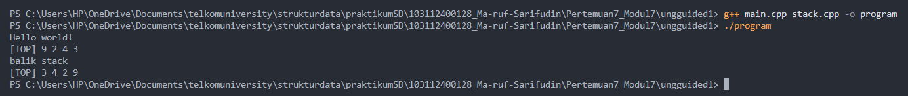
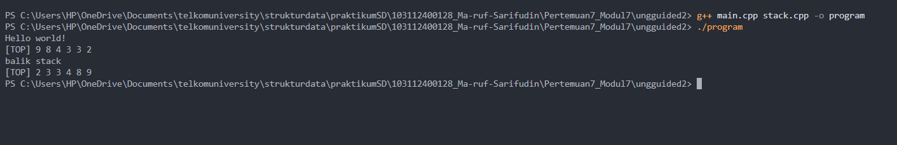
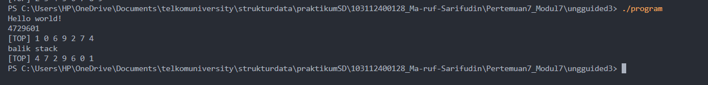

# <h1 align="center">Laporan Praktikum Modul 7 - STACK</h1>
<p align="center">Ma'ruf Sarifudin - 103112400128</p>


## Dasar Teor
Stack atau tumpukan merupakan salah satu bentuk struktur data linier yang prinsip kerjanya mengikuti konsep LIFO (Last In, First Out), yaitu elemen yang terakhir dimasukkan ke dalam stack akan menjadi elemen pertama yang dikeluarkan. Menurut penelitian oleh Setiyawan, Hermawan, Abdillah, Mujayanah, & Vindua (2024) dalam JUTECH Journal of Education and Technology, stack memiliki dua operasi utama, yaitu push untuk menambahkan data dan pop untuk menghapus data dari bagian atas tumpukan. Stack sering digunakan dalam proses komputasi yang membutuhkan penyimpanan sementara, seperti pemanggilan fungsi rekursif, backtracking, proses undo-redo, serta evaluasi ekspresi aritmatika. Penelitian tersebut juga menjelaskan bahwa stack dapat diimplementasikan menggunakan array atau linked list. Implementasi menggunakan array bersifat statis karena kapasitasnya ditentukan di awal, sedangkan implementasi menggunakan linked list bersifat dinamis karena node baru dapat ditambahkan secara fleksibel sesuai kebutuhan program.

Sementara itu, menurut Putri (2024) dalam Jurnal TEKSIS, penggunaan stack terbukti mempermudah pengelolaan data berurutan karena seluruh operasi dilakukan pada satu ujung tumpukan, yaitu bagian atas (top). Penelitian ini menunjukkan bahwa dengan prinsip LIFO, stack mampu menyederhanakan proses manipulasi data seperti pengurutan, penyimpanan sementara, dan pemrosesan data secara berlapis. Dalam penerapan nyata, konsep stack banyak digunakan pada sistem pemutar lagu (playlist management), manajemen memori pada kompilasi program, serta simulasi proses komputer yang bersifat berurutan.

Berdasarkan kedua sumber tersebut, dapat disimpulkan bahwa struktur data stack berperan penting dalam berbagai aplikasi yang memerlukan kontrol urutan masuk dan keluar data secara efisien. Implementasinya baik dengan array maupun linked list memiliki kelebihan masing-masing: array lebih mudah diimplementasikan dan cepat diakses, sementara linked list lebih fleksibel untuk data yang jumlahnya berubah-ubah. Pemahaman mendalam tentang prinsip LIFO serta pengelolaan pointer pada stack menjadi dasar utama dalam perancangan sistem data yang stabil dan efisien.

## Guided 

## 1. guided 1 

### 1. File stack.h 
```C++
#ifndef STACK
#define STACK
#define Nil NULL

#include<iostream>
using namespace std;

typedef struct node *address;

struct node{
    int dataAngka;
    address next;
};

struct stack{
    address top;
};

bool isEmpty(stack listStack);
void createStack(stack &listStack);
address alokasi(int angka);
void dealokasi(address &node);

void push(stack &listStack, address nodeBaru);
void pop(stack &listStack);
void update(stack &listStack, int posisi);
void view(stack listStack);
void searchData(stack listStack, int data);

#endif

```


### 2. File stack.cpp 

```C++
#include "stack.h"
#include <iostream>

using namespace std;

bool isEmpty(stack listStack){
    if(listStack.top == Nil){
        return true;
    } else {
        return false;
    }
}

void createStack(stack &listStack){
    listStack.top = Nil;
}

address alokasi(int angka){
    address nodeBaru = new node;
    nodeBaru->dataAngka = angka;
    nodeBaru->next = Nil;
    return nodeBaru;
}

void dealokasi(address &node){
    node->next = Nil;
    delete node;
}

void push(stack &listStack, address nodeBaru){
    nodeBaru->next = listStack.top;
    listStack.top = nodeBaru;
    cout << "Node " << nodeBaru->dataAngka << " berhasil ditambahkan kedalam stack!" << endl;
}

void pop(stack &listStack){
    address nodeHapus;
    if(isEmpty(listStack) == true){
        cout << "Stack kosong!" << endl;
    } else {
        nodeHapus = listStack.top;
        listStack.top = listStack.top->next;
        nodeHapus->next = Nil;
        dealokasi(nodeHapus);
        cout << "node " <<  nodeHapus->dataAngka << " berhasil dihapus dari stack!" << endl;
    }
}

void update(stack &listStack, int posisi){
    if(isEmpty(listStack) == true){
        cout << "Stack kosong!" << endl;
    } else {
        if(posisi == 0){
            cout << "Posisi tidak valid!" << endl;
        } else {
            address nodeBantu = listStack.top;
            int count = 1;
            bool found = false;
            while(nodeBantu != Nil){
                if(count < posisi){
                    nodeBantu = nodeBantu->next;
                    count++;
                } else if(count == posisi){
                    cout << "Update node poisisi ke-" << posisi << endl;
                    cout << "Masukkan angka : ";
                    cin >> nodeBantu->dataAngka;
                    cout << "Data berhasil diupdate!" << endl;
                    cout << endl;
                    found = true;
                    break;
                }
            }
            if(found == false){
                cout << "Posisi " << posisi << " tidak valid!" << endl;
            }
        }
    }
}

void view(stack listStack){
    if(isEmpty(listStack) == true){
        cout << "List kosong!" << endl;
    } else {
        address nodeBantu = listStack.top;
        while(nodeBantu != Nil){
            cout << nodeBantu->dataAngka << " ";
            nodeBantu = nodeBantu->next;
        }
    }
    cout << endl;
}

void searchData(stack listStack, int data){
    if(isEmpty(listStack) == true){
        cout << "List kosong!" << endl;
    } else {
        address nodeBantu = listStack.top;
        int posisi = 1;
        bool found = false;
        cout << "Mencari data " << data << "..." << endl;
        while(nodeBantu != Nil){
            if(nodeBantu->dataAngka == data){
                cout << "Data " << data << " ditemukan pada posisi ke-" << posisi << endl;
                found = true;
                cout << endl;
                break;
            } else {
                posisi++;
                nodeBantu = nodeBantu->next;
            }
        }
        if(found == false){
            cout << "Data " << data << " tidak ditemukan didalam stack!" << endl;
            cout << endl;
        }
    }
}


```

### 3. File main.cpp 

```C++
#include "stack.h"
#include <iostream>

using namespace std;

int main(){
    stack listStack;
    address nodeA, nodeB, nodeC, nodeD, nodeE = Nil;
    createStack(listStack);

    nodeA = alokasi(1);
    nodeB = alokasi(2);
    nodeC = alokasi(3);
    nodeD = alokasi(4);
    nodeE = alokasi(5);

    push(listStack, nodeA);
    push(listStack, nodeB);
    push(listStack, nodeC);
    push(listStack, nodeD);
    push(listStack, nodeE);
    cout << endl;

    cout << "--- Stack setelah push ---" << endl;
    view(listStack);
    cout << endl;

    pop(listStack);
    pop(listStack);
    cout << endl;

    cout << "--- Stack setelah pop 2 kali ---" << endl;
    view(listStack);
    cout << endl;

    update(listStack, 2);
    update(listStack, 1);
    update(listStack, 4);
    cout << endl;

    cout << "--- Stack setelah update ---" << endl;
    view(listStack);
    cout << endl;

    searchData(listStack, 4);
    searchData(listStack, 9);

    return 0;
}


```
Program ini adalah implementasi dari Stack menggunakan Representasi List (Pointer), yang sesuai dengan metode pertama yang diajarkan dalam Modul 7 , dan dibagi secara modular menjadi tiga file. File stack.h bertindak sebagai header yang mendefinisikan struct node (dengan dataAngka dan next) dan struct stack (yang hanya berisi satu pointer, address top ), serta mendaftarkan semua prototipe fungsi. File stack.cpp berisi implementasi logikanya: createStack mengatur top ke Nil , push bekerja persis seperti insertFirst pada linked list , dan pop bekerja persis seperti deleteFirst , menghapus elemen teratas dan mendealokasinya. Uniknya, program ini juga menyertakan fungsi view, update, dan searchData yang "melanggar" aturan LIFO murni dengan cara menelusuri seluruh list dari top ke bawah menggunakan loop while. Terakhir, file main.cpp adalah program utama yang menjalankan skenario: ia membuat stack, melakukan push lima angka (1-5), melakukan pop dua kali (menghapus 5 dan 4), kemudian memanggil update untuk mengubah data di posisi tertentu, dan akhirnya memanggil searchData untuk mencari data di dalam stack.

## 2. guided 2 

### 1. File stack.h 
```C++
#ifndef STACK_TABLE
#define STACK_TABLE

#include <iostream>
using namespace std;

// Ubah kapasitas sesuai kebutuhan
const int MAX = 10;

struct stackTable {
    int data[MAX];
    int top; // -1 = kosong
};

bool isEmpty(stackTable s);
bool isFull(stackTable s);
void createStack(stackTable &s);

void push(stackTable &s, int angka);
void pop(stackTable &s);
void update(stackTable &s, int posisi);
void view(stackTable s);
void searchData(stackTable s, int data);

#endif

```


### 2. File stack.cpp 

```C++
#include "stack.h"
#include <iostream>

using namespace std;

bool isEmpty(stackTable s){
    return s.top == -1;
}

bool isFull(stackTable s){
    return s.top == MAX - 1;
}

void createStack(stackTable &s){
    s.top = -1;
}

void push(stackTable &s, int angka){
    if(isFull(s)){
        cout << "Stack penuh!" << endl;
    } else {
        s.top++;
        s.data[s.top] = angka;
        cout << "Data " << angka << " berhasil ditambahkan kedalam stack!" << endl;
    }
}

void pop(stackTable &s){
    if(isEmpty(s)){
        cout << "Stack kosong!" << endl;
    } else {
        int val = s.data[s.top];
        s.top--;
        cout << "Data " << val << " berhasil dihapus dari stack!" << endl;
    }
}

void update(stackTable &s, int posisi){
    if(isEmpty(s)){
        cout << "Stack kosong!" << endl;
        return;
    }

    if(posisi <= 0){
        cout << "Posisi tidak valid!" << endl;
        return;
    }

    // index = top - (posisi - 1)
    int idx = s.top - (posisi - 1);
    if(idx < 0 || idx > s.top){
        cout << "Posisi " << posisi << " tidak valid!" << endl;
        return;
    }
    cout << "Update data posisi ke-" << posisi << endl;
    cout << "Masukkan angka : ";
    cin >> s.data[idx];
    cout << "Data berhasil diupdate!" << endl;
    cout << endl;
} 

void view(stackTable s){
    if(isEmpty(s)){
        cout << "Stack kosong!" << endl;
    } else {
        for(int i = s.top; i >= 0; i--){
            cout << s.data[i] << " ";
        }
        cout << endl;
    }
}

void searchData(stackTable s, int data){
    if(isEmpty(s)){
        cout << "Stack kosong!" << endl;
        return;
    }

    cout << "Mencari data " << data << "..." << endl;
    int posisi = 1;
    bool found = false;

    for(int i = s.top; i >= 0; i--){
        if(s.data[i] == data){
            cout << "Data " << data << " ditemukan pada posisi ke-" << posisi << endl;
            cout << endl;
            found = true;
            break;
        }
        posisi++;
    }

    if(!found){
        cout << "Data " << data << " tidak ditemukan dalam stack!" << endl;
    }
    cout << endl;
}


```

### 3. File main.cpp 

```C++
#include "stack.h"
#include <iostream>

using namespace std;

int main(){
    stackTable s;
    createStack(s);

    push(s, 1);
    push(s, 2);
    push(s, 3);
    push(s, 4);
    push(s, 5);
    cout << endl;

    cout << "--- Stack setelah push ---" << endl;
    view(s);
    cout << endl;

    pop(s);
    pop(s);
    cout << endl;

    cout << "--- Stack setelah pop 2 kali ---" << endl;
    view(s);
    cout << endl;

    // Posisi dihitung dari TOP (1-based)
    update(s, 2);
    update(s, 1);
    update(s, 4);
    cout << endl;

    cout << "--- Stack setelah update ---" << endl;
    view(s);
    cout << endl;

    searchData(s, 4);
    searchData(s, 9);

    return 0;
}


```
Program guided 2 ini mengimplementasikan Stack menggunakan Representasi Tabel (Array), berbeda dari guided 1 yang memakai pointer. Sesuai dengan metode kedua di Modul 7 , file stack.h mendefinisikan struct stackTable yang berisi int data[MAX] (array berukuran tetap 10) dan int top . File stack.cpp mengimplementasikan logika operasinya: createStack mengatur top = -1 , isEmpty memeriksa top == -1, dan isFull memeriksa top == MAX - 1. Algoritma push menaikkan top terlebih dahulu (top++) sebelum memasukkan data ke data[top], sementara pop  mengambil data dari data[top] lalu menurunkan top (top--). Program ini juga menyertakan fungsi view dan searchData yang "melanggar" aturan murni LIFO dengan cara menelusuri array secara mundur (dari top ke 0) untuk menampilkan atau mencari data. Terakhir, main.cpp menjalankan skenario pengujian dengan melakukan push lima angka, pop dua angka, memanggil update untuk mengubah data di posisi tertentu, dan akhirnya memanggil searchData untuk mencari data.

## Unguided 

### 1. Soal Unguided 1

Buatlah ADT Stack menggunakan ARRAY sebagai berikut di dalam file “stack.h”:
Type infotype : integer
Type Stack <
info : array [20] of integer
top : integer
>
procedure CreateStack( input/output S : Stack )
procedure push(input/output S : Stack,
input x : infotype)
function pop(input/output t S : Stack )
→ infotype
procedure printInfo( input S : Stack )
procedure balikStack(input/output S :
Stack )
Program 2 Stack.h
Buatlah implementasi ADT Stack menggunakan Array pada file “stack.cpp” dan “main.cpp”
int main()
{
cout << "Hello world!" <<
endl;
Stack S;
createStack(S);
Push(S,3);
Push(S,4);
Push(S,8);
pop(S)
Push(S,2);
Push(S,3);
pop(S);
Push(S,9);
printInfo(S);
cout<<"balik stack"<<endl;
balikStack(S);
printInfo(S);
return 0;
}


### 1. file stack.h
```C++
#ifndef STACK_H
#define STACK_H

#include <iostream>
using namespace std;

const int MAX = 20;

typedef int infotype;

struct Stack {
    infotype info[MAX];
    int top;
};

void createStack(Stack &S);
bool isEmpty(Stack S);
bool isFull(Stack S);

void push(Stack &S, infotype x);
infotype pop(Stack &S);
void printInfo(Stack S);
void balikStack(Stack &S);

#endif

```

### 2. file stack.cpp
```C++
#include "stack.h"

void createStack(Stack &S) {
    S.top = -1;
}

bool isEmpty(Stack S) {
    return S.top == -1;
}

bool isFull(Stack S) {
    return S.top == MAX - 1;
}

void push(Stack &S, infotype x) {
    if (isFull(S)) {
        cout << "Stack penuh" << endl;
    } else {
        S.top++;
        S.info[S.top] = x;
    }
}

infotype pop(Stack &S) {
    if (isEmpty(S)) {
        cout << "Stack kosong" << endl;
        return -1; 
    } else {
        infotype x = S.info[S.top];
        S.top--;
        return x;
    }
}

void printInfo(Stack S) {
    cout << "[TOP] ";
    if (!isEmpty(S)) {
        for (int i = S.top; i >= 0; i--) {
            cout << S.info[i] << " ";
        }
    }
    cout << endl;
}

void balikStack(Stack &S) {
    Stack Temp;
    createStack(Temp);
    infotype x;

    while (!isEmpty(S)) {
        x = pop(S);
        push(Temp, x);
    }
    S = Temp; 
}


```
### 3. file main.cpp

```C++
#include "stack.h"
#include <iostream>

using namespace std;

int main() {
    cout << "Hello world!" << endl;
    Stack S;
    createStack(S);
    
    push(S, 3);
    push(S, 4);
    push(S, 8);
    
    infotype dataPopped1 = pop(S); 
    
    push(S, 2);
    push(S, 3);
    
    infotype dataPopped2 = pop(S); 
    push(S, 9);
    
    printInfo(S);
    
    cout << "balik stack" << endl;
    balikStack(S);
    printInfo(S);
    
    return 0;
}

```

### Output Unguided 1 :

##### Output 1



penjelasan unguided 1 

Program ini adalah implementasi dari ADT (Abstract Data Type) Stack yang menggunakan Representasi Tabel (Array) dengan ukuran statis 20, sesuai dengan Modul 7 dan guided 2. Program ini dibagi secara modular menjadi tiga file. File stack.h bertindak sebagai header yang mendefinisikan struct Stack, yang terdiri dari sebuah info (array integer) dan int top sebagai penanda indeks teratas. File ini juga mendaftarkan semua prototipe fungsi, termasuk push, pop, printInfo, dan fungsi khusus balikStack. File stack.cpp berisi implementasi dari semua fungsi tersebut: algoritma createStack menginisialisasi tumpukan kosong dengan mengatur S.top = -1; isEmpty memeriksa jika top == -1; isFull memeriksa jika top == MAX - 1; push bekerja dengan menaikkan top terlebih dahulu lalu menyisipkan elemen di info[top]; dan pop mengambil data dari info[top] lalu menurunkan top. Algoritma printInfo dirancang untuk mencetak isi stack dari atas ke bawah dengan melakukan looping mundur dari top ke 0. Fungsi balikStack mengimplementasikan algoritma pembalikan stack dengan cara membuat Stack Temp kosong, memindahkan semua elemen dari S ke Temp (menggunakan pop dari S dan push ke Temp), yang secara efektif membalik urutannya, lalu menyalin Temp kembali ke S. Terakhir, file main.cpp bertindak sebagai driver yang menguji fungsionalitas ini. main.cpp melakukan serangkaian operasi: push(3), push(4), push(8), pop() (menghapus 8), push(2), push(3), pop() (menghapus 3), dan push(9). Ini menghasilkan stack akhir yang berisi (dari bawah ke atas) 3, 4, 2, 9. Panggilan printInfo(S) pertama kemudian mencetak output sesuai urutan LIFO, yaitu [TOP] 9 2 4 3 . Setelah itu, balikStack(S) dipanggil, membalik isi stack menjadi 9, 2, 4, 3 (dari bawah ke atas). Panggilan printInfo(S) kedua membuktikan ini dengan mencetak output [TOP] 3 4 2 9 , sesuai dengan hasil yang diharapkan..

### 2. Soal unguided 2

Tambahkan prosedur pushAscending( in/out S : Stack, in x : integer)
int main()
{
Gambar 7-11 Output stack
STRUKTUR DATA 65
cout << "Hello world!" << endl;
Stack S;
createStack(S);
pushAscending(S,3);
pushAscending(S,4);
pushAscending(S,8);
pushAscending(S,2);
pushAscending(S,3);
pushAscending(S,9);
printInfo(S);
cout<<"balik stack"<<endl;
balikStack(S);
printInfo(S);
return 0;
}


### 1. file stack.h
```C++
#ifndef STACK_H
#define STACK_H

#include <iostream>
using namespace std;

const int MAX = 20;

typedef int infotype;

struct Stack {
    infotype info[MAX];
    int top;
};

void createStack(Stack &S);
bool isEmpty(Stack S);
bool isFull(Stack S);

void push(Stack &S, infotype x);
infotype pop(Stack &S);
void printInfo(Stack S);
void balikStack(Stack &S);

infotype topValue(Stack S); 
void pushAscending(Stack &S, infotype x);

#endif

```

### 2. file stack.cpp
```C++
#include "stack.h"

void createStack(Stack &S) {
    S.top = -1;
}

bool isEmpty(Stack S) {
    return S.top == -1;
}

bool isFull(Stack S) {
    return S.top == MAX - 1;
}

void push(Stack &S, infotype x) {
    if (isFull(S)) {
        cout << "Stack penuh" << endl;
    } else {
        S.top++;
        S.info[S.top] = x;
    }
}

infotype pop(Stack &S) {
    if (isEmpty(S)) {
        cout << "Stack kosong" << endl;
        return -1; 
    } else {
        infotype x = S.info[S.top];
        S.top--;
        return x;
    }
}

void printInfo(Stack S) {
    cout << "[TOP] ";
    if (!isEmpty(S)) {
        for (int i = S.top; i >= 0; i--) {
            cout << S.info[i] << " ";
        }
    }
    cout << endl;
}

void balikStack(Stack &S) {
    Stack Temp;
    createStack(Temp);
    infotype x;

    while (!isEmpty(S)) {
        x = pop(S);
        push(Temp, x);
    }
    S = Temp; 
}

infotype topValue(Stack S) {
    if (!isEmpty(S)) {
        return S.info[S.top];
    }
    return -1; 
}

void pushAscending(Stack &S, infotype x) {
    Stack Temp;
    createStack(Temp);
    infotype dataPindah;

    while (!isEmpty(S) && x < topValue(S)) {
        dataPindah = pop(S);
        push(Temp, dataPindah);
    }
    
    push(S, x);
    
    while (!isEmpty(Temp)) {
        dataPindah = pop(Temp);
        push(S, dataPindah);
    }
}


```
### 3. file main.cpp

```C++
#include "stack.h"
#include <iostream>

using namespace std;

int main() {
    cout << "Hello world!" << endl;
    Stack S;
    createStack(S);
    
    pushAscending(S, 3);
    pushAscending(S, 4);
    pushAscending(S, 8);
    pushAscending(S, 2);
    pushAscending(S, 3);
    pushAscending(S, 9);
    
    printInfo(S);
    
    cout << "balik stack" << endl;
    balikStack(S);
    printInfo(S);
    
    return 0;
}

```

### Output Unguided 2 :

##### Output 1



penjelasan unguided 2

Program ini adalah lanjutan dari Unguided 1, di mana pada Unguided 1 telah berhasil diimplementasikan ADT Stack dasar menggunakan Representasi Array . Program sebelumnya itu mencakup fungsi-fungsi inti seperti createStack (dengan top = -1), push standar (LIFO murni), pop (yang mengembalikan nilai), printInfo (mencetak dari top ke bawah), dan balikStack . Di Unguided 2 ini, program diperintahkan untuk menambahkan fungsionalitas baru yang lebih kompleks, yaitu sebuah prosedur khusus bernama pushAscending, yang bertujuan memasukkan data ke dalam stack namun tetap menjaga agar isi stack selalu terurut.

File stack.h berfungsi sebagai "cetak biru" yang diperbarui untuk ADT Stack. Selain semua deklarasi (prototipe) fungsi dari Unguided 1, file ini ditambahkan dua prototipe baru untuk mendukung fungsionalitas Unguided 2. Prototipe pertama adalah infotype topValue(Stack S); ini adalah fungsi helper (pembantu) yang penting, dirancang untuk "mengintip" atau melihat nilai yang ada di S.top tanpa harus menghapusnya (tidak seperti pop). Prototipe kedua adalah void pushAscending(Stack &S, infotype x), yang merupakan prosedur inti baru yang akan menggantikan pemanggilan push standar di main.cpp.

File stack.cpp berisi implementasi atau logika "cara kerja" dari fungsi-fungsi baru tersebut, selain kode fungsi dasar dari Unguided 1. Fungsi topValue diimplementasikan secara sederhana dengan mengembalikan S.info[S.top], yang memungkinkan fungsi lain memeriksa nilai teratas. Algoritma pushAscending adalah bagian paling kompleks; ia tidak bisa langsung memasukkan data, melainkan harus menjaga urutan. Berdasarkan output yang diharapkan ([TOP] 9 8 4 3 3 2), urutan yang dijaga adalah descending (menurun) dari top. Logikanya adalah: pertama, sebuah Stack Temp dibuat. Kedua, sebuah loop while dijalankan untuk "membongkar" stack S: selama S belum kosong DAN nilai x yang akan dimasukkan lebih kecil daripada nilai di top S (x < topValue(S)), program akan pop elemen dari S dan push elemen itu ke Temp. Ketiga, setelah loop berhenti (karena S kosong atau x lebih besar/sama dengan topValue(S)), push(S, x) dieksekusi, menempatkan x di posisinya yang benar. Terakhir, semua elemen yang tadi dipindahkan ke Temp dikembalikan lagi ke S (dengan pop(Temp) dan push(S, ...)), menempatkan mereka kembali di atas x.

File main.cpp untuk Unguided 2 ini diubah secara signifikan untuk menguji fungsionalitas pushAscending. Setelah mencetak "Hello world!" dan membuat Stack S, program tidak lagi menggunakan push biasa. Sebaliknya, ia memanggil pushAscending secara berurutan untuk angka 3, 4, 8, 2, 3, dan 9. Saat dieksekusi, pushAscending akan otomatis menyusun data ini. Sebagai contoh, saat pushAscending(S, 2) dipanggil (setelah 8, 4, 3 sudah ada), angka 8, 4, dan 3 akan dipindah ke Temp, lalu 2 dimasukkan, baru 3, 4, dan 8 dikembalikan lagi ke S. Panggilan printInfo(S) pertama akan mencetak isi stack yang sudah terurut menurun dari top, menghasilkan output: [TOP] 9 8 4 3 3 2 . Setelah itu, balikStack(S) dipanggil, yang membalik total urutan stack tersebut (dari 9..2 menjadi 2..9). Panggilan printInfo(S) kedua kemudian mencetak hasil terbaliknya, yaitu [TOP] 2 3 3 4 8 9

### 3. Soal unguided 3

Tambahkan prosedur getInputStream( in/out S : Stack ). Prosedur akan terus membaca dan
menerima input user dan memasukkan setiap input ke dalam stack hingga user menekan
tombol enter. Contoh: gunakan cin.get() untuk mendapatkan inputan user.
int main()
{
cout << "Hello world!" << endl;
Stack S;
createStack(S);
getInputStream(S);
printInfo(S);
cout<<"balik stack"<<endl;
balikStack(S);
printInfo(S);
return 0;
}


### 1. file stack.h
```C++
#ifndef STACK_H
#define STACK_H

#include <iostream>
using namespace std;

const int MAX = 20;

typedef int infotype;

struct Stack {
    infotype info[MAX];
    int top;
};

void createStack(Stack &S);
bool isEmpty(Stack S);
bool isFull(Stack S);

void push(Stack &S, infotype x);
infotype pop(Stack &S);
void printInfo(Stack S);
void balikStack(Stack &S);

infotype topValue(Stack S); 
void pushAscending(Stack &S, infotype x);

void getInputStream(Stack &S);

#endif

```

### 2. file stack.cpp
```C++
#include "stack.h"


void createStack(Stack &S) {
    S.top = -1;
}

bool isEmpty(Stack S) {
    return S.top == -1;
}

bool isFull(Stack S) {
    return S.top == MAX - 1;
}

void push(Stack &S, infotype x) {
    if (isFull(S)) {
        cout << "Stack penuh" << endl;
    } else {
        S.top++;
        S.info[S.top] = x;
    }
}

infotype pop(Stack &S) {
    if (isEmpty(S)) {
        cout << "Stack kosong" << endl;
        return -1; 
    } else {
        infotype x = S.info[S.top];
        S.top--;
        return x;
    }
}

void printInfo(Stack S) {
    cout << "[TOP] ";
    if (!isEmpty(S)) {
        for (int i = S.top; i >= 0; i--) {
            cout << S.info[i] << " ";
        }
    }
    cout << endl;
}

void balikStack(Stack &S) {
    Stack Temp;
    createStack(Temp);
    infotype x;

    while (!isEmpty(S)) {
        x = pop(S);
        push(Temp, x);
    }
    S = Temp; 
}

infotype topValue(Stack S) {
    if (!isEmpty(S)) {
        return S.info[S.top];
    }
    return -1; 
}

void pushAscending(Stack &S, infotype x) {
    Stack Temp;
    createStack(Temp);
    infotype dataPindah;

    while (!isEmpty(S) && x < topValue(S)) {
        dataPindah = pop(S);
        push(Temp, dataPindah);
    }
    
    push(S, x);
    
    while (!isEmpty(Temp)) {
        dataPindah = pop(Temp);
        push(S, dataPindah);
    }
}

void getInputStream(Stack &S) {
    char kar;
    infotype x;
    
    kar = cin.get(); 
    
    while (kar != '\n') { 
        if (kar >= '0' && kar <= '9') { 
            x = kar - '0'; 
            push(S, x);
        }
        kar = cin.get(); 
    }
}


```
### 3. file main.cpp

```C++
#include "stack.h"
#include <iostream>

using namespace std;

int main()
{
    cout << "Hello world!" << endl;
    Stack S;
    createStack(S);
    
  
    getInputStream(S); 
    
    printInfo(S);
    
    cout << "balik stack" << endl;
    balikStack(S);
    printInfo(S);
    
    return 0;
}

```
### Output Unguided 3 :

##### Output 1



penjelasan unguided 3

Program ini adalah lanjutan dari Unguided 1 dan Unguided 2. Pada Unguided 1, program mengimplementasikan ADT Stack dasar (Representasi Array) dengan fungsi inti seperti push, pop, printInfo, dan balikStack . Di Unguided 2, program tersebut diperkaya dengan menambahkan fungsionalitas pushAscending untuk memasukkan data secara terurut . Pada Unguided 3 ini, program diperintahkan untuk menambahkan prosedur getInputStream, yang bertujuan untuk membaca stream input langsung dari pengguna dan memasukkannya ke dalam stack

File stack.h diperbarui untuk mendukung fungsionalitas baru ini. Selain semua deklarasi (prototipe) fungsi dari Unguided 1 dan 2, deklarasi void getInputStream(Stack &S) ditambahkan ke dalam "cetak biru" ADT Stack. Definisi struct Stack itu sendiri tidak berubah, tetap menggunakan info[MAX] (dengan MAX = 20) dan int top, yang menegaskan bahwa program ini masih konsisten menggunakan Representasi Tabel (Array)  sesuai dengan Modul 7. Semua fungsi yang telah didefinisikan sebelumnya, seperti createStack, push, pop, balikStack, dan pushAscending, tetap ada di header ini, sehingga main.cpp dapat mengakses fungsionalitas penuh dari ADT

File stack.cpp kini berisi implementasi atau algoritma dari getInputStream, selain semua kode dari latihan sebelumnya. Logika prosedur baru ini dirancang untuk menangani input karakter berkelanjutan. Ia bekerja dengan membaca satu karakter (char kar) pertama menggunakan cin.get(). Kemudian, ia masuk ke dalam loop while yang memiliki kondisi berhenti kar != '\n', yang artinya loop akan terus berjalan sampai pengguna menekan tombol Enter. Di dalam loop, sebuah validasi if (kar >= '0' && kar <= '9') digunakan untuk memastikan bahwa hanya karakter digit yang diproses, mengabaikan karakter lain seperti spasi atau huruf. Jika karakter tersebut adalah digit, ia dikonversi menjadi tipe data infotype (integer) melalui operasi x = kar - '0', yang mengubah nilai ASCII karakter (misal '4') menjadi nilai numerik (int 4). Angka integer x ini kemudian dimasukkan ke dalam stack menggunakan prosedur push. Di akhir loop, cin.get() dipanggil lagi untuk membaca karakter berikutnya, dan proses ini berulang hingga \n terdeteksi.

File main.cpp untuk Unguided 3 ini diubah total dari latihan sebelumnya agar fokus menguji fungsionalitas getInputStream . Setelah mencetak "Hello world!" dan membuat Stack S kosong menggunakan createStack, program langsung memanggil getInputStream(S). Pada titik ini, program akan menjeda dan menunggu input pengguna. Sesuai contoh output , jika pengguna mengetik 4729601 lalu menekan Enter, prosedur getInputStream akan mem-push angka-angka tersebut satu per satu. Karena push bekerja dengan prinsip LIFO, stack akan berisi 1 (di top), diikuti 0, 6, 9, 2, 7, dan 4 (di dasar). Panggilan printInfo(S) pertama kemudian mencetak isi stack dari top ke bawah, menghasilkan output: [TOP] 1 0 6 9 2 7 4 . Setelah itu, balikStack(S) dipanggil, yang membalik urutan stack tersebut (sekarang 4 berada di top). Akhirnya, printInfo(S) kedua mencetak hasil terbaliknya, yaitu [TOP] 4 7 2 9 6 0 1 .

## Kesimpulan
Berdasarkan hasil praktikum pada Modul 7 mengenai struktur data Stack, dapat disimpulkan bahwa stack merupakan struktur data linier yang bekerja dengan prinsip LIFO (Last In, First Out), di mana elemen yang terakhir dimasukkan akan menjadi elemen pertama yang dikeluarkan. Implementasi stack dapat dilakukan dengan dua cara, yaitu menggunakan linked list (pointer) dan array (tabel). Implementasi berbasis linked list lebih fleksibel karena tidak dibatasi ukuran tetap, sedangkan implementasi berbasis array lebih sederhana dan efisien untuk ukuran data yang sudah pasti. Melalui percobaan guided dan unguided, diperoleh pemahaman bahwa operasi dasar seperti push, pop, printInfo, dan balikStack adalah inti dari pengelolaan stack. Selain itu, variasi fungsi seperti pushAscending dan getInputStream menunjukkan bagaimana konsep stack dapat dikembangkan untuk menangani kebutuhan yang lebih kompleks, seperti penyusunan data secara terurut dan pembacaan input berkelanjutan. Dengan memahami prinsip kerja serta implementasinya, stack dapat diterapkan secara efektif dalam berbagai konteks pemrograman, seperti manajemen memori, pemrosesan data berurutan, dan pengembangan algoritma yang memerlukan penyimpanan sementara.


## Referensi
[1]Setiyawan, R. D., Hermawan, D., Abdillah, A. F., Mujayanah, A., & Vindua, R. (2024). PENGGUNAAN STRUKTUR DATA STACK DALAM PEMROGRAMAN C++ DENGAN PENDEKATAN ARRAY DAN LINKED LIST. JUTECH: Journal Education and Technology, 5(2), 484-498.
<br>Putri, G. M., Di Pradja, K. A., Azizi, M. B. M., Nurwahid, P., & Perdana, A. S. (2024). Implementasi Stack dan Array pada Pengurutan Lagu dengan Metode Selection Sort. Jurnal Teknologi Dan Sistem Informasi Bisnis, 6(2), 286-296.


