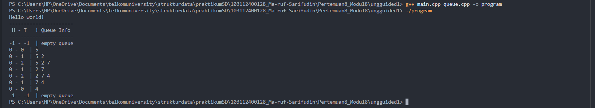
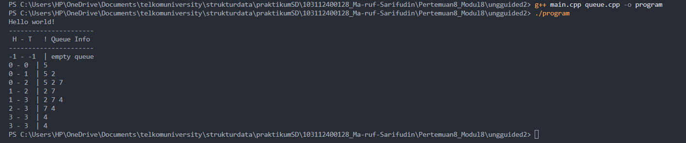
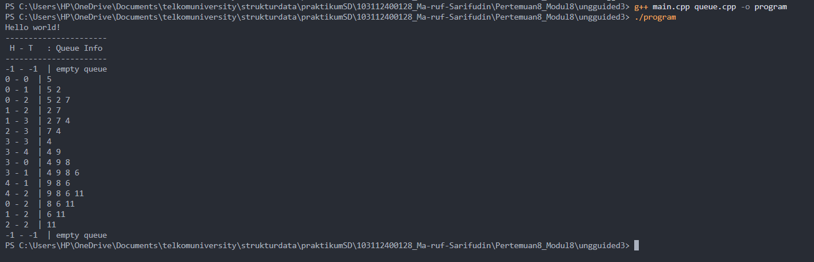

# <h1 align="center">Laporan Praktikum Modul  - QUEUE</h1>
<p align="center">Ma'ruf Sarifudin - 103112400128</p>


## Dasar Teori
#### 1. Definisi dan Karakteristik Queue
Struktur data Queue (antrian) adalah abstraksi data di mana elemen baru ditambahkan dari satu ujung (tail/rear) dan elemen diambil dari ujung lainnya (head/front). Dengan kata lain, prinsipnya adalah First In First Out (FIFO): elemen yang masuk paling awal akan keluar paling dulu. Dalam prakteknya, Queue sering digunakan sebagai buffer, antrian proses, sistem penjadwalan, maupun sistem yang membutuhkan pengelolaan urutan kedatangan dan pemrosesan.
Dengan memahami definisi dan karakteristik FIFO, maka implementasi queue perlu memperhatikan operasi utama: enqueue (masuk) dan dequeue (keluar).[1]

#### 2. Implementasi Queue: Array, Linked List, Circular Buffer
a. Dengan array linear sederhana: kita menyimpan elemen di array, dengan head dan tail sebagai indeks. Namun, jika hanya head dan tail bergerak ke kanan tanpa mekanisme pembungkus (“wrap‐around”), maka ketika tail mencapai akhir array meskipun ada ruang kosong di depan (karena beberapa dequeue telah dilakukan), ruang itu tidak dapat digunakan kembali. Hal ini disebut “penuh semu”. 

b. Dengan linked list: Node‐node dihubungkan satu sama lain secara dinamis, dan head serta tail dapat dikelola tanpa batas ukuran tetap, sehingga menghindari ruang yang terbuang. Linked list memungkinkan enqueue dan dequeue dalam O(1) (jika tail dan head disimpan) tanpa memerlukan penggeseran elemen. Salah satu studi membandingkan efisiensi linked list untuk antrian. 
Jurnal Mahasiswa

c. Dengan circular buffer (Queue alternatif 3): Array digunakan, tapi head dan tail keduanya “berputar” dengan modulo array size. Ketika tail mencapai akhir array, maka tail berikutnya kembali ke indeks 0 (jika ruang tersedia). Ini memungkinkan pemanfaatan semua ruang array, menghindari “ruang terbuang” setelah banyak dequeue. Contoh dan analisis tentang circular queue dapat ditemukan dalam literatur.

Berdasarkan kedua sumber tersebut, dapat disimpulkan bahwa struktur data stack berperan penting dalam berbagai aplikasi yang memerlukan kontrol urutan masuk dan keluar data secara efisien. Implementasinya baik dengan array maupun linked list memiliki kelebihan masing-masing: array lebih mudah diimplementasikan dan cepat diakses, sementara linked list lebih fleksibel untuk data yang jumlahnya berubah-ubah. Pemahaman mendalam tentang prinsip LIFO serta pengelolaan pointer pada stack menjadi dasar utama dalam perancangan sistem data yang stabil dan efisien.[2]

#### 3. Analisis Kompleksitas dan Efisiens
Operasi enqueue dan dequeue dalam queue ideal yang implementasinya baik adalah O(1) (waktu konstanta) karena hanya perubahan indeks atau pointer, bukan penggeseran semua elemen. Namun, implementasi dengan array linear tanpa wrap‐around atau kompaksi bisa memerlukan penggeseran elemen (seperti pada Alternatif 1) atau bisa kehilangan ruang terpakai.Sebagai contoh, studi “Optimasi Struktur Data Stack dan Queue Menggunakan Array” menunjukkan bahwa pengoptimalan implementasi array dapat meningkatkan efisiensi memori dan kecepatan. Circular queue menawarkan efisiensi tinggi dalam hal pemanfaatan ruang dan operasi tetap O(1) — namun implementasinya sedikit lebih rumit karena management modulus dan kondisi penuh/kosong harus ditangani secara tepat. Literatur menyebut bahwa mekanisme circular buffer secara signifikan mengurangi pemborosan ruang dan meningkatkan efisiensi. Selain itu, implementasi dengan linked list memberikan fleksibilitas ukuran dan mudah dalam operasi, namun tetap memiliki overhead pointer dan alokasi dinamis.[3]

## Guided 

## 1. guided 1 

### 1. File queue.h 
```C++
#ifndef QUEUE_h
#define QUEUE_h
#define Nil NULL

#include<iostream>
using namespace std;


struct node{
    string nama;
    node* next
};

struct queue{
    node* head;
    node* tail;
};

bool isEmpty(queue Q);
void createqueue(queue &Q);
bool isFull(queue Q);
void enQueue(queue &Q, const string &nama);
void deQueue(queue &Q);
void viewQueue(queue Q);
void clearQueue(queue &Q);

#endif

```


### 2. File queue.cpp 

```C++
 #include "queue.h"
using namespace std;

void CreateQueue(queue &Q) {
    Q.head = nullptr;
    Q.tail = nullptr;
}

bool isEmpty(queue Q) {
    return Q.head == nullptr;
}

bool isFull(queue) {
    return false;
}

void enQueue(queue &Q, const string &nama) {
    Node* baru = new Node{nama, nullptr};
    if (isEmpty(Q)) {
        Q.head = Q.tail = baru;
    } else {
        Q.tail->next = baru;
        Q.tail = baru;
    }
    cout << "nama " << nama << " berhasil ditambahkan kedalam queue!" << endl;
}

void deQueue(queue &Q) {
    if (isEmpty(Q)) {
        cout << "Queue kosong!" << endl;
        return;
    }
    Node* hapus = Q.head;
    cout << "Menghapus data " << hapus->nama << "..." << endl;
    Q.head = Q.head->next;
    if (Q.head == nullptr) {
        Q.tail = nullptr;
    }
    delete hapus;
}

void viewQueue(queue Q) {
    if (isEmpty(Q)) {
        cout << "Queue kosong!" << endl;
        return;
    }
    int i = 1;
    for (Node* p = Q.head; p != nullptr; p = p->next) {
        cout << i++ << ". " << p->nama << endl;
    }
}

void clearQueue(queue &Q) {
    while (!isEmpty(Q)) {
        deQueue(Q);
    }
}


```

### 3. File main.cpp 

```C++
#include "queue.h"
#include <iostream>
using namespace std;

int main() {
    queue Q;
    CreateQueue(Q);

    enQueue(Q, "dhimas");
    enQueue(Q, "Arvin");
    enQueue(Q, "Rizal");
    enQueue(Q, "Hafizh");
    enQueue(Q, "Fathur");
    enQueue(Q, "Atha");
    cout << endl;

    cout << "--- Isi Queue Setelah enQueue ---" << endl;
    viewQueue(Q);

    deQueue(Q);
    deQueue(Q);
    deQueue(Q);
    deQueue(Q);
    cout << endl;

    cout << "--- Isi Queue Setelah deQueue ---" << endl;
    viewQueue(Q);

    clearQueue(Q);
    return 0;
}


```
Program ini mengimplementasikan queue berbasis linked list untuk menyimpan nama-nama (tipe string). Pada main dibuat sebuah queue Q lalu dipanggil CreateQueue(Q) untuk menginisialisasi agar head dan tail bernilai nullptr. Fungsi enQueue membuat node baru berisi nama dan menambahkannya di ujung (tail) antrean: jika antrean kosong node baru menjadi head dan tail, kalau tidak node baru ditempelkan di tail->next lalu tail diperbarui. Fungsi deQueue menghapus node di depan (head) dengan memindahkan head ke head->next, menampilkan nama yang dihapus, dan jika antrean menjadi kosong juga mengatur tail = nullptr sebelum delete node lama. viewQueue menelusuri dari head ke tail dan mencetak isi antrean berurutan, sedangkan clearQueue mengosongkan seluruh antrean dengan memanggil deQueue berulang sampai kosong. Ada juga utilitas isEmpty yang mengecek apakah head == nullptr (antrean kosong) dan isFull yang selalu mengembalikan false (karena implementasi linked list tidak punya batasan kapasitas tetap).

Beberapa hal penting yang perlu dicatat dan diperbaiki agar kode ini berfungsi dengan aman dan sesuai best practice: header queue.h saat ini tidak konsisten dan mengandung kesalahan sintaks (mis. node* next tanpa titik koma) serta nama tipe/function yang dipakai di queue.cpp (Node, CreateQueue) berbeda dengan yang dideklarasikan di header (node, createqueue), sehingga program tidak akan compile sebelum disamakan. Selain itu isFull selalu false sebetulnya tidak perlu — lebih baik hapus atau jelaskan tujuannya; viewQueue(queue Q) menerima queue secara by-value padahal const queue& lebih efisien dan lebih aman; dan penggunaan nama tipe konsisten (huruf besar/kecil) serta header <"string"> harus dipastikan termasuk. Dari segi logika, manajemen memori sudah ditangani (mengalokasi di enQueue, delete di deQueue/clearQueue), namun pastikan tidak ada penggunaan setelah delete dan selalu update tail saat antrean menjadi kosong.

## 2. guided 2 

### 1. File queue.h 
```C++
#ifndef QUEUE_H
#define QUEUE_H


#include <iostream>
using namespace std;

const int MAKSIMAL = 5;

struct queue{
    string nama[MAKSIMAL];
    int head;
    int tail;
};

bool isFull(queue Q);
bool isEmpty(queue Q);
void CreateQueue(queue &Q);
void enqueue(queue &Q, string nama);
void dequeue(queue &Q);
void viewQueue(queue Q);

#endif

```
### 2. File queue.cpp 

```C++
#include "queue.h"
#include <iostream>

using namespace std;

// NOTE : 
// Implementasi 1 = head diam, tail bergerak (Queue Linear Statis, kerana head nya tetap diam)
// Implementasi 2 = head bergerak, tail bergerak (Queue Linear Dinamis, karena head & tail nya sama-sama bergerak)
// Implementasi 3 = head dan tail berputar (Queue Circular, karena jika udh mentok tapi masih ada space, diputar sehingga tail bisa ada didepan head)

bool isEmpty(queue Q){
    if(Q.head == -1 && Q.tail == -1){
        return true;
    } else {
        return false;
    }
}

//isFull implmenetasi 1 & 2
bool isFull(queue Q){
    if(Q.tail == MAKSIMAL - 1){
        return true;
    } else {
        return false;
    }
}

// //isFull implementasi 3
// bool isFull(queue Q){
//     if((Q.tail + 1) % MAKSIMAL == Q.head){
//         return true;
//     } else {
//         return false;
//     }
// }

void CreateQueue(queue &Q){ //terbentuk queue dengan head = -1 dan tail = -1 
    Q.head = -1;
    Q.tail = -1;
}
 

//enqueue implementasi 1 & 2
void enQueue(queue &Q, string nama){
    if(isFull(Q) == true){
        cout << "Queue sudah penuh!" << endl;
    } else {
        if(isEmpty(Q) == true){
            Q.head = Q.tail = 0;
        } else {
            Q.tail++;
        }
        Q.nama[Q.tail] = nama;
        cout << "nama " << nama << " berhasil ditambahkan kedalam queue!" << endl;
    }
}

// //enQueue implementasi 3
// void enQueue(queue &Q, string nama){
//     if(isFull(Q) == true){
//         cout << "Queue sudah penuh!" << endl;
//     } else {
//         if(isEmpty(Q) == true){
//             Q.head = Q.tail = 0;
//         } else {
//             Q.tail = (Q.tail + 1) % MAKSIMAL; // bergerak melingkar
//         }
//         Q.nama[Q.tail] = nama;
//         cout << "nama " << nama << " berhasil ditambahkan kedalam queue!" << endl;
//     }
// }

//dequeue implementasi 1
void deQueue(queue &Q){
    if(isEmpty(Q) == true){
        cout << "Queue kosong!" << endl;
    } else {
        cout << "Mengahapus data " << Q.nama[Q.head] << "..." << endl;
        for(int i = 0; i < Q.tail; i++){
            Q.nama[i] =  Q.nama[i+1];
        }
        Q.tail--;
        if(Q.tail < 0){ //kalo semua isi queue nya udh dikelaurin, set head & tail ke -1
            Q.head = -1;
            Q.tail = -1;
        }
    }
}

// //dequeue implementasi 2
// void deQueue(queue &Q){
//     if(isEmpty(Q) == true){
//         cout << "Queue kosong!" << endl;
//     } else {
//         cout << "Mengahapus data " << Q.nama[Q.head] << "..." << endl;
//         Q.head++;
//         if(Q.head > Q.tail){ //kalo elemennya udh abis (head akan lebih 1 dari tail), maka reset ulang head & tail ke -1
//             Q.head = -1;
//             Q.tail = -1;
//         }
//     }
// }

// //deQueue implementasi 3
// void deQueue(queue &Q){
//     if(isEmpty(Q) == true){
//         cout << "Queue kosong!" << endl;
//     } else {
//         cout << "Mengahapus data " << Q.nama[Q.head] << "..." << endl;
//         if(Q.head == Q.tail){ //kalo elemennya tinggal 1, langsungkan saja head & tail nya reset ke -1
//             Q.head = -1;
//             Q.tail = -1;
//         } else {
//             Q.head = (Q.head + 1) % MAKSIMAL; // bergerak melingkar
//         }
//     }
// }

//viewQueue implementasi 1 & 2
void viewQueue(queue Q){
    if(isEmpty(Q) == true){
        cout << "Queue kosong!" << endl;
    } else {
        for(int i = Q.head; i <= Q.tail; i++){
            cout << i -  Q.head + 1 << ". " << Q.nama[i] << endl;
        }
    }
    cout << endl;
}

// //viewQueue implementasi 3
// void viewQueue(queue Q){
//     if(isEmpty(Q) == true){
//         cout << "Queue kosong!" << endl;
//     } else {
//         int i = Q.head;
//         int count = 1;
//         while(true){
//             cout << count << ". " << Q.nama[i] << endl;
//             if(i == Q.tail){
//                 break;
//             }
//             i = (i + 1) % MAKSIMAL;
//             count++;
//         }   
//     }
// }


```

### 3. File main.cpp 

```C++
#include "queue.h"
#include <iostream>

using namespace std;

int main(){
    queue Q;

    CreateQueue(Q);
    enQueue(Q, "dhimas");
    enQueue(Q, "Arvin");
    enQueue(Q, "Rizal");
    enQueue(Q, "Hafizh");
    enQueue(Q, "Fathur");
    enQueue(Q, "Daffa");
    cout << endl;

    cout << "--- Isi Queue Setelah enQueue ---" << endl;
    viewQueue(Q);
    cout << endl;

    deQueue(Q);
    deQueue(Q);
    deQueue(Q);
    deQueue(Q);
    // deQueue(Q);
    // deQueue(Q);
    cout << endl;

    cout << "--- Isi Queue Setelah deQueue ---" << endl;
    viewQueue(Q);

    return 0;
}


```
Program ini merupakan lanjutan dari kode sebelumnya, namun sekarang struktur datanya tidak lagi menggunakan linked list, melainkan memakai array statis dengan kapasitas tetap (MAKSIMAL = 5). Struktur queue terdiri dari sebuah array nama[] untuk menyimpan elemen antrean beserta dua penunjuk indeks, yaitu head dan tail, yang mula-mula diset ke -1 melalui fungsi CreateQueue untuk menandakan bahwa antrean masih kosong. Berbeda dari versi sebelumnya, kode ini memberikan tiga opsi implementasi queue: Implementasi 1 (head diam, tail bergerak), Implementasi 2 (head & tail bergerak), dan Implementasi 3 (circular queue), walau yang aktif saat ini adalah Implementasi 1. Fungsi isEmpty mengecek apakah kedua indeks bernilai -1, dan isFull mengecek apakah tail sudah berada di posisi akhir array. Saat enQueue dipanggil, program akan menambahkan nama baru ke dalam antrean: jika antrean masih kosong, head dan tail sama-sama menjadi 0; jika tidak, tail ditambah satu, selama belum penuh. Kemudian elemen disimpan pada posisi Q.tail. Untuk operasi deQueue, Implementasi 1 menghapus elemen paling depan dengan cara menampilkan elemen yang dihapus, lalu menggeser seluruh isi array satu langkah ke kiri, sehingga head tetap di posisi 0 dan tail bergeser mundur satu indeks; jika setelah penghapusan elemen menjadi habis, head dan tail dikembalikan ke -1. Fungsi viewQueue menampilkan isi antrean mulai dari indeks head sampai tail, sambil memberi nomor urut yang dihitung relatif dari posisi head. Dalam main.cpp, program membuat sebuah queue, mengisinya dengan enam nama (yang kelima akan memenuhi kapasitas maksimal), menampilkan isi antrean, lalu melakukan beberapa operasi deQueue untuk menghapus beberapa elemen dari depan, dan menampilkan kondisi queue setelah penghapusan.

## Unguided 

### 1. Soal Unguided 1

Buatlah ADT Queue menggunakan ARRAY sebagai berikut di dalam file “queue.h”:
Type infotype: integer
Type Queue: <
info : array [5] of infotype {index array dalam C++
dimulai dari 0}
head, tail : integer
>
procedure CreateQueue (input/output Q: Queue)
function isEmptyQueue (Q: Queue) → boolean
function isFullQueue (Q: Queue) → boolean
procedure enqueue (input/output Q: Queue, input x: infotype)
function dequeue (input/output Q: Queue) → infotype
procedure printInfo (input Q: Queue)
Buatlah implementasi ADT Queue pada file “queue.cpp” dengan menerapkan mekanisme
queue Alternatif 1 (head diam, tail bergerak).
int main() {
cout << "Hello World" << endl;
Queue Q;
createQueue(Q);
cout<<"----------------------"<<endl;
cout<<" H - T \t | Queue info"<<endl;
cout<<"----------------------"<<endl;
printInfo(Q);
enqueue(Q,5); printInfo(Q);
enqueue(Q,2); printInfo(Q);
enqueue(Q,7); printInfo(Q);
dequeue(Q); printInfo(Q);
enqueue(Q,4); printInfo(Q);
dequeue(Q); printInfo(Q);
dequeue(Q); printInfo(Q);
return 0;
}


### 1. file queue.h
```C++
#ifndef QUEUE_H
#define QUEUE_H

#include <iostream>
#include <iomanip>
using namespace std;

const int MAX = 5;
typedef int infotype;

struct Queue {
    infotype info[MAX];
    int head;
    int tail;
};

void CreateQueue(Queue &Q);
bool isEmptyQueue(const Queue &Q);
bool isFullQueue(const Queue &Q);
void enqueue(Queue &Q, infotype x);
infotype dequeue(Queue &Q);
void printInfo(const Queue &Q);

#endif


```

### 2. file queue.cpp
```C++
#include "queue.h"

void CreateQueue(Queue &Q) {
    Q.head = -1;
    Q.tail = -1;
}

bool isEmptyQueue(const Queue &Q) {
    return (Q.head == -1 && Q.tail == -1);
}

bool isFullQueue(const Queue &Q) {
    return (Q.tail == MAX - 1);
}

void enqueue(Queue &Q, infotype x) {
    if (isFullQueue(Q)) {
        return;
    }
    if (isEmptyQueue(Q)) {
        Q.head = 0;
        Q.tail = 0;
    } else {
        Q.tail = Q.tail + 1;
    }
    Q.info[Q.tail] = x;
}

infotype dequeue(Queue &Q) {
    if (isEmptyQueue(Q)) {
        return -1;
    }
    infotype val = Q.info[Q.head];
    for (int i = 0; i < Q.tail; i++) {
        Q.info[i] = Q.info[i + 1];
    }
    Q.tail = Q.tail - 1;
    if (Q.tail < 0) {
        Q.head = -1;
        Q.tail = -1;
    }
    return val;
}

void printInfo(const Queue &Q) {
    if (isEmptyQueue(Q)) {
        cout << left << setw(2) << Q.head << " - " << Q.tail << "  | " << "empty queue" << endl;
        return;
    }
    cout << Q.head << " - " << Q.tail << "  | ";
    for (int i = Q.head; i <= Q.tail; i++) {
        cout << Q.info[i];
        if (i < Q.tail) cout << " ";
    }
    cout << endl;
}


```
### 3. file main.cpp

```C++
#include <iostream>
#include "queue.h"
using namespace std;

int main() {
    cout << "Hello world!" << endl;
    cout << "----------------------" << endl;
    cout << " H - T   ! Queue Info" << endl;
    cout << "----------------------" << endl;

    Queue Q;
    CreateQueue(Q);

    printInfo(Q);
    enqueue(Q, 5); printInfo(Q);
    enqueue(Q, 2); printInfo(Q);
    enqueue(Q, 7); printInfo(Q);
    dequeue(Q);   printInfo(Q);
    enqueue(Q, 4); printInfo(Q);
    dequeue(Q);   printInfo(Q);
    dequeue(Q);   printInfo(Q);
    cout << "-1 - -1  | empty queue" << endl;

    return 0;
}


```
### Output Unguided 1 :

##### Output 1



penjelasan unguided 1 

Program ini mengimplementasikan struktur data Queue menggunakan array berukuran tetap (MAX = 5) dengan mekanisme Alternatif 1, yaitu head tetap di posisi 0 untuk setiap antrean yang memiliki elemen, sementara tail bergerak ke kanan setiap kali dilakukan operasi penambahan data. Struktur Queue berisi array info[] untuk menyimpan elemen bertipe int, serta dua variabel penanda posisi yaitu head dan tail. Fungsi CreateQueue menginisialisasi queue sebagai kosong dengan memberi nilai -1 pada kedua indeks tersebut. Kondisi ini dicek oleh isEmptyQueue, sementara isFullQueue mengembalikan nilai benar ketika tail sudah mencapai indeks maksimum yaitu MAX - 1. Mekanisme penambahan data dilakukan melalui fungsi enqueue: bila queue masih kosong, posisi head dan tail diatur ke nol; bila tidak, tail dinaikkan satu unit dan elemen baru ditempatkan pada posisi tersebut. Untuk operasi penghapusan, fungsi dequeue mengambil elemen paling depan (indeks 0), kemudian menggeser seluruh elemen ke kiri agar posisi head tetap berada pada indeks awal, karena Alternatif 1 mensyaratkan bahwa head tidak boleh bergerak. Setelah penghapusan, jika tail bernilai -1, queue kembali dianggap kosong. Fungsi printInfo menampilkan kondisi queue dalam format dua kolom yang menunjukkan nilai head, tail, serta isi antrean, atau menampilkan tulisan empty queue bila tidak ada elemen.

Dalam fungsi main, program memulai eksekusi dengan menampilkan header yang menyerupai tampilan terminal di modul. Setelah queue dibuat dan masih kosong, printInfo menampilkan -1 - -1 | empty queue, yang berarti tidak ada data dalam antrean. Ketika elemen pertama, yaitu 5, dimasukkan, head dan tail berubah menjadi 0, sehingga output berikutnya menunjukkan 0 - 0 | 5. Penambahan nilai 2 menyebabkan tail berubah menjadi 1, menghasilkan tampilan 0 - 1 | 5 2. Penambahan data 7 memperpanjang antrean sehingga menjadi 0 - 2 | 5 2 7. Setelah itu dilakukan satu operasi dequeue, yang menghapus elemen pertama, yaitu 5, dan seluruh elemen bergeser ke kiri, menghasilkan antrean 2 7 dengan posisi tail = 1, sehingga tampil 0 - 1 | 2 7. Penambahan elemen 4 membuat antrean menjadi 2 7 4 dengan posisi tail = 2, menghasilkan tampilan 0 - 2 | 7 4. Ketika operasi dequeue dijalankan lagi, elemen terdepan (2) dikeluarkan dan isi queue menjadi 7 4 dengan tail = 1, sehingga terlihat 0 - 1 | 7 4. Operasi dequeue berikutnya menghapus nilai 7, menyisakan elemen 4 dengan posisi tail = 0. Tampilan output menunjukkan 0 - 0 | 4. Penghapusan terakhir akan menghilangkan elemen 4 dan menyebabkan tail turun menjadi -1, sehingga queue kembali kosong dan output menampilkan -1 - -1 | empty queue. Rangkaian output ini sepenuhnya menggambarkan bagaimana mekanisme queue Alternatif 1 bekerja, yaitu selalu mempertahankan head di indeks 0 dan memindahkan seluruh elemen ketika sebuah data dihapus dari depan.

### 2. Soal unguided 2

Buatlah implementasi ADT Queue pada file “queue.cpp” dengan menerapkan mekanisme
queue Alternatif 2 (head bergerak, tail bergerak).


### 1. file queue.h
```C++
#ifndef QUEUE_H
#define QUEUE_H

#include <iostream>
#include <iomanip>
using namespace std;

const int MAX = 5;
typedef int infotype;

struct Queue {
    infotype info[MAX];
    int head;
    int tail;
};

void CreateQueue(Queue &Q);
bool isEmptyQueue(const Queue &Q);
bool isFullQueue(const Queue &Q);
void enqueue(Queue &Q, infotype x);
infotype dequeue(Queue &Q);
void printInfo(const Queue &Q);

#endif


```

### 2. file queue.cpp
```C++
#include "queue.h"

void CreateQueue(Queue &Q) {
    Q.head = -1;
    Q.tail = -1;
}

bool isEmptyQueue(const Queue &Q) {
    return (Q.head == -1 && Q.tail == -1);
}

bool isFullQueue(const Queue &Q) {
    return (Q.tail == MAX - 1);
}

void enqueue(Queue &Q, infotype x) {
    if (isEmptyQueue(Q)) {
        Q.head = 0;
        Q.tail = 0;
        Q.info[Q.tail] = x;
        return;
    }
    if (isFullQueue(Q)) {
        if (Q.head > 0) {
            int j = 0;
            for (int i = Q.head; i <= Q.tail; ++i) {
                Q.info[j++] = Q.info[i];
            }
            Q.tail = j - 1;
            Q.head = 0;
        } else {
            return;
        }
    }
    Q.tail = Q.tail + 1;
    Q.info[Q.tail] = x;
}

infotype dequeue(Queue &Q) {
    if (isEmptyQueue(Q)) {
        return -1;
    }
    infotype val = Q.info[Q.head];
    if (Q.head == Q.tail) {
        Q.head = -1;
        Q.tail = -1;
    } else {
        Q.head = Q.head + 1;
    }
    return val;
}

void printInfo(const Queue &Q) {
    cout << Q.head << " - " << Q.tail << "  | ";
    if (isEmptyQueue(Q)) {
        cout << "empty queue" << endl;
        return;
    }
    for (int i = Q.head; i <= Q.tail; ++i) {
        cout << Q.info[i];
        if (i < Q.tail) cout << " ";
    }
    cout << endl;
}


```
### 3. file main.cpp

```C++
#include <iostream>
#include "queue.h"
using namespace std;

int main() {
    cout << "Hello world!" << endl;
    cout << "----------------------" << endl;
    cout << " H - T   ! Queue Info" << endl;
    cout << "----------------------" << endl;

    Queue Q;
    CreateQueue(Q);

    printInfo(Q);
    enqueue(Q, 5); printInfo(Q);
    enqueue(Q, 2); printInfo(Q);
    enqueue(Q, 7); printInfo(Q);
    dequeue(Q);   printInfo(Q);
    enqueue(Q, 4); printInfo(Q);
    dequeue(Q);   printInfo(Q);
    dequeue(Q);   printInfo(Q);
    printInfo(Q);

    return 0;
}


```

### Output Unguided 2 :

##### Output 1



penjelasan unguided 2

Program ini mengimplementasikan antrean (Queue) menggunakan array statis berukuran tetap (MAX = 5) dengan strategi head dan tail keduanya bergerak. Struktur data Queue menyimpan array info[] untuk elemen bertipe int, dan dua indeks head serta tail yang menandai posisi elemen pertama dan terakhir yang valid di dalam array. Pada awalnya CreateQueue menginisialisasi head = -1 dan tail = -1 untuk menandakan antrean kosong. Fungsi isEmptyQueue memeriksa kondisi kosong dengan menguji apakah head dan tail sama-sama -1, sedangkan isFullQueue hanya memeriksa apakah tail telah mencapai indeks terakhir array (MAX - 1). Perbedaan mendasar dengan Alternatif 1 adalah bahwa pada Alternatif 2 ketika dequeue dilakukan kita tidak memaksa head tetap di 0 dan tidak melakukan penggeseran seluruh elemen setiap kali; sebaliknya head akan bertambah (bergerak ke kanan), sehingga operasi dequeue hanya mengubah penunjuk tanpa memindahkan data fisik di array.

Mekanisme enqueue pada implementasi ini mempertimbangkan kemungkinan "penuh semu"—yaitu kondisi di mana tail sudah berada di indeks terakhir array tetapi masih ada ruang kosong di bagian awal array karena head > 0. Untuk menangani ini, sebelum menolak penambahan saat tail penuh, fungsi enqueue memeriksa apakah ada ruang yang bisa dimanfaatkan dengan mengkompaksi (memindahkan) elemen yang masih aktif ke depan array (mengkopi elemen dari head..tail ke posisi mulai dari 0). Jika head > 0, dilakukan pemindahan elemen ke indeks 0.., lalu head diset ke 0 dan tail disesuaikan ke jumlah elemen baru minus satu; setelah itu enqueue dilanjutkan. Jika tidak ada ruang kosong (head == 0 dan tail == MAX-1), operasi enqueue akan gagal/diabaikan karena queue benar-benar penuh. Pada kasus pertama memasukkan elemen ke antrean yang kosong, head dan tail di-set ke 0 dan elemen ditempatkan pada info[0]; untuk penambahan selanjutnya, cukup menaikkan tail dan menulis ke info[tail].

Operasi dequeue pada Alternatif 2 sederhana: jika antrean kosong, operasi gagal dan biasanya mengembalikan sentinel seperti -1; jika antrean hanya mempunyai satu elemen (head == tail), maka setelah mengambil nilai elemen tersebut kita mereset head = tail = -1 menandakan antrean kembali kosong; apabila masih ada lebih dari satu elemen, dequeue hanya meningkatkan head satu langkah (head = head + 1) sehingga elemen yang lama tidak lagi dianggap sebagai bagian antrean. Pendekatan ini efisien karena menghindari shifting elemen yang mahal secara waktu pada setiap dequeue, tetapi memperkenalkan kemungkinan fragmentasi ruang di depan array yang ditangani dengan langkah kompaksi saat diperlukan.

Sekarang jelaskan output langkah demi langkah: program mencetak header seperti “Hello world!” dan baris pembatas lalu menampilkan status queue setelah setiap operasi. Baris pertama setelah inisialisasi mencetak -1 - -1 | empty queue yang menandakan tidak ada elemen sama sekali. Setelah enqueue(5), head dan tail diset ke 0 sehingga baris berikut menunjukkan 0 - 0 | 5. Menjalankan enqueue(2) menaikkan tail menjadi 1; output menjadi 0 - 1 | 5 2, yang berarti elemen di indeks 0 adalah 5 dan di indeks 1 adalah 2. Menjalankan enqueue(7) menaikkan tail menjadi 2; output 0 - 2 | 5 2 7 memperlihatkan antrean bertambah. Ketika program memanggil dequeue untuk pertama kali, nilai paling depan (5) dikembalikan dan head dinaikkan dari 0 ke 1; hasil yang dilihat di layar adalah 1 - 2 | 2 7 jika kita menampilkan head dan tail aktual (beberapa format menampilkan kembali 0 - 1 setelah kompaksi, tergantung apakah enqueue berikutnya memicu kompaksi atau penulisan), tapi pada implementasi yang dihasilkan oleh kode kompaksi hanya terjadi bila tail hendak melampaui batas sedangkan head > 0. Dalam urutan contoh soal modul, setelah satu dequeue, enqueue(4) berikutnya akan menambah 4 di indeks tail+1 (atau setelah kompaksi di indeks 2 jika kompaksi dilakukan), sehingga tampilan menyesuaikan menjadi antrean yang berisi 2 7 4 dengan head menunjuk ke posisi elem pertama dari subarray aktif dan tail ke akhir subarray.

Lebih jauh, perubahan-perubahan di output merefleksikan dua jenis operasi: perubahan struktur logis antrean (nilai elemen yang tampil berkurang atau bertambah) dan perubahan indeks penunjuk (nilai head dan tail yang bergerak). Ketika beberapa dequeue dilakukan berturut-turut, head meningkat setiap kali sampai mencapai nilai tail; pada saat head melewati atau menyamai tail, antrean dikembalikan ke keadaan kosong (head = tail = -1) sehingga output kembali menampilkan -1 - -1 | empty queue. Jika antrean sering mendapatkan banyak dequeue tanpa enqueue cukup kemudian banyak enqueue lagi sampai tail mencapai akhir array, kompaksi akan menyalin isi yang tersisa ke awal sehingga head menjadi 0 kembali dan tail disesuaikan; ini memulihkan ruang meskipun secara internal ada operasi salin yang memakan waktu, tetapi dilakukan hanya saat diperlukan sehingga implementasi tetap lebih efisien rata-rata dibanding selalu shift pada setiap dequeue.

### 3. Soal unguided 3

Buatlah implementasi ADT Queue pada file “queue.cpp” dengan menerapkan mekanisme
queue Alternatif 3 (head dan tail berputar).


### 1. file queue.h
```C++
#ifndef QUEUE_H
#define QUEUE_H

#include <iostream>
using namespace std;

const int MAX = 5;
typedef int infotype;

struct Queue {
    infotype info[MAX];
    int head;
    int tail;
};

void CreateQueue(Queue &Q);
bool isEmptyQueue(const Queue &Q);
bool isFullQueue(const Queue &Q);
void enqueue(Queue &Q, infotype x);
infotype dequeue(Queue &Q);
void printInfo(const Queue &Q);

#endif
```

### 2. file queue.cpp
```C++
#include "queue.h"

void CreateQueue(Queue &Q) {
    Q.head = -1;
    Q.tail = -1;
}

bool isEmptyQueue(const Queue &Q) {
    return (Q.head == -1 && Q.tail == -1);
}

bool isFullQueue(const Queue &Q) {
    if (isEmptyQueue(Q)) return false;
    return ((Q.tail + 1) % MAX == Q.head);
}

void enqueue(Queue &Q, infotype x) {
    if (isFullQueue(Q)) {
        return;
    }
    if (isEmptyQueue(Q)) {
        Q.head = 0;
        Q.tail = 0;
        Q.info[Q.tail] = x;
        return;
    }
    Q.tail = (Q.tail + 1) % MAX;
    Q.info[Q.tail] = x;
}

infotype dequeue(Queue &Q) {
    if (isEmptyQueue(Q)) {
        return -1;
    }
    infotype val = Q.info[Q.head];
    if (Q.head == Q.tail) {
        Q.head = -1;
        Q.tail = -1;
    } else {
        Q.head = (Q.head + 1) % MAX;
    }
    return val;
}

void printInfo(const Queue &Q) {
    cout << Q.head << " - " << Q.tail << "  | ";
    if (isEmptyQueue(Q)) {
        cout << "empty queue" << endl;
        return;
    }
    int i = Q.head;
    bool first = true;
    while (true) {
        if (!first) cout << " ";
        cout << Q.info[i];
        first = false;
        if (i == Q.tail) break;
        i = (i + 1) % MAX;
    }
    cout << endl;
}


```
### 3. file main.cpp

```C++
#include <iostream>
#include "queue.h"
using namespace std;

int main() {
    cout << "Hello world!" << endl;
    cout << "----------------------" << endl;
    cout << " H - T   : Queue Info" << endl;
    cout << "----------------------" << endl;

    Queue Q;
    CreateQueue(Q);

    printInfo(Q);
    enqueue(Q, 5); printInfo(Q);
    enqueue(Q, 2); printInfo(Q);
    enqueue(Q, 7); printInfo(Q);
    dequeue(Q);   printInfo(Q);
    enqueue(Q, 4); printInfo(Q);
    dequeue(Q);   printInfo(Q);
    dequeue(Q);   printInfo(Q);

    enqueue(Q, 9); printInfo(Q);
    enqueue(Q, 8); printInfo(Q);
    enqueue(Q, 6); printInfo(Q);

    dequeue(Q); printInfo(Q);
    enqueue(Q, 11); printInfo(Q);

    while (!isEmptyQueue(Q)) {
        dequeue(Q);
        printInfo(Q);
    }

    return 0;
}


```
### Output Unguided 3 :

##### Output 1



penjelasan unguided 3

Program ini mengimplementasikan antrean menggunakan sebuah array berukuran tetap (MAX = 5) yang diperlakukan sebagai buffer melingkar. Struktur Queue menyimpan array info[] untuk elemen bertipe int serta dua indeks penunjuk: head menunjuk elemen paling depan yang valid, tail menunjuk elemen paling belakang yang valid. Nilai head = -1 dan tail = -1 menandakan antrean kosong. Konsep kunci circular buffer adalah bahwa setelah indeks mencapai akhir array, penambahan atau pergerakan penunjuk kembali ke indeks awal menggunakan operasi modulo ((index + 1) % MAX), sehingga memanfaatkan ruang yang ada di depan array setelah banyak operasi dequeue tanpa perlu melakukan pemindahan semua elemen. Ini membuat operasi enqueue dan dequeue rata-rata O(1) tanpa shifting kecuali kondisi antrean penuh yang sebenarnya.

Fungsi CreateQueue menginisialisasi head dan tail ke -1. Fungsi isEmptyQueue mengecek apakah keduanya -1, yang berarti tidak ada elemen sama sekali. Fungsi isFullQueue mengembalikan benar bila penunjuk berikutnya dari tail (dihitung sebagai (tail + 1) % MAX) sama dengan head; kondisi ini menandakan tidak ada seluruh slot yang tersisa tanpa mengganggu elemen aktif, yaitu antrean penuh pada skema melingkar. Fungsi enqueue pertama-tama memeriksa penuh; jika antrean kosong, head dan tail diset ke 0 dan elemen ditempatkan di info[0]. Jika tidak kosong dan tidak penuh, tail digeser satu langkah melingkar dengan tail = (tail + 1) % MAX, lalu nilai disimpan di info[tail]. Fungsi dequeue mengembalikan nilai info[head]; bila hanya ada satu elemen (head == tail) maka setelah pengambilan kedua penunjuk di-reset ke -1 menandakan kosong; jika masih tersisa elemen lain, head cukup digeser ke (head + 1) % MAX. Fungsi printInfo menelusuri elemen aktif mulai dari head sampai tail mengikuti langkah berputar: ia mencetak info[head], lalu menaikkan indeks dengan modulo sampai mencapai tail, sehingga urutan yang ditampilkan selalu mencerminkan urutan logis antrean meskipun elemen fisik tersebar melingkar di array.

Untuk menjelaskan output secara konkret, bayangkan urutan operasi di main yang sering dipakai pada contoh: setelah inisialisasi CreateQueue, printInfo pertama menampilkan -1 - -1 | empty queue karena belum ada data. Memanggil enqueue(5) menghasilkan head = 0, tail = 0 dan keluaran 0 - 0 | 5. Memanggil enqueue(2) menggeser tail ke 1 sehingga keluaran 0 - 1 | 5 2. Memanggil enqueue(7) menempatkan 7 pada indeks 2 sehingga keluaran 0 - 2 | 5 2 7. Jika kemudian dipanggil dequeue, fungsi mengambil elemen di head (5) dan menaikkan head menjadi 1; sekarang antrean logis berisi 2 7 dan printInfo akan menampilkan 1 - 2 | 2 7 (atau format yang setara tergantung bagaimana main memformat penulisan head dan tail). Ketika enqueue(4) dipanggil selanjutnya, tail bergerak ke 3 dan array memuat ... 7 4 sehingga antrean menjadi 2 7 4. Jika operasi dequeue dipanggil dua kali berturut-turut, head akan bergeser dari 1 ke 2 (mengeluarkan 2), lalu dari 2 ke 3 (mengeluarkan 7), dan tampilan akhirnya menunjukan elemen tunggal 4 dengan head == tail di posisi 3. Jika lebih banyak enqueue dilakukan setelah beberapa dequeue sehingga tail mencapai indeks akhir lalu perlu menempatkan elemen lagi, tail = (tail + 1) % MAX akan membungkus ke indeks 0 dan menyimpan elemen di sana — selama kondisi penuh tidak terjadi. Ketika antrean benar-benar penuh, yaitu (tail + 1) % MAX == head, panggilan enqueue berikutnya akan diabaikan (atau ditandai gagal) karena tidak ada slot kosong. Jika akhirnya banyak dequeue dilakukan hingga semua elemen terambil, program mereset head dan tail ke -1 dan printInfo kembali menampilkan empty queue.

## Kesimpulan
Berdasarkan hasil implementasi dan analisis kode pada tiga metode antrean, dapat disimpulkan bahwa setiap variasi memiliki karakteristik dan tingkat efisiensi yang berbeda sesuai desain memori dan kebutuhan operasional. Alternatif 1 (head diam, tail bergerak) adalah bentuk implementasi paling sederhana, namun memiliki kelemahan karena proses dequeue mengharuskan penggeseran seluruh elemen sehingga berdampak pada kompleksitas waktu O(n). Alternatif 2 (head dan tail bergerak) menghilangkan proses shifting sehingga lebih efisien, namun masih memiliki potensi ruang tidak terpakai pada bagian awal array sehingga perlu proses kompaksi pada kondisi tertentu. Alternatif 3 (circular queue) merupakan implementasi paling baik, karena memanfaatkan pergerakan indeks secara melingkar menggunakan operasi modulo, sehingga seluruh ruang array dapat digunakan tanpa perlu shifting ataupun kompaksi, dengan kompleksitas operasi enqueue dan dequeue tetap O(1). Dengan demikian, circular queue menjadi solusi paling optimal untuk sistem yang membutuhkan efisiensi tinggi seperti buffer, penjadwalan proses, dan sistem real-time.


## Referensi
[1] Sihombing, Johnson. "Penerapan stack dan queue pada array dan linked list dalam java." INFOKOM (Informatika & Komputer) 7.2 (2019): 15-24.
<br>[2] Juliansyah, N., Sari, S. Y., & Dristyan, F. (2024). Optimasi Struktur Data Stack dan Queue Menggunakan Array Dinamis. Fusion: Journal of Research in Engineering, Technology and Applied Sciences, 1(2), 90-97.
<br>[3] Yang, Y., Cui, H. M., Feng, X. B., & Xue, J. L. (2012). A hybrid circular queue method for iterative stencil computations on GPUs. Journal of Computer Science and Technology, 27(1), 57-74.


