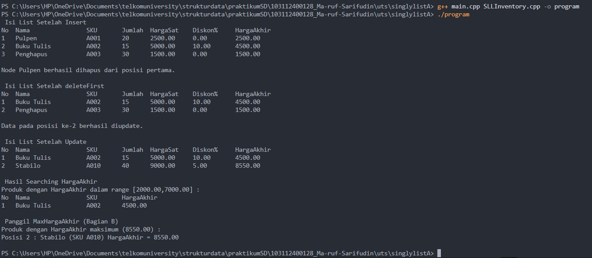
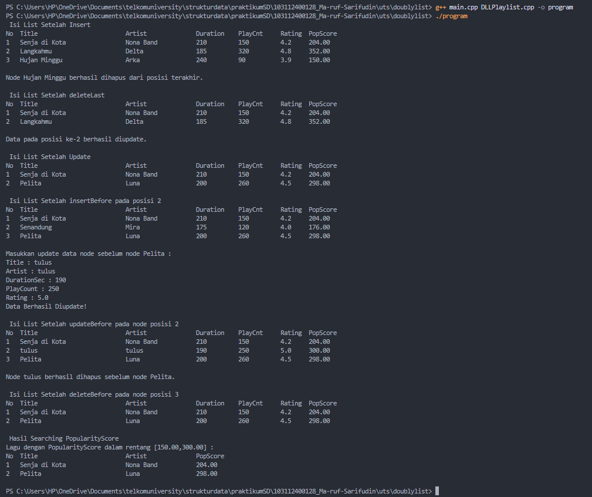
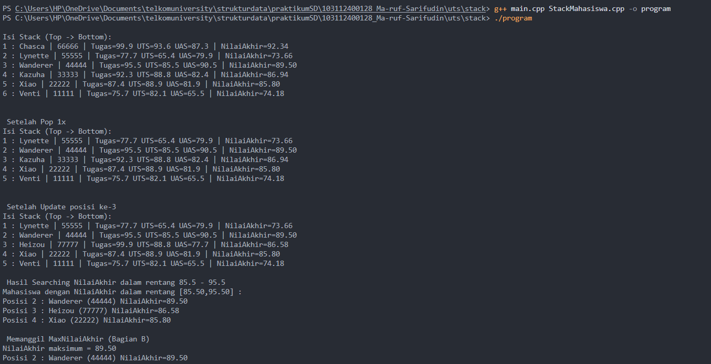

# <h1 align="center">Laporan Praktikum UTS </h1>
<p align="center">Ma'ruf Sarifudin - 103112400128</p>


## uts 

## 1.  Single Linked List

### 1. File SLLInventory.h 
```C++
#ifndef SLLINVENTORY_H
#define SLLINVENTORY_H

#include <iostream>
using namespace std;

#define Nil NULL

struct Product {
    string Nama;
    string SKU;
    int Jumlah;
    float HargaSatuan;
    float DiskonPersen;
};

typedef Product product;

typedef struct node *address;

struct node {
    product info;
    address next;
};

struct linkedlist {
    address head;
};

bool isEmpty(linkedlist L);
void createList(linkedlist &L);
address allocate(product P);
void deallocate(address &addr);

void insertFirst(linkedlist &L, address nodeBaru);
void insertLast(linkedlist &L, address nodeBaru);
void insertAfter(linkedlist &L, address Prev, address nodeBaru);

void deleteFirst(linkedlist &L);
void deleteLast(linkedlist &L);
void deleteAfter(linkedlist &L, address Prev);

void updateAtPosition(linkedlist &L, int posisi, product newData);
void viewList(const linkedlist &L);
void searchByFinalPriceRange(const linkedlist &L, float minPrice, float maxPrice);

// bagian B
void MaxHargaAkhir(const linkedlist &L);

#endif


```


### 2. File SLLInventory.cpp 

```C++
 #include "SLLInventory.h"
#include <iostream>
#include <cmath>

using namespace std;

bool isEmpty(linkedlist L) {
    return L.head == Nil;
}

void createList(linkedlist &L) {
    L.head = Nil;
}

address allocate(product P) {
    address nodeBaru = new node;
    nodeBaru->info = P;
    nodeBaru->next = Nil;
    return nodeBaru;
}

void deallocate(address &addr) {
    addr->next = Nil;
    delete addr;
    addr = Nil;
}

void insertFirst(linkedlist &L, address nodeBaru) {
    nodeBaru->next = L.head;
    L.head = nodeBaru;
}

void insertLast(linkedlist &L, address nodeBaru) {
    if (isEmpty(L)) {
        L.head = nodeBaru;
    } else {
        address p = L.head;
        while (p->next != Nil) {
            p = p->next;
        }
        p->next = nodeBaru;
    }
}

void insertAfter(linkedlist &L, address Prev, address nodeBaru) {
    if (Prev != Nil) {
        nodeBaru->next = Prev->next;
        Prev->next = nodeBaru;
    }
}

void deleteFirst(linkedlist &L) {
    if (isEmpty(L)) {
        cout << "List kosong!" << endl;
        return;
    }
    address p = L.head;
    L.head = L.head->next;
    cout << "Node " << p->info.Nama << " berhasil dihapus dari posisi pertama." << endl;
    deallocate(p);
}

void deleteLast(linkedlist &L) {
    if (isEmpty(L)) {
        cout << "List kosong!" << endl;
        return;
    }
    address p = L.head;
    if (p->next == Nil) {
        cout << "Node " << p->info.Nama << " berhasil dihapus dari posisi terakhir." << endl;
        deallocate(p);
        L.head = Nil;
        return;
    }
    address prev = Nil;
    while (p->next != Nil) {
        prev = p;
        p = p->next;
    }
    prev->next = Nil;
    cout << "Node " << p->info.Nama << " berhasil dihapus dari posisi terakhir." << endl;
    deallocate(p);
}

void deleteAfter(linkedlist &L, address Prev) {
    if (isEmpty(L)) {
        cout << "List kosong!" << endl;
        return;
    }
    if (Prev == Nil || Prev->next == Nil) {
        cout << "Posisi sebelumnya tidak valid atau tidak ada node setelahnya!" << endl;
        return;
    }
    address p = Prev->next;
    Prev->next = p->next;
    cout << "Node " << p->info.Nama << " berhasil dihapus setelah node " << Prev->info.Nama << "." << endl;
    deallocate(p);
}

void updateAtPosition(linkedlist &L, int posisi, product newData) {
    if (isEmpty(L)) {
        cout << "List kosong!" << endl;
        return;
    }
    if (posisi <= 0) {
        cout << "Posisi tidak valid!" << endl;
        return;
    }
    address p = L.head;
    int idx = 1;
    bool found = false;
    while (p != Nil) {
        if (idx == posisi) {
            p->info = newData;
            cout << "Data pada posisi ke-" << posisi << " berhasil diupdate." << endl;
            found = true;
            break;
        }
        p = p->next;
        idx++;
    }
    if (!found) {
        cout << "Posisi " << posisi << " tidak ditemukan!" << endl;
    }
}

void viewList(const linkedlist &L) {
    if (isEmpty(L)) {
        cout << "List kosong!" << endl;
        return;
    }
    address p = L.head;
    int idx = 1;
    cout << left << setw(4) << "No" << setw(20) << "Nama" << setw(10) << "SKU" << setw(8) << "Jumlah" << setw(12) << "HargaSat" << setw(12) << "Diskon%" << setw(12) << "HargaAkhir" << endl;
    while (p != Nil) {
        float hargaAkhir = p->info.HargaSatuan * (1.0f - (p->info.DiskonPersen / 100.0f));
        cout << left << setw(4) << idx
             << setw(20) << p->info.Nama
             << setw(10) << p->info.SKU
             << setw(8) << p->info.Jumlah
             << setw(12) << fixed << setprecision(2) << p->info.HargaSatuan
             << setw(12) << fixed << setprecision(2) << p->info.DiskonPersen
             << setw(12) << fixed << setprecision(2) << hargaAkhir
             << endl;
        p = p->next;
        idx++;
    }
}

void searchByFinalPriceRange(const linkedlist &L, float minPrice, float maxPrice) {
    if (isEmpty(L)) {
        cout << "List kosong!" << endl;
        return;
    }
    address p = L.head;
    int idx = 1;
    bool found = false;
    while (p != Nil) {
        float hargaAkhir = p->info.HargaSatuan * (1.0f - (p->info.DiskonPersen / 100.0f));
        if (hargaAkhir >= minPrice && hargaAkhir <= maxPrice) {
            if (!found) {
                cout << "Produk dengan HargaAkhir dalam range [" << minPrice << "," << maxPrice << "] :" << endl;
                cout << left << setw(4) << "No" << setw(20) << "Nama" << setw(10) << "SKU" << setw(12) << "HargaAkhir" << endl;
            }
            cout << left << setw(4) << idx << setw(20) << p->info.Nama << setw(10) << p->info.SKU << setw(12) << fixed << setprecision(2) << hargaAkhir << endl;
            found = true;
        }
        p = p->next;
        idx++;
    }
    if (!found) {
        cout << "Tidak ditemukan produk dengan HargaAkhir dalam rentang tersebut." << endl;
    }
}


//bagian B
void MaxHargaAkhir(const linkedlist &L) {
    if (isEmpty(L)) {
        cout << "List kosong!" << endl;
        return;
    }
    address p = L.head;
    float maxHarga = -1.0f;
    while (p != Nil) {
        float hargaAkhir = p->info.HargaSatuan * (1.0f - (p->info.DiskonPersen / 100.0f));
        if (hargaAkhir > maxHarga) {
            maxHarga = hargaAkhir;
        }
        p = p->next;
    }
    p = L.head;
    int idx = 1;
    cout << "Produk dengan HargaAkhir maksimum (" << fixed << setprecision(2) << maxHarga << ") :" << endl;
    bool any = false;
    while (p != Nil) {
        float hargaAkhir = p->info.HargaSatuan * (1.0f - (p->info.DiskonPersen / 100.0f));
        if (std::fabs(hargaAkhir - maxHarga) < 0.0001f) {
            cout << "Posisi " << idx << " : " << p->info.Nama << " (SKU " << p->info.SKU << ") HargaAkhir = " << fixed << setprecision(2) << hargaAkhir << endl;
            any = true;
        }
        p = p->next;
        idx++;
    }
    if (!any) {
        cout << "Tidak ada produk dengan HargaAkhir maksimum." << endl;
    }
}


```

### 3. File main.cpp 

```C++
#include "SLLInventory.h"
#include <iostream>

using namespace std;

int main() {
    linkedlist L;
    createList(L);

    product p1;
    p1.Nama = "Pulpen";
    p1.SKU = "A001";
    p1.Jumlah = 20;
    p1.HargaSatuan = 2500;
    p1.DiskonPersen = 0;

    product p2;
    p2.Nama = "Buku Tulis";
    p2.SKU = "A002";
    p2.Jumlah = 15;
    p2.HargaSatuan = 5000;
    p2.DiskonPersen = 10;

    product p3;
    p3.Nama = "Penghapus";
    p3.SKU = "A003";
    p3.Jumlah = 30;
    p3.HargaSatuan = 1500;
    p3.DiskonPersen = 0;

    insertLast(L, allocate(p1));
    insertLast(L, allocate(p2));
    insertLast(L, allocate(p3));

    cout << " Isi List Setelah Insert " << endl;
    viewList(L);
    cout << endl;

    deleteFirst(L);
    cout << endl;

    cout << " Isi List Setelah deleteFirst " << endl;
    viewList(L);
    cout << endl;

    product newP;
    newP.Nama = "Stabilo";
    newP.SKU = "A010";
    newP.Jumlah = 40;
    newP.HargaSatuan = 9000;
    newP.DiskonPersen = 5;

    updateAtPosition(L, 2, newP);
    cout << endl;

    cout << " Isi List Setelah Update " << endl;
    viewList(L);
    cout << endl;

    cout << "--- Hasil Searching HargaAkhir " << endl;
    searchByFinalPriceRange(L, 2000.0f, 7000.0f);
    cout << endl;

    //bagian B
     cout << " Memanggil MaxHargaAkhir (Bagian B) " << endl;
    MaxHargaAkhir(L);
    cout << endl;

    return 0;
}


```
### Output Single Linked List

##### Output 1



## 2. Double Linked List

### 1. File DLLPlaylist.h
```C++
#ifndef DLLPLAYLIST_H
#define DLLPLAYLIST_H

#include <iostream>
using namespace std;

#define Nil NULL

struct Song {
    string Title;
    string Artist;
    int DurationSec;
    int PlayCount;
    float Rating;
};

typedef Song song;

typedef struct node *address;

struct node {
    song info;
    address prev;
    address next;
};

struct linkedlist {
    address head;
    address tail;
};

bool isEmpty(linkedlist L);
void createList(linkedlist &L);
address allocate(song S);
void deallocate(address &P);

void insertFirst(linkedlist &L, address nodeBaru);
void insertLast(linkedlist &L, address nodeBaru);
void insertAfter(linkedlist &L, address Q, address nodeBaru);
void insertBefore(linkedlist &L, address Q, address nodeBaru);

void deleteFirst(linkedlist &L, song &S);
void deleteLast(linkedlist &L, song &S);
void deleteAfter(linkedlist &L, address Q, song &S);
void deleteBefore(linkedlist &L, address Q, song &S);
void deleteNode(linkedlist &L, address target);

void updateAtPosition(linkedlist &L, int posisi, song newData);
void updateBefore(linkedlist &L, address nodeNext);

void viewList(const linkedlist &L);
void searchByPopularityRange(const linkedlist &L, float minScore, float maxScore);

float popularityScore(const song &s);

address getNodeAtPosition(const linkedlist &L, int posisi);

#endif


```
### 2. File DLLPlaylist.cpp

```C++
#include "DLLPlaylist.h"
#include <iostream>
#include <cmath>

using namespace std;

bool isEmpty(linkedlist L) {
    return L.head == Nil;
}

void createList(linkedlist &L) {
    L.head = Nil;
    L.tail = Nil;
}

address allocate(song S) {
    address P = new node;
    P->info = S;
    P->prev = Nil;
    P->next = Nil;
    return P;
}

void deallocate(address &P) {
    P->prev = Nil;
    P->next = Nil;
    delete P;
    P = Nil;
}

void insertFirst(linkedlist &L, address nodeBaru) {
    if (isEmpty(L)) {
        L.head = nodeBaru;
        L.tail = nodeBaru;
    } else {
        nodeBaru->next = L.head;
        L.head->prev = nodeBaru;
        L.head = nodeBaru;
    }
}

void insertLast(linkedlist &L, address nodeBaru) {
    if (isEmpty(L)) {
        L.head = nodeBaru;
        L.tail = nodeBaru;
    } else {
        nodeBaru->prev = L.tail;
        L.tail->next = nodeBaru;
        L.tail = nodeBaru;
    }
}

void insertAfter(linkedlist &L, address Q, address nodeBaru) {
    if (Q == Nil) return;
    if (Q == L.tail) {
        insertLast(L, nodeBaru);
    } else {
        nodeBaru->next = Q->next;
        nodeBaru->prev = Q;
        Q->next->prev = nodeBaru;
        Q->next = nodeBaru;
    }
}

void insertBefore(linkedlist &L, address Q, address nodeBaru) {
    if (Q == Nil) return;
    if (Q == L.head) {
        insertFirst(L, nodeBaru);
    } else {
        nodeBaru->prev = Q->prev;
        nodeBaru->next = Q;
        Q->prev->next = nodeBaru;
        Q->prev = nodeBaru;
    }
}

void deleteFirst(linkedlist &L, song &S) {
    if (isEmpty(L)) {
        cout << "List kosong! Tidak ada node yang dihapus." << endl;
        return;
    }
    address p = L.head;
    S = p->info;
    if (L.head == L.tail) {
        L.head = Nil;
        L.tail = Nil;
    } else {
        L.head = p->next;
        L.head->prev = Nil;
    }
    cout << "Node " << S.Title << " berhasil dihapus dari posisi pertama." << endl;
    deallocate(p);
}

void deleteLast(linkedlist &L, song &S) {
    if (isEmpty(L)) {
        cout << "List kosong! Tidak ada node yang dihapus." << endl;
        return;
    }
    address p = L.tail;
    S = p->info;
    if (L.head == L.tail) {
        L.head = Nil;
        L.tail = Nil;
    } else {
        L.tail = p->prev;
        L.tail->next = Nil;
    }
    cout << "Node " << S.Title << " berhasil dihapus dari posisi terakhir." << endl;
    deallocate(p);
}

void deleteAfter(linkedlist &L, address Q, song &S) {
    if (isEmpty(L)) {
        cout << "List kosong! Tidak ada node yang dihapus." << endl;
        return;
    }
    if (Q == Nil || Q->next == Nil) {
        cout << "Node sebelumnya tidak valid atau tidak ada node setelahnya!" << endl;
        return;
    }
    address p = Q->next;
    S = p->info;
    if (p == L.tail) {
        deleteLast(L, S);
        return;
    }
    Q->next = p->next;
    p->next->prev = Q;
    cout << "Node " << S.Title << " berhasil dihapus setelah node " << Q->info.Title << "." << endl;
    deallocate(p);
}

void deleteBefore(linkedlist &L, address Q, song &S) {
    if (isEmpty(L)) {
        cout << "List kosong! Tidak ada node yang dihapus." << endl;
        return;
    }
    if (Q == Nil || Q->prev == Nil) {
        cout << "Node setelahnya tidak valid atau tidak ada node sebelumnya!" << endl;
        return;
    }
    address p = Q->prev;
    S = p->info;
    if (p == L.head) {
        deleteFirst(L, S);
        return;
    }
    p->prev->next = Q;
    Q->prev = p->prev;
    cout << "Node " << S.Title << " berhasil dihapus sebelum node " << Q->info.Title << "." << endl;
    deallocate(p);
}

void deleteNode(linkedlist &L, address target) {
    if (isEmpty(L) || target == Nil) {
        cout << "Target tidak valid atau list kosong!" << endl;
        return;
    }
    if (target == L.head) {
        song tmp;
        deleteFirst(L, tmp);
    } else if (target == L.tail) {
        song tmp;
        deleteLast(L, tmp);
    } else {
        address Ls = target->prev;
        address Rs = target->next;
        Ls->next = Rs;
        Rs->prev = Ls;
        cout << "Node " << target->info.Title << " berhasil dihapus dari tengah list." << endl;
        deallocate(target);
    }
}

void updateAtPosition(linkedlist &L, int posisi, song newData) {
    if (isEmpty(L)) {
        cout << "List kosong!" << endl;
        return;
    }
    if (posisi <= 0) {
        cout << "Posisi tidak valid!" << endl;
        return;
    }
    address p = getNodeAtPosition(L, posisi);
    if (p == Nil) {
        cout << "Posisi " << posisi << " tidak ditemukan!" << endl;
        return;
    }
    p->info = newData;
    cout << "Data pada posisi ke-" << posisi << " berhasil diupdate." << endl;
}

void updateBefore(linkedlist &L, address nodeNext) {
    if (isEmpty(L)) {
        cout << "List kosong!" << endl;
        return;
    }
    if (nodeNext == Nil || nodeNext->prev == Nil) {
        cout << "Node sebelumnya (prev) tidak valid!" << endl;
        return;
    }
    address p = nodeNext->prev;
    cout << "Masukkan update data node sebelum node " << nodeNext->info.Title << " : " << endl;
    cout << "Title : ";
    getline(cin, p->info.Title);
    cout << "Artist : ";
    getline(cin, p->info.Artist);
    cout << "DurationSec : ";
    cin >> p->info.DurationSec;
    cout << "PlayCount : ";
    cin >> p->info.PlayCount;
    cout << "Rating : ";
    cin >> p->info.Rating;
    cin.ignore();
    cout << "Data Berhasil Diupdate!" << endl;
}

float popularityScore(const song &s) {
    return 0.8f * float(s.PlayCount) + 20.0f * s.Rating;
}

void viewList(const linkedlist &L) {
    if (isEmpty(L)) {
        cout << "List kosong!" << endl;
        return;
    }
    address p = L.head;
    int idx = 1;
    cout << left << setw(4) << "No" << setw(30) << "Title" << setw(20) << "Artist" << setw(12) << "Duration" << setw(12) << "PlayCnt" << setw(8) << "Rating" << setw(12) << "PopScore" << endl;
    while (p != Nil) {
        cout << left << setw(4) << idx
             << setw(30) << p->info.Title
             << setw(20) << p->info.Artist
             << setw(12) << p->info.DurationSec
             << setw(12) << p->info.PlayCount
             << setw(8) << fixed << setprecision(1) << p->info.Rating
             << setw(12) << fixed << setprecision(2) << popularityScore(p->info)
             << endl;
        p = p->next;
        idx++;
    }
}

void searchByPopularityRange(const linkedlist &L, float minScore, float maxScore) {
    if (isEmpty(L)) {
        cout << "List kosong!" << endl;
        return;
    }
    address p = L.head;
    int idx = 1;
    bool found = false;
    while (p != Nil) {
        float score = popularityScore(p->info);
        if (score >= minScore && score <= maxScore) {
            if (!found) {
                cout << "Lagu dengan PopularityScore dalam rentang [" << minScore << "," << maxScore << "] :" << endl;
                cout << left << setw(4) << "No" << setw(30) << "Title" << setw(20) << "Artist" << setw(12) << "PopScore" << endl;
            }
            cout << left << setw(4) << idx << setw(30) << p->info.Title << setw(20) << p->info.Artist << setw(12) << fixed << setprecision(2) << score << endl;
            found = true;
        }
        p = p->next;
        idx++;
    }
    if (!found) {
        cout << "Tidak ditemukan lagu dengan PopularityScore dalam rentang tersebut." << endl;
    }
}

address getNodeAtPosition(const linkedlist &L, int posisi) {
    if (isEmpty(L) || posisi <= 0) return Nil;
    address p = L.head;
    int idx = 1;
    while (p != Nil) {
        if (idx == posisi) return p;
        p = p->next;
        idx++;
    }
    return Nil;
}


```

### 3. File main.cpp 

```C++
#include "DLLPlaylist.h"
#include <iostream>

using namespace std;

int main() {
    linkedlist L;
    createList(L);

    song s1;
    s1.Title = "Senja di Kota";
    s1.Artist = "Nona Band";
    s1.DurationSec = 210;
    s1.PlayCount = 150;
    s1.Rating = 4.2f;

    song s2;
    s2.Title = "Langkahmu";
    s2.Artist = "Delta";
    s2.DurationSec = 185;
    s2.PlayCount = 320;
    s2.Rating = 4.8f;

    song s3;
    s3.Title = "Hujan Minggu";
    s3.Artist = "Arka";
    s3.DurationSec = 240;
    s3.PlayCount = 90;
    s3.Rating = 3.9f;

    insertLast(L, allocate(s1));
    insertLast(L, allocate(s2));
    insertLast(L, allocate(s3));

    cout << " Isi List Setelah Insert " << endl;
    viewList(L);
    cout << endl;

    song tmp;
    deleteLast(L, tmp);
    cout << endl;

    cout << " Isi List Setelah deleteLast " << endl;
    viewList(L);
    cout << endl;

    song newSong;
    newSong.Title = "Pelita";
    newSong.Artist = "Luna";
    newSong.DurationSec = 200;
    newSong.PlayCount = 260;
    newSong.Rating = 4.5f;

    updateAtPosition(L, 2, newSong);
    cout << endl;

    cout << " Isi List Setelah Update " << endl;
    viewList(L);
    cout << endl;

    address nodePos2 = getNodeAtPosition(L, 2);
    song beforeSong;
    beforeSong.Title = "Senandung";
    beforeSong.Artist = "Mira";
    beforeSong.DurationSec = 175;
    beforeSong.PlayCount = 120;
    beforeSong.Rating = 4.0f;

    insertBefore(L, nodePos2, allocate(beforeSong));
    cout << " Isi List Setelah insertBefore pada posisi 2 " << endl;
    viewList(L);
    cout << endl;

    updateBefore(L, nodePos2);
    cout << endl;

    cout << " Isi List Setelah updateBefore pada node posisi 2 " << endl;
    viewList(L);
    cout << endl;

    address nodePos3 = getNodeAtPosition(L, 3);
    deleteBefore(L, nodePos3, tmp);
    cout << endl;

    cout << " Isi List Setelah deleteBefore pada node posisi 3 " << endl;
    viewList(L);
    cout << endl;

    cout << " Hasil Searching PopularityScore dalam rentang 150 - 300 " << endl;
    searchByPopularityRange(L, 150.0f, 300.0f);
    cout << endl;

    return 0;
}

```
### Output Double Linked List

##### Output 1


## 3. Stack

### 1. file StackMahasiswa.h
```C++
#ifndef STACKMAHASISWA_H
#define STACKMAHASISWA_H

#include <iostream>
using namespace std;

const int MAX = 6;

struct Mahasiswa {
    string Nama;
    string NIM;
    float NilaiTugas;
    float NilaiUTS;
    float NilaiUAS;
};

typedef Mahasiswa mahasiswa;

struct StackMHS {
    mahasiswa data[MAX];
    int top;
};

bool isEmpty(StackMHS s);
bool isFull(StackMHS s);
void createStack(StackMHS &s);
void Push(StackMHS &s, mahasiswa m);
void Pop(StackMHS &s);
void Update(StackMHS &s, int posisi, mahasiswa m);
void View(const StackMHS &s);
void SearchNilaiAkhirRange(const StackMHS &s, float minVal, float maxVal);
float NilaiAkhir(const mahasiswa &m);
void MaxNilaiAkhir(const StackMHS &s);

#endif


```

### 2. file StackMahasiswa.cpp
```C++
#include "StackMahasiswa.h"
#include <iostream>
#include <cmath>

using namespace std;

bool isEmpty(StackMHS s) {
    return s.top == -1;
}

bool isFull(StackMHS s) {
    return s.top == MAX - 1;
}

void createStack(StackMHS &s) {
    s.top = -1;
}

void Push(StackMHS &s, mahasiswa m) {
    if (isFull(s)) {
        cout << "Stack penuh!" << endl;
        return;
    }
    s.top++;
    s.data[s.top] = m;
}

void Pop(StackMHS &s) {
    if (isEmpty(s)) {
        cout << "Stack kosong!" << endl;
        return;
    }
    s.top--;
}

void Update(StackMHS &s, int posisi, mahasiswa m) {
    if (isEmpty(s)) {
        cout << "Stack kosong!" << endl;
        return;
    }
    if (posisi <= 0) {
        cout << "Posisi tidak valid!" << endl;
        return;
    }
    int idx = s.top - (posisi - 1);
    if (idx < 0 || idx > s.top) {
        cout << "Posisi " << posisi << " tidak valid!" << endl;
        return;
    }
    s.data[idx] = m;
}

void View(const StackMHS &s) {
    if (isEmpty(s)) {
        cout << "Stack kosong!" << endl;
        return;
    }
    cout << "Isi Stack :" << endl;
    for (int i = s.top; i >= 0; --i) {
        int posisi = s.top - i + 1;
        cout << posisi << " : " << s.data[i].Nama << " | " << s.data[i].NIM << " | Tugas=" << fixed << setprecision(1) << s.data[i].NilaiTugas
             << " UTS=" << fixed << setprecision(1) << s.data[i].NilaiUTS << " UAS=" << fixed << setprecision(1) << s.data[i].NilaiUAS
             << " | NilaiAkhir=" << fixed << setprecision(2) << NilaiAkhir(s.data[i]) << endl;
    }
}

float NilaiAkhir(const mahasiswa &m) {
    return 0.2f * m.NilaiTugas + 0.4f * m.NilaiUTS + 0.4f * m.NilaiUAS;
}

void SearchNilaiAkhirRange(const StackMHS &s, float minVal, float maxVal) {
    if (isEmpty(s)) {
        cout << "Stack kosong!" << endl;
        return;
    }
    bool found = false;
    for (int i = s.top; i >= 0; --i) {
        float na = NilaiAkhir(s.data[i]);
        if (na >= minVal && na <= maxVal) {
            if (!found) {
                cout << "Mahasiswa dengan NilaiAkhir dalam rentang [" << minVal << "," << maxVal << "] :" << endl;
            }
            int posisi = s.top - i + 1;
            cout << "Posisi " << posisi << " : " << s.data[i].Nama << " (" << s.data[i].NIM << ") NilaiAkhir=" << fixed << setprecision(2) << na << endl;
            found = true;
        }
    }
    if (!found) {
        cout << "Tidak ada mahasiswa dengan NilaiAkhir dalam rentang tersebut." << endl;
    }
}


//bagian B
void MaxNilaiAkhir(const StackMHS &s) {
    if (isEmpty(s)) {
        cout << "Stack kosong!" << endl;
        return;
    }
    float maxVal = -1.0f;
    for (int i = s.top; i >= 0; --i) {
        float na = NilaiAkhir(s.data[i]);
        if (na > maxVal) maxVal = na;
    }
    cout << "NilaiAkhir maksimum = " << fixed << setprecision(2) << maxVal << endl;
    for (int i = s.top; i >= 0; --i) {
        float na = NilaiAkhir(s.data[i]);
        if (std::fabs(na - maxVal) < 0.0001f) {
            int posisi = s.top - i + 1;
            cout << "Posisi " << posisi << " : " << s.data[i].Nama << " (" << s.data[i].NIM << ") NilaiAkhir=" << fixed << setprecision(2) << na << endl;
        }
    }
}


```
### 3. file main.cpp

```C++
#include "StackMahasiswa.h"
#include <iostream>

using namespace std;

int main() {
    StackMHS S;
    createStack(S);

    mahasiswa m1;
    m1.Nama = "Venti";
    m1.NIM = "11111";
    m1.NilaiTugas = 75.7f;
    m1.NilaiUTS = 82.1f;
    m1.NilaiUAS = 65.5f;

    mahasiswa m2;
    m2.Nama = "Xiao";
    m2.NIM = "22222";
    m2.NilaiTugas = 87.4f;
    m2.NilaiUTS = 88.9f;
    m2.NilaiUAS = 81.9f;

    mahasiswa m3;
    m3.Nama = "Kazuha";
    m3.NIM = "33333";
    m3.NilaiTugas = 92.3f;
    m3.NilaiUTS = 88.8f;
    m3.NilaiUAS = 82.4f;

    mahasiswa m4;
    m4.Nama = "Wanderer";
    m4.NIM = "44444";
    m4.NilaiTugas = 95.5f;
    m4.NilaiUTS = 85.5f;
    m4.NilaiUAS = 90.5f;

    mahasiswa m5;
    m5.Nama = "Lynette";
    m5.NIM = "55555";
    m5.NilaiTugas = 77.7f;
    m5.NilaiUTS = 65.4f;
    m5.NilaiUAS = 79.9f;

    mahasiswa m6;
    m6.Nama = "Chasca";
    m6.NIM = "66666";
    m6.NilaiTugas = 99.9f;
    m6.NilaiUTS = 93.6f;
    m6.NilaiUAS = 87.3f;

    Push(S, m1);
    Push(S, m2);
    Push(S, m3);
    Push(S, m4);
    Push(S, m5);
    Push(S, m6);

    cout << endl;
    View(S);
    cout << endl;

    Pop(S);
    cout << endl;

    cout << " Setelah Pop 1x " << endl;
    View(S);
    cout << endl;

    mahasiswa newM;
    newM.Nama = "Heizou";
    newM.NIM = "77777";
    newM.NilaiTugas = 99.9f;
    newM.NilaiUTS = 88.8f;
    newM.NilaiUAS = 77.7f;

    Update(S, 3, newM);
    cout << endl;

    cout << " Setelah Update posisi ke-3 " << endl;
    View(S);
    cout << endl;

    cout << " Hasil Searching NilaiAkhir dalam rentang 85.5 - 95.5 " << endl;
    SearchNilaiAkhirRange(S, 85.5f, 95.5f);
    cout << endl;


    //Bagian B
    cout << " Memanggil MaxNilaiAkhir (Bagian B) " << endl;
    MaxNilaiAkhir(S);
    cout << endl;

    return 0;
}


```
### Output Stack :

##### Output 1



### 4. Soal Queue


### 1. file QueuePengiriman.h
```C++
#ifndef QUEUEPENGIRIMAN_H
#define QUEUEPENGIRIMAN_H

#include <iostream>
using namespace std;

const int MAKS = 5;
const int TARIF_PER_KG = 8250;

struct Paket {
    string KodeResi;
    string NamaPengirim;
    int BeratBarang;
    string Tujuan;
};

typedef Paket paket;

struct QueueEkspedisi {
    paket data[MAKS];
    int head;
    int tail;
};

bool isEmpty(QueueEkspedisi Q);
bool isFull(QueueEkspedisi Q);
void createQueue(QueueEkspedisi &Q);
void enqueue(QueueEkspedisi &Q, paket x);
paket dequeue(QueueEkspedisi &Q);
void viewQueue(const QueueEkspedisi &Q);

// bagian B
long long TotalBiayaPengiriman(const QueueEkspedisi &Q);

#endif


```

### 2. file QueuePengiriman.cpp
```C++
#include "QueuePengiriman.h"
#include <iostream>

using namespace std;

bool isEmpty(QueueEkspedisi Q) {
    return Q.head == -1 && Q.tail == -1;
}

bool isFull(QueueEkspedisi Q) {
    return Q.tail == MAKS - 1;
}

void createQueue(QueueEkspedisi &Q) {
    Q.head = -1;
    Q.tail = -1;
}

void enqueue(QueueEkspedisi &Q, paket x) {
    if (isFull(Q)) {
        return;
    }
    if (isEmpty(Q)) {
        Q.head = 0;
        Q.tail = 0;
    } else {
        Q.tail = Q.tail + 1;
    }
    Q.data[Q.tail] = x;
}

paket dequeue(QueueEkspedisi &Q) {
    paket kosong;
    kosong.KodeResi = "";
    kosong.NamaPengirim = "";
    kosong.BeratBarang = 0;
    kosong.Tujuan = "";
    if (isEmpty(Q)) {
        return kosong;
    }
    paket val = Q.data[Q.head];
    for (int i = 0; i < Q.tail; ++i) {
        Q.data[i] = Q.data[i + 1];
    }
    Q.tail = Q.tail - 1;
    if (Q.tail < 0) {
        Q.head = -1;
        Q.tail = -1;
    }
    return val;
}

void viewQueue(const QueueEkspedisi &Q) {
    if (isEmpty(Q)) {
        cout << "Head = " << -1 << " , Tail = " << -1 << " | empty queue" << endl;
        return;
    }
    cout << "H = " << Q.head << " , T = " << Q.tail << " | Queue Info" << endl;
    cout << left << setw(6) << "Idx" << setw(12) << "KodeResi" << setw(18) << "NamaPengirim" << setw(10) << "Berat" << setw(12) << "Tujuan" << endl;
    for (int i = Q.head; i <= Q.tail; ++i) {
        cout << left << setw(6) << (i - Q.head)
             << setw(12) << Q.data[i].KodeResi
             << setw(18) << Q.data[i].NamaPengirim
             << setw(10) << Q.data[i].BeratBarang
             << setw(12) << Q.data[i].Tujuan
             << endl;
    }
}

long long TotalBiayaPengiriman(const QueueEkspedisi &Q) {
    if (isEmpty(Q)) return 0;
    long long total = 0;
    for (int i = Q.head; i <= Q.tail; ++i) {
        total += (long long)Q.data[i].BeratBarang * TARIF_PER_KG;
    }
    return total;
}


```
### 3. file main.cpp

```C++
#include "QueuePengiriman.h"
#include <iostream>
using namespace std;


int main() {
    QueueEkspedisi Q;
    createQueue(Q);

    paket p1;
    p1.KodeResi = "123456";
    p1.NamaPengirim = "Hutao";
    p1.BeratBarang = 14;
    p1.Tujuan = "Sumeru";

    paket p2;
    p2.KodeResi = "234567";
    p2.NamaPengirim = "Ayaka";
    p2.BeratBarang = 10;
    p2.Tujuan = "Fontaine";

    paket p3;
    p3.KodeResi = "345678";
    p3.NamaPengirim = "Bennet";
    p3.BeratBarang = 7;
    p3.Tujuan = "Nattan";

    paket p4;
    p4.KodeResi = "456789";
    p4.NamaPengirim = "Furina";
    p4.BeratBarang = 16;
    p4.Tujuan = "Liyue";

    paket p5;
    p5.KodeResi = "567890";
    p5.NamaPengirim = "Nefer";
    p5.BeratBarang = 6;
    p5.Tujuan = "Inazuma";

    enqueue(Q, p1);
    enqueue(Q, p2);
    enqueue(Q, p3);
    enqueue(Q, p4);
    enqueue(Q, p5);

    cout << " Isi Queue Setelah Enqueue " << endl;
    viewQueue(Q);
    cout << endl;

    dequeue(Q);
    cout << " Isi Queue Setelah Dequeue " << endl;
    viewQueue(Q);
    cout << endl;

    //bagian B
    long long total = TotalBiayaPengiriman(Q);
    cout << "Total Biaya Pengiriman Semua Paket = Rp " << total << endl;

    return 0;
}


```

### Output Queue :

##### Output 1


