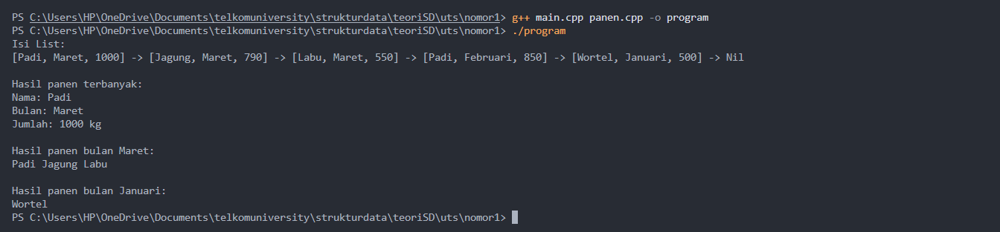

# <h1 align="center">Laporan Praktikum Modul 7 - STACK</h1>
<p align="center">Ma'ruf Sarifudin - 103112400128</p>


## SOAL 1: SINGLY LINKED LIST (SLL)


### 1. File panen.h 
```C++
#ifndef PANEN_H
#define PANEN_H
#define Nil nullptr

#include <iostream>
#include <string>

using namespace std;

struct tPanen {
    string nama;
    string bulan;
    int jumlah;
};

typedef tPanen infotype;
typedef struct elmlist *address;

struct elmlist {
    infotype info;
    address next;
};

struct list {
    address FIRST;
};


void createList(list &L);
bool isEmpty(list L);
address createNewElm(infotype x);

void tambahData(list &L, infotype dataBaru);
address panenTerbanyak(list L);
void panenBulanan(list L, string bulanCari);


void printList(list L);

#endif
```


### 2. File panen.cpp 

```C++
#include "panen.h"

void createList(list &L) {
    L.FIRST = Nil;
}

bool isEmpty(list L) {
    return L.FIRST == Nil;
}

address createNewElm(infotype x) {
    address P = new elmlist;
    P->info = x;
    P->next = Nil;
    return P;
}

void tambahData(list &L, infotype dataBaru) {
    address P = createNewElm(dataBaru);
    P->next = L.FIRST;
    L.FIRST = P;
}

address panenTerbanyak(list L) {
    if (isEmpty(L)) {
        return Nil;
    }

    address P = L.FIRST;
    address maxAddress = P;
    int maxPanen = P->info.jumlah;
    P = P->next;

    while (P != Nil) {
        if (P->info.jumlah > maxPanen) {
            maxPanen = P->info.jumlah;
            maxAddress = P;
        }
        P = P->next;
    }
    return maxAddress;
}

void panenBulanan(list L, string bulanCari) {
    address P = L.FIRST;
    while (P != Nil) {
        if (P->info.bulan == bulanCari) {
            cout << P->info.nama << " ";
        }
        P = P->next;
    }
    cout << endl;
}

void printList(list L) {
    address P = L.FIRST;
    if (isEmpty(L)) {
        cout << "List kosong." << endl;
        return;
    }
    while (P != Nil) {
        cout << "[" << P->info.nama << ", " << P->info.bulan << ", " << P->info.jumlah << "] -> ";
        P = P->next;
    }
    cout << "Nil" << endl;
}


```

### 3. File main.cpp 

```C++
#include "panen.h"

int main() {
    list L;
    createList(L);

  
    tambahData(L, {"Wortel", "Januari", 500});
    tambahData(L, {"Padi", "Februari", 850});
    tambahData(L, {"Labu", "Maret", 550});
    tambahData(L, {"Jagung", "Maret", 790});
    tambahData(L, {"Padi", "Maret", 1000});

    cout << "Isi List:" << endl;
    printList(L);
    cout << endl;


    address panenMax = panenTerbanyak(L);
    if (panenMax != Nil) {
        cout << "Hasil panen terbanyak:" << endl;
        cout << "Nama: " << panenMax->info.nama << endl;
        cout << "Bulan: " << panenMax->info.bulan << endl;
        cout << "Jumlah: " << panenMax->info.jumlah << " kg" << endl;
    } else {
        cout << "List panen kosong." << endl;
    }
    cout << endl;


    string bulan = "Maret";
    cout << "Hasil panen bulan " << bulan << ":" << endl;
    panenBulanan(L, bulan);
    cout << endl;
    
    bulan = "Januari";
    cout << "Hasil panen bulan " << bulan << ":" << endl;
    panenBulanan(L, bulan);

    return 0;
}


```
### Output soal 1 :

##### Output 1



